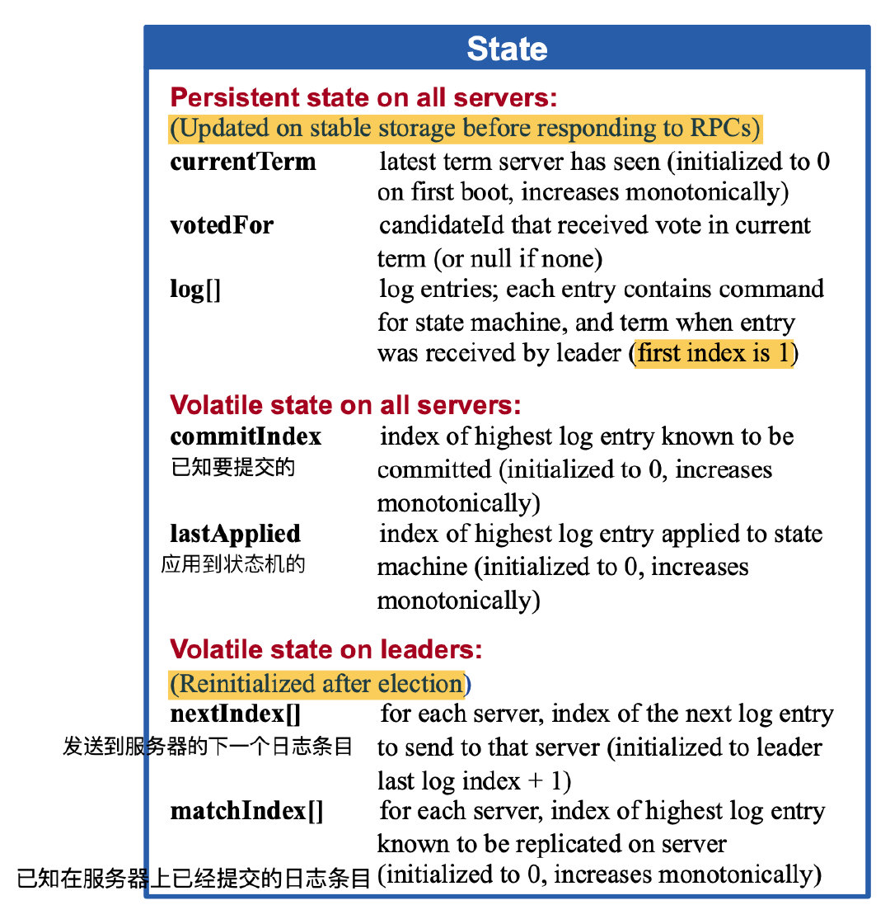
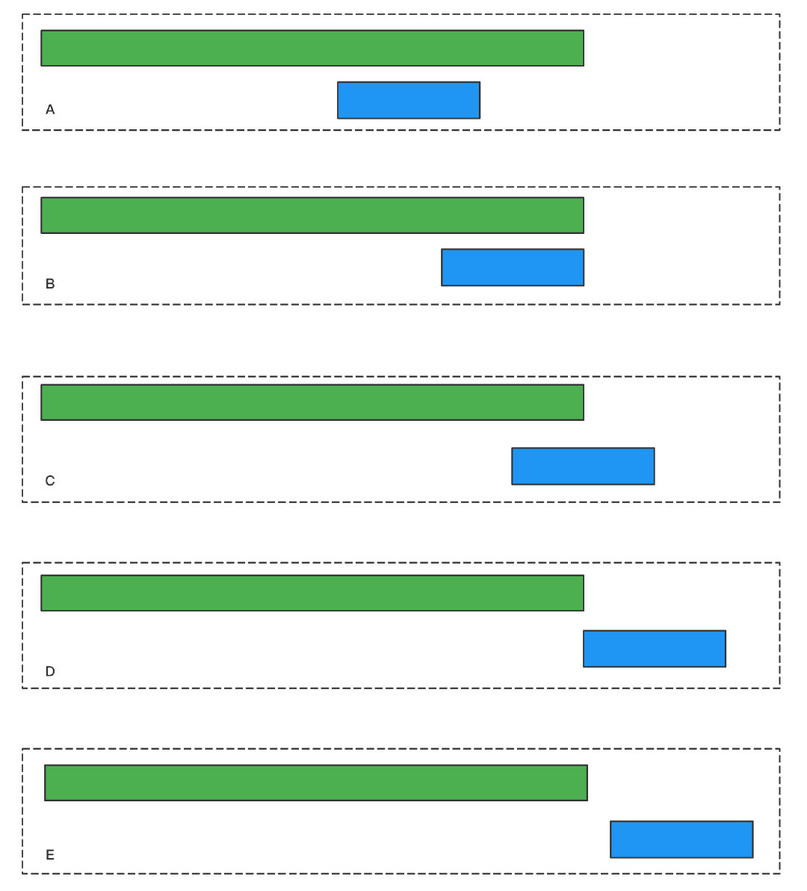
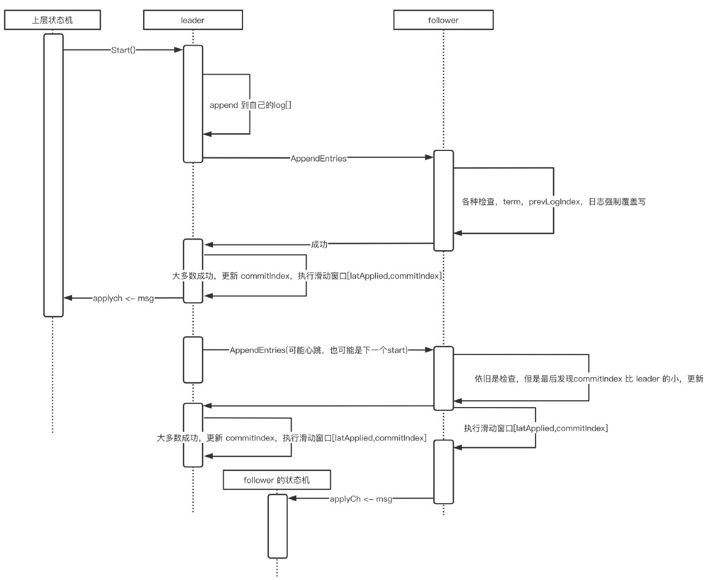
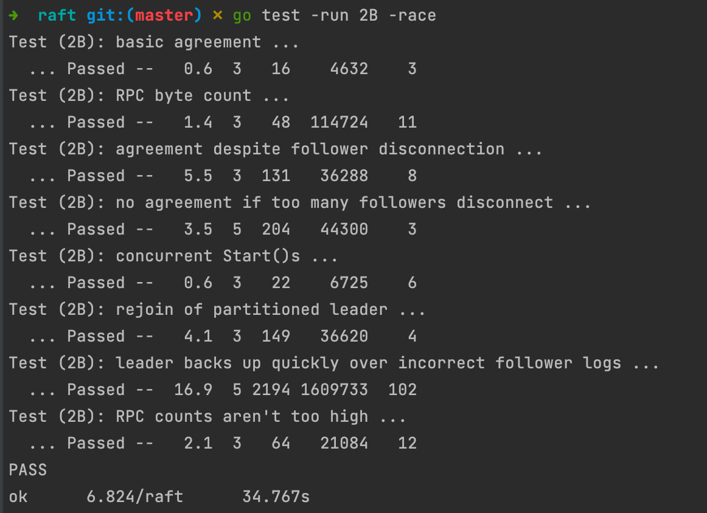

# MIT6.824_2021_lab2B_log_replication

lab2B，日志复制，我愿称之为 raft 核心中的核心，细节爆炸💥，细节都在魔鬼中

还是需要将 Fig2 完全实现，并且将 5.3 和 5.4节完全实现，这里我在实现的时候顺便把 nextIndex 优化给做了，具体实现可以直接在助教的 guide 中直接找到

## lab2B:log replication

### 实验内容

实现 leader 和 follower 的相关代码以实现日志追加，用`go test -run 2B -race`进行测试

### 实验提示

1. 实现 `Start()`
2. 根据 5.4.1 节，实现选举限制（lab2A可以一并是实现了，就是 up-to-date 定理）
3. 除了 ticker 之外，也可以 go 一些重复检查某些事件的循环。但是不要让这些循环连续执行而不暂停，因为这会降低效率，导致测试失败。
   可以使用 Go 的条件变量，或者在每次循环迭代中插入一个 time.Sleep(10 * time.Millisecond)。
4. 不要瞎写乱写，拉面条；请合理设计，封装复用（大致意思是这个）
5. `config.go`和`test_test.go`里可以看到所有的测试细节

### 实验思路

1. lab2A 是实现心跳，从这里开始，有时候心跳包会带上日志条目信息了，并且日志条目信息还和`nextIndex`有关
2. 觉得下手困难的话，可以先从 Fig2 出发，先把`AppendEntries`和`RequestVote`的 Receiver implement 逻辑实现
3. 动手之前如果可以理解 raft 的 Fig2 的基础属性是最好的，这里稍后给出自己的理解
4. 整理过后，个人认为需要实现的模块有：
   1. rpc_sender&handler：根据图2，实现`AppendEntries`和`RequestVote`两个基本rpc的 sender 和 handler，包括 args 参数构建过程，sender 的发送规则，handler 中 reply 的处理细节
   2. checkCommit：除了`ticker`之外，需要在`Make()`中，再go新的协程出来做定时任务，这里本人实现有两种，一种是 leader 和 follower 都各开一个协程去 check commit，但是也可以将 leader 和 follower 的 check commit 行为糅杂在一个协程里做，见仁见智了（后续可以采取多态的形式重构优化，而不是if-else）；其实就是一个`[lastApplied, commitIndex]`的滑动窗口提交日志规则
   3. nextIndex优化：参考助教的guide，就可以实现

### 实现思路

#### raft state

如果要把逻辑写对，首先就要将 raft 中的 state 的各种属性的作用理解清楚，这里给出自己的理解，具体就是图2的左上角

##### currentTerm

在 lab2A 其实就已经结束了，如果 lab2A 将 up-to-date 的逻辑也补上，那么 candidate 的工作已经结束了

currentTerm 指当前 peer 的任期，且单调递增

##### votedFor

指代投票给谁，candiateId，在 lab2A 也是做完了的

##### log[]

日志条目，在 lab2B 中，一条日志条目应该包含以下信息

- Term
- Command

以及其在数组的下标 Index，建议对 log[] 再封装一层 getter, setter，因为 lab2D 快照的引入会涉及到 log[] 的改造

并且 log[] 不从0开始，0为空节点，方便运算

##### commitIndex

已知可以提交的日志条目下标，会和`lastApplied`搭配使用

##### lastApplied

已经提交了的日志条目下标

`commitIndex`和`lastApplied`组成了 follower 的日志提交方式，下面有详细解释

##### nextIndex[]

leader 专有，助教的 guide 里也有说明，`nextIndex`为乐观估计，**指代 leader 保留的对应 follower 的下一个需要传输的日志条目**，应该初始化为(lastIndex + 1)

##### matchIndex[]

leader 专有，`matchIndex`为悲观估计，应该初始化为 0 (lab2D 会有改动)，**指代 leader 已经传输给对应 follower 的日志条目下标，即follower 目前所拥有的的总日志条目**，通常为 nextIndex - 1

`commitIndex`，`lastApplied`，`nextIndex[]`，`matchIndex[]`共同组成了 leader 的提交规则，并且 leader 总是最先提交的，可以认为 leader 为这个集群的代表，leader 提交后，follower 才会提交

#### follower 的提交规则 & AppendEntries

##### AppendEntries

follower 只会在收到`AppendEntries` rpc 请求后执行提交，图2 说明得很清楚，流程如下：

1. 若 term < currentTerm，返回 false
2. 若 `prevLogIndex`处的日志条目不匹配，如找不到，term不对等，返回 false
3. 强制覆盖写：若 leader 发来的日志条目和已存在的日志条目不匹配，则截断不匹配的下标，并拼接 leader 的剩余日志
4. 若 `leaderCommit > commitIndex`，`commitIndex = min(leaderCommit, 最后一个日志条目下标)`

这里比较绕的是强制覆盖写，尽量不要创造晦涩难懂的代码，需要分类讨论

仔细考虑，可以想出 5 种情况，如图所示，绿色表示 follower 当前内存中的日志条目长，而蓝色表示一次`AppendEntries`带过去的日志条目长，而其中情况E可以在`Reply false if log doesn’t contain an entry at prevLogIndex whose term matches prevLogTerm (§5.3)`情况里直接返回 false 了，则只剩下4种情况

再进一步考虑，泛化下来其实只有A C D 三种情况，其中：

- A 中若发生冲突，则截断后拼接剩余蓝色部分，若没有冲突，则只是检查一遍 log[]
- C 中若发生冲突，截断后拼接剩余蓝色部分，若没有冲突，拼接多出来的蓝色部分
- D 直接看 prevLogIndex 是否有冲突，没有则直接拼接

最后follower 会更新`commitIndex`，更新后会触发提交

##### follower 提交规则：[lastApplied, commitIndex]滑动窗口

可以将`[lastApplied, commitIndex]`想象成**滑动窗口**，更新了`commitIndex`后，将从 `log[lastApplied -> commitIndex]`制造出`ApplyMsg`，一直提交到`lastApplied == commitIndex`，之后`commitIndex `等待 leader 通知再次更新，再次导致`commitIndex > lastApplied`，然后再来一次提交规则

所以，这个滑动窗口的规则可以用一个 goroutine 持续监听，一旦发现`commitIndex > lastApplied`，开始并发执行提交

> 并且 applyCh <- ApplyMsg 时不要占用锁，lab2B 可以过，在 lab2D 时将可能导致死锁

follower 的 `commitIndex` 是 leader 进行通知更新的，那么 leader 的 `commitIndex` 怎么更新？

答：`matchIndex[]`

#### leader 的提交规则 & AppendEntriesSender

翻译提取自图2 leader 部分

- 选举成功，立即发送心跳给所有 peer，并周期性重复
- 若接收到来自 client 的命令，append 日志条目，再将其日志条目提交到上层状态机之后才返回给 client
- 对于每一个 follower，若`lastIndex >= nextIndex`，则发送的`AppendEntries`需要带有`[nextIndex, lastIndex]`的日志条目
  - 成功：若日志条目更新该 follower 的`nextIndex`和`matchIndex`
  - 失败：`nextIndex-1`并重试（减一是不够的，还需要 nextIndex 优化）
- 提交规则：若存在一个数`N`，`N>commitIndex`，并且 N 是`matchIndex[]`的中位数，并且`log[N].term == currentTerm`，置`commitIndex = N`

leader 的提交规则有点绕，总结来看是：

1. 等大多数 follower 都返回成功后，根据`prevLogIndex`和`args.LogEntries`得到最新的`nextIndex`，会让`matchIndex[]`数组会被更新到一个较新的状态
2. 然后 leader 可以周期性地检查`matchIndex[]`，得到一个中位数`N`，且N比 `commitIndex`大；为什么是中位数？论文里有说明，中位数意味着大多数派已经和 leader 信息同步，不需要等待落后的节点，大多数保证了集群整体一定是一个完整且新的状态
3. 并且 leader 只能提交其当前任期的日志，以此来间接提交以前的term的日志，这个是 leader 的**延迟提交**，否则会导致日志冲突（论文5.4节有详细证明）
4. 和follower 类似，执行`[lastApplied, commitIndex]`的滑动窗口提交规则

为了得到`N`，我这里的实现从简，是copy一份`matchIndex[]`副本，并且leader 的 `matchIndex`应该是`lastIndex`，然后排序取中位数

##### AppendEntriesSender

一次 rpc 请求发送抽象来看可以是：

构建 args -> 发送rpc请求 -> 处理rpc的reply

构建 args 时，对应检查 nextIndex 和 prevLogIndex

处理 rpc 的 reply，对应 leader 的提交规则

在下一次的`AppendEntries`请求发出时，此时的 leader 已经提交日志，并且`leaderCommitIndex`比follower 的新，则触发 follower 的日志提交，至此，整个提交规则联动已经完成

#### 时序图总结

下面是我自己理解的，一批日志条目从 append 到提交的流程，时序图会更清晰一些

可以发现，leader 的信息总是会比 follower 要提前一个`AppendEntries`并且彼此之间依靠该rpc 更新日志条目，如此循环反复

### 实验结果

### 感想

lab2B 细节爆炸，`Dprint`疯狂用，并且在做 lab2C 的时候，恶心的 Fig8 测试让我回头发现了两个 bug：

1. rpc 状态检查，在发送 rpc 前和接收到 rpc 返回体后，sender 都需要检查自身的身份和 currentTerm 是否有转变，有则放弃这次 rpc 的发送和返回处理
2. nextIndex 优化，优化细节里，需要我们分别找到指定`term`的第一个出现的index 或 最后一个 index，此时`term`可能会发生断层，即需要找`term`为13的日志条目下标，但是本地的`log[]`只有 term 为 12 和 14 的日志条目，此时是找不到`indexForNil`，第一次写默认是`term`连续

这里也给自己留一个 TODO：

raft 的状态转移和每个状态对应的不同行为，我这里实现还是用的 if-else，之前在知乎看到过一篇用 多态 实现屏蔽差异的，这个确实可取，可以尝试重构优化，并且使用队列处理 rpc 请求（这个有待考证，个人觉得没必要）

