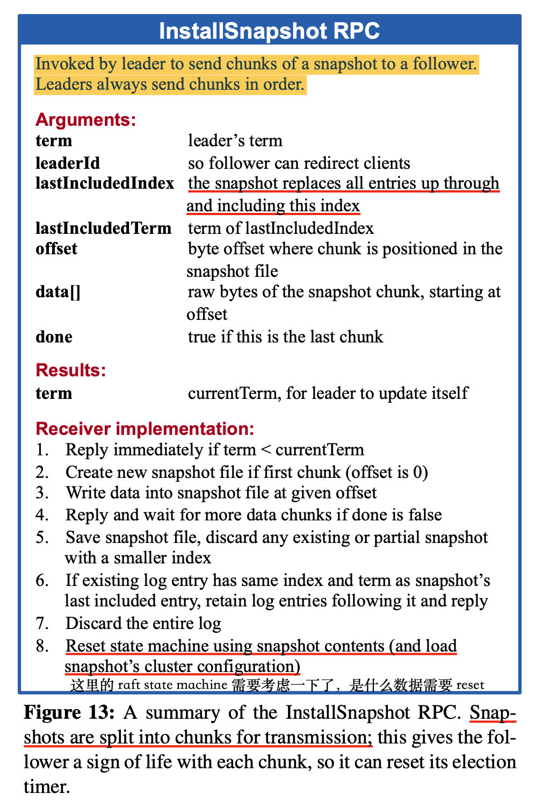
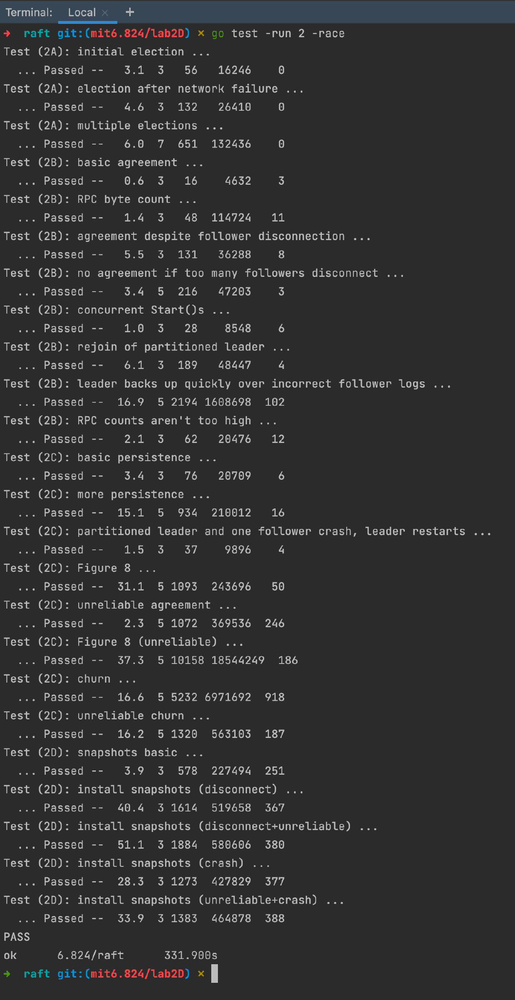

# MIT6.824_2021_lab2D_log_compaction

lab2D 主要是日志压缩功能，实验里是采用论文的最简单的方式，snapshot 压缩快照，并且更简单的是不分块的形式；感觉主要有两点需要注意：

1. 快照功能的加入对原有逻辑的修改
2. 快照功能的流程(InstallSnapshot, Snapshot, CondInstallSnapshot, applyCh)

## lab2D_log_compaction

### 实验内容

1. 要实现快照功能，需要实现 `Snapshot`、`CondInstallSnapshot` 和 `InstallSnapshot RPC` 
2. 还需要继续使用修剪后的日志进行操作
3. lab3 将会对 lab2 更彻底地测试快照功能，因为会压测

### 实验提示

- 在单个 `InstallSnapshot` RPC 中发送整个快照。不用分块和 offset
- Raft 日志不能再使用日志条目的绝对位置或日志的长度来确定日志条目索引；您将需要使用独立于日志位置的**索引方案**。
- 即使日志被修剪，仍然需要在`AppendEntries` RPC 中的新条目之前正确发送条目的术语和索引；这可能需要保存和引用最新快照的`lastIncludedTerm/lastIncludedIndex`，且两者需要考虑被持久化
- 使用`persister.SaveStateAndSnapshot()`将每个快照存储在持久化对象中 。
- 完整的 lab2 测试 (2A+2B+2C+2D) 的合理消耗时间是 8 分钟的实时时间和一分半的 CPU 时间。

继续从 lab2D 中提取出的提示有：

- 整个 lab 的架构，可以查看架构图：https://pdos.csail.mit.edu/6.824/notes/raft_diagram.pdf；从分层的角度看，整个系统包括：client 层，service 状态机层， raft 层，persister 持久化层

- 除了 raft code 之外，还有上层服务（这里叫 service），service 也需要拿到一份快照

- service 调用`Snapshot`将快照应用给 raft

- leader 调用 `InstappSnapshot` rpc 请求将快照传播给 followers

- 当 follower 接收到 `InstallSnapshot` RPC 后，必须将 raft 包含的快照提交给上层服务。通过 `applyCh <- ApplyMsg` 的方式；上层 service 从`applyCh`中读，并使用`CondInstallSnapshot`以告诉 Raft 该服务需要安装该快照

- 可以在`config.go`中的 `applierSnap()` 中查看上层服务调用快照的用法

- 如果快照是旧快照，则`CondInstallSnapshot`拒绝安装快照，即 Raft 在快照的`lastIncludedTerm/lastIncludedIndex`之后处理了条目

  这是因为 Raft 可能会在处理`InstallSnapshot` RPC 之后，并且在服务调用`CondInstallSnapshot`之前，处理其他 RPC 并在`applyCh`上发送消息。Raft 返回到旧快照是不行的，因此必须拒绝旧快照。当您的实现拒绝快照时，`CondInstallSnapshot`应该只返回 `false，`以便服务知道它不应该切换到快照（这一段我理解一切都是为了原子性应用快照）

- 若快照是最新的，则 raft 修建其日志，然后返回 true，并且服务应该在处理`applyCh`上的下一条消息之前切换到快照。

- `CondInstallSnapshot`是为了让 服务 和 raft 原子地切换到快照，可以以其他接口实现，你也可以始终返回 `true` 的方式来实现 raft

### 实验思路

#### 关于`CondInstallSnapshot`

这里看资料，实现方式参差不齐，有的始终返回 true，有的会实现逻辑，对这个 api 有解释的，当时只找到这篇文章

https://www.cnblogs.com/sun-lingyu/p/14591757.html

总结来说，是为了实现 service 和 raft 两层应用**快照的原子性**

经过思考之后，这里给出自己的理解，如若不对，欢迎提出改进和建议

- `Snapshot`是上层 service 主动调用 api 通知 raft peer 创建快照并存储到 persister 持久化层的；
- 而`InstallSnapshot`这条链路是，leader 通知 follower，即 follower 被动接受 leader 的快照，并且只是在 raft 层，而快照是需要上层 service 同时持有，所以一条完整链路应该是`InstallSnapshot -> applyCh -> CondInstallSnapshot`，引入这种处理逻辑，是为了保证上层 `service` 和 raft 层应用快照时是原子性地同时应用

即`CondInstallSnapshot`是在上层 service 拿到快照后，询问 raft 层是否一起安装快照

#### `InstallSnapshot`RPC

论文图 13 描述的很清楚，但是这里的实现可以不用管 chunk 实现，部分参数和逻辑忽略

`offset`和`done`属性可以不要了，实现步骤中的 2、3、4 也可以不要了

这里我一开始有个疑问是，这个 rpc 请求的返回体参数只有 term 一个，并不考虑成功与否；并且 rpc handler 实现中也可以不用像 `AppendEntries` 那样判断日志是否冲突；但是陈旧的日志判断，还是要有

其实这里应该利用了 5.4 节的 raft 安全性，能成为真正的 leader，其日志条目必定是最新且完整的，故其生成的快照信息是对的，如果该 leader 是陈旧的 leader，将必定会导致 term 落后而变成 follower ；如果该 leader 的 term 与绝大多数的 follower term 一致，即能与其他follower 取得联系，则该 leader 根据选举的 up-to-date 原则和安全性，其生成的快照对于落后的 follower 来说是正确的

#### 快照引入后改造的索引系统

快照功能引入后，由于涉及日志条目的截断操作，截断之前的日志变得不可访问了，故需要设置 getter 和 setter 做下标的转换，不能直接获取绝对位置了，这里有几点需要注意

- 需要实现关于`log[]`的 getter 和 setter

- 原有实现是下标从1开始，0为空日志；在引入快照功能后，截断过后下标也要从1开始，0为`lastIncludedTerm`日志，这样方便下标运算
- 对于`nextIndex[]`也要有相关逻辑的改造，若发现 nextIndex 比快照`lastIncludedIndex`小，则改为发送快照，而不是 log 日志条目，并且相关逻辑也从`nextIndex > 0`变为`nextIndex > lastIncludedIndex`

### 实验结果

全部 passed 🎉

### 感想

对于最后的 lab2D，不要只实现了功能就完了，还需要理解`Snapshot`，`InstallSnapshot`，`CondInstallSnapshot`这些 api 的意义，其实 lab2D 已经引出了 raft 层之上的 service 层了，这个将会在 lab3 有更深的接触

