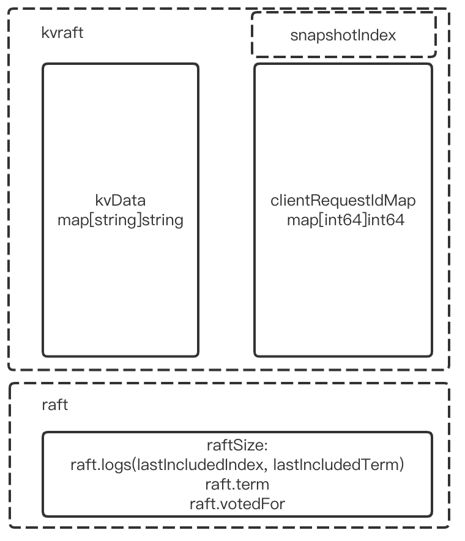
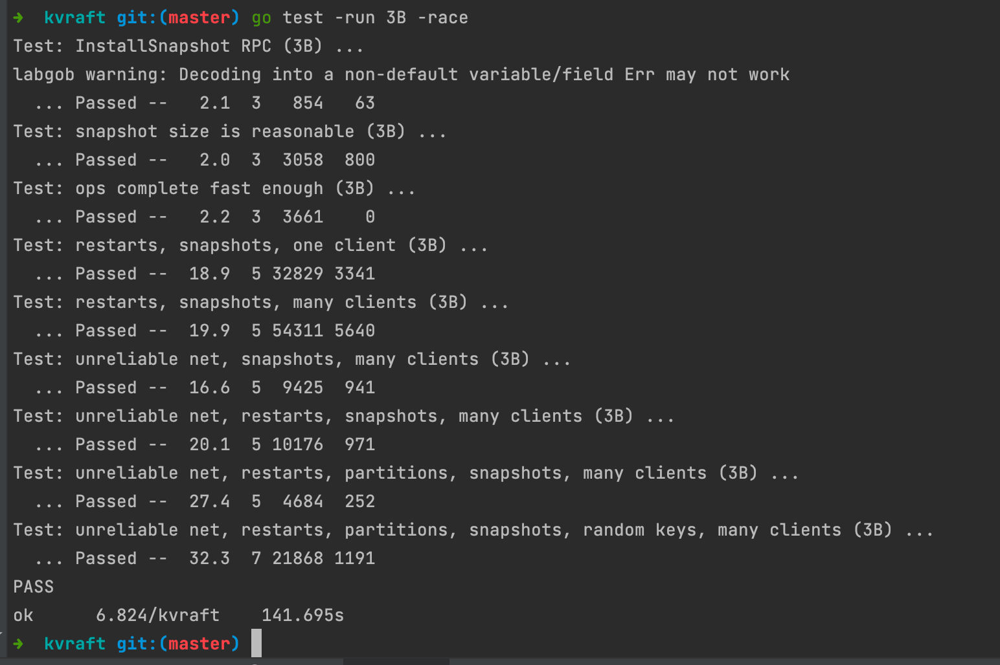

# MIT6.824_2021_lab3B_kvraft_with_snapshots

## Part B: Key/value service with snapshots

紧接着 lab3A，将键值存储服务的快照功能加上，这里的代码量不多，主要是对lab3A，和 raft 一些细枝末节的改动，让整体代码更可读，但还是发现了一个 raft 初始化的 bug，导致自己卡了一会，不过也加深了自己对 persist 这一部分的理解

## 实验内容

首先要知道，重启的服务器会执行一次完整的Raft日志以恢复其状态，但是，raft 日志不可能永远增长(和 lab2D 一样)；

使用Raft的`Snapshot()`和来自lab 2D的`CondInstallSnapshot`来节省空间

启动 server 时将`maxraftstate`传递给`StartKVServer()`。`maxraftstate`表示允许的持久Raft状态的最大字节大小(包括`raftState`，但不包括快照)。使用`maxraftstate`和`persister.Raftstatesize()`做比较。

每当kv服务器检测到Raft状态大小接近这个阈值时，使用`Snapshot()`保存一个快照，而snapshot又使用`persister.Saveraftstate()`。如果`maxraftstate`为-1，则快照功能关闭。

kv server 检测持久化的Raft状态何时变得过大，然后将一个快照交给Raft。当kvserver服务器重新启动时，它应该从persister读取快照并从快照恢复其状态。

## 实验提示

- 考虑一下kvserver什么时候进行快照，快照中应该包含哪些内容。Raft使用`SaveStateAndSnapshot()`将每个快照以及相应的Raft状态存储在持久对象中。您可以使用`ReadSnapshot()`读取最新存储的快照。
- kvserver 重启后必须还能照常检测出重复请求，因此重复请求检测状态也必须包含在快照中。
- 大写......
- raft 可能会有 bug，fix 它并通过 lab3, lab2 所有测试
- Lab 3测试所需的合理时间是400秒的实时时间和700秒的CPU时间。此外，测试运行`TestSnapshotSize`所需的实时时间应该少于20秒。
- 您的代码应该通过3B测试和3A测试(并且Raft必须通过Lab 2测试)。

## 实验思路

### 使用到的 API

根据实验内容和实验提示总结，所使用到的 API 有：

- Raft
  - Snapshot
  - CondInstallSnapshot
- Persister
  - RaftStateSize
  - ReadSnapshot

### 需要持久化的状态

而所需要持久化的状态由：

- kv键值对的 data
- 重复请求检测的 map[clientId]requestId
- kv.snapshotIndex (优化用)

如下图：

其实这里的导出`kvState`和安装快照`installSnapshot`的逻辑，可以仿照lab2D 的encoder 和 decoder 的逻辑写出

### 何时进行持久化

有两种情况的持久化，分为主动和被动

主动：这里我的实现是，从`applyCh`中每次拿到 msg 之后，如果是`CommandValid`，则说明raft 的状态增加了，主动检测一次是否达到了`maxraftstate`，是则主动调用`Snapshot`

被动：从`applyCh`中拿到的是`SnapshotValid`，则证明是 leader 发来的安装快照信息，主动调用`CondInstallSnapshot`，并根据返回的 ok 确认是否安装该快照

## 引入的bug

在 raft 的`Make()`初始化的时候，如果检测到有快照信息，则将 raft 的logs 丢弃，然后新生成一个以快照结尾信息为下标0的空数组 logs；这是不行的，每次持久化的时候，并不是完全将 raft 的logs 清空掉的，而是`[0, lastIncludedIndex] (lastIncludedIndex, end)`，其中`[0, lastIncludedIndex]`已经转化为上层的`snapshot`丢弃掉了，但是`(lastIncludedIndex, end)`还是作为了 raftSize 的一份子持久化了，当重启之后，raft 会重新 apply `(lastIncludedIndex, end)`这些 logs 的残党，上层 service 需要重新应用；即除了将信息持久化保存下来以外，service 重启之后不需要从0开始 apply 了，而是从 `lastIncludedIndex` 开始

## 改进的点

之前 lab3A 的实现里，引入的是一个`make(chan Op, 1)`的`waitCh`，因为这些 chan 问题，导致引入了 lab3A 里的 bug 2,3,4。。。

在 lab3B 中，我将`waitCh`改为仅起到通知作用的`make(chan struct{})`；当处理完`CommandValid`之后，判断是否有对应的`waitCh`，有则直接 close 掉，通过使用`close(waitCh)`，实现通知的效果，而不再需要担心什么死锁阻塞问题了；

而判断`op != opFromCh`的 msg 不匹配问题，变成了直接调用`GetState()`然后判断`!isLeader || term != currentTerm`，也可以达到同样的效果

## 实验结果

当然了，需要回归测试一次 lab3 和 lab2

## 感想

有时候被一些 bug 阻挠了很久，当解决之后，发现是多么小的一个小细节，真的想锤死自己，焯！

lab4 需要暂告一段落了，毕业的答辩通知来了，再不搞毕业的事情，就要毕不了业了QAQ

