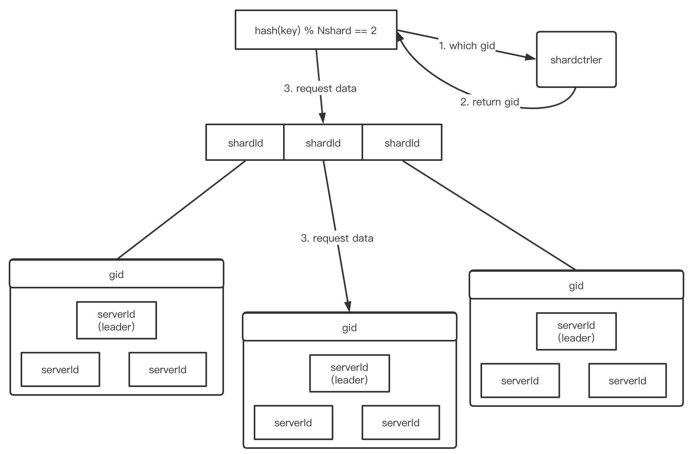
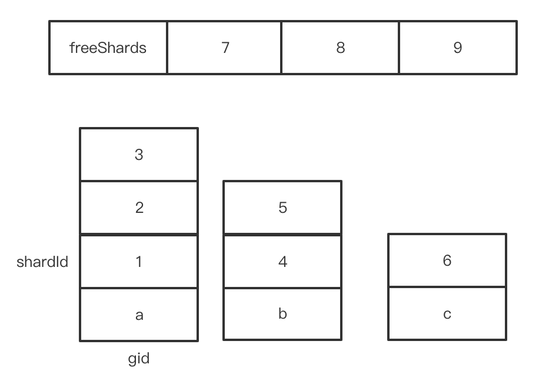
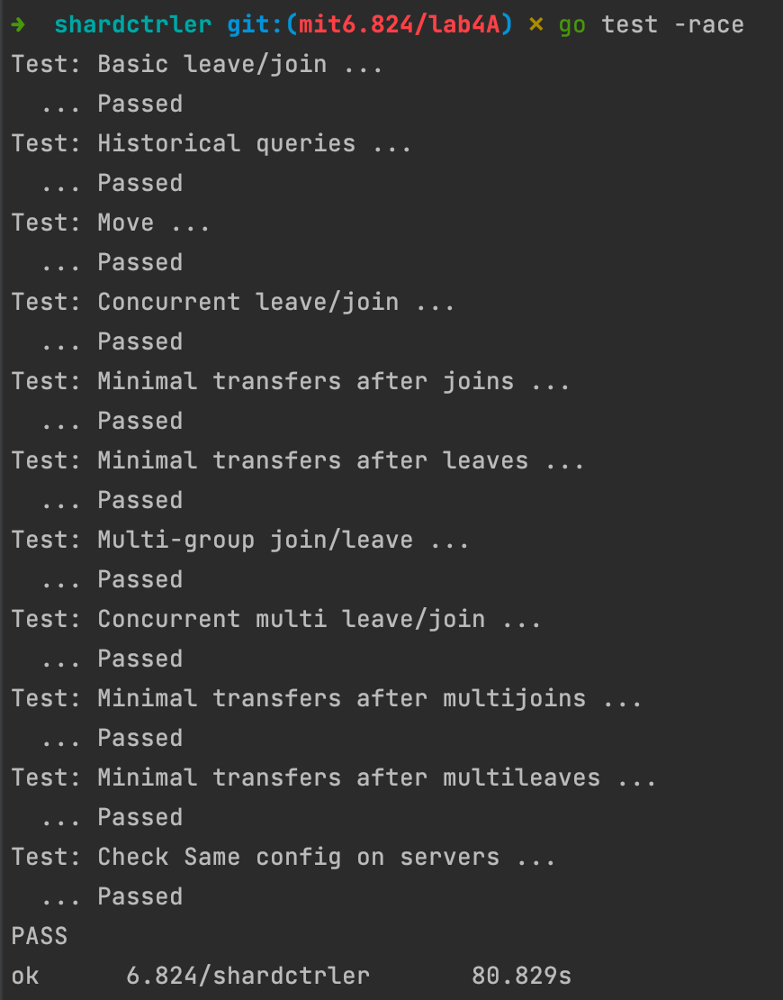

# mit_6.824_2021_lab4A_The_Shard_controller

lab4 系列除了构建一个 键值存储系统，还需要将系统按键 分片(shard) 或对一组副本进行分区；

分片的策略有很多，比如：所有以 "a" 开头的键是一个分片，所有以 "b" 开头的键是一个分片，等等

为什么需要分片？从性能考虑，每个副本只处理一部分分片的 put 和 get，并且这些副本之间是支持并行操作的；因此，系统的总吞吐量和副本的数量成比例增加

### shard kv 系统组成

分片键值对存储系统将由两个组件组成；

首先是一组副本，每个副本负责处理分片的一部分。一个副本由使用 raft  副本组分片的服务器组成。

第二个组件是 分片控制器，分片控制器决定哪个副本组对应服务哪个分片，即管理配置信息。配置随时间变化，客户端咨询 分片控制器，寻找对应 key 的副本组，而 副本组会请求控制器，以找到需要装载的分片。分片控制器是单例，采用 raft 实现容错。

### shard kv 系统功能

分片存储系统必须能在多个副本组之间转移分片，需要支持该功能的原因是：一某些组的负载可能会比其他组重，移动分片来实现负载均衡；二是某些组可能会加入或退出系统，又或者增加新的组以增加分片容量，或将已有的副本组下线修复

### 实验挑战

处理重新配置功能，即将分片重新分配给副本组。在一个副本组中，所有组成员必须就客户端的请求在进行重新配置时达成一致。如，请求在重配置的同时到达，重配置导致副本组不再对持有该键的分片负责。所以组中的所有副本服务器必须就请求在重配置前还是后达成一致，如果在重配置前，则请求生效，分片的新所有者需要看到生效效果。否则，请求无法生效，客户端必须在新所有者处重新请求。

推荐的方法是，让每个副本组使用 raft，不仅记录请求的序列，还记录重配置的序列；需要确保在任何时间最多只有一个副本组为所有分片提供服务

重配置还涉及到副本组之间的交互，如在配置编号10中，G1组负责分片S1，配置11中，G2组负责分配S1。在10到11 的配置变换过程中，G1和G2需要使用RPC将分片S1内容做迁移

> 只有RPC可以用于客户端和服务器之间的交互。服务器的不同实例不允许共享Go变量或文件，逻辑上是物理分离的

> 重配置将分片分配给副本组，重配置不是 raft 集群成员变更，我们不需要实现 raft 集群成员变更

### 关于生产环境

这个实验的通用架构：一个配置服务和一组副本；与Flat Datacenter Storage、BigTable、Spanner、FAWN、Apache HBase、Rosebud、Spinnaker和其他许多通用模式类似。

但是生产环境中的系统更复杂，功能更强；例如，lab 中不会变更每个 raft 组中的服务器集合（成员变更），其数据和查询模型也十分简单（目前是简单的 kv 存取），分片切换速度很慢，还不允许客户端并发访问（如何客户端允许并发，那之前lab3 的线性一致性不能得到保证了）

> lab4 和 lab3 都需要使用相同的 raft 实现，需要回归测试

## PartA_The_Shard_controller

在`shardctrler/server`中实现分片控制器

其管理一个编号配置序列。每个配置描述一组副本和分配给副本的分片信息。当配置需要更改时，控制器会创建一个新配置。当客户端或服务器需要知道当前（或以往）配置时，会请求控制器

实现 `Join, Leave, Move, Query` rpc

Join rpc，添加新的副本组。shardctrler 创建一个包含新副本组的新配置做出响应；新配置应该做到分片的负载均衡，并尽可能少地移动分片。

### 实验要求

在客户端和服务端实现上述接口，且 shardctrler 必须是容错的，故需要使用 lab2/3 的 raft 库

### 实验提示

- 从一个简化的 kvraft 服务器副本开始
- 实现对分片控制器的rpc的重复客户端请求检测。shardctrler 的测试没有测试这个，但是shardkv测试稍后会在一个不可靠的网络上使用shardctrler;如果shardctrler没有过滤掉重复的rpc，那么将不能通过
- 对于 golang 的map：map 的迭代顺序是不确定的，其次，且 map 是引用对象，需要用深拷贝做复制
- `go test -race`很好用

----

> 以上均整理自 lab 官网：https://pdos.csail.mit.edu/6.824/labs/lab-shard.html

### 实验思路

我理解 shardctrler 是一个分布式 kv 存取系统的配置管理器，作为一个 raft 实例存在，一个 raft 实例又包含几个节点做容错备份处理，但是对外表现成单例，可以直接抄 lab3A 的代码逻辑到 lab4A，然后分别将`Move, Query, Join, Leave`的逻辑补充完整

#### gid, shardId, serverId

里面需要理解的是 gid，shardId，serverId 的区别，如下图



gid 为 group_id，是一个 raft 组的总体 id，一个 raft 组之下又包含若干个 serverId，一个 raft 组对外表现为一个服务，但实际上有若干个节点做容错备份；

> serverId 其实可以用 ip:port 唯一确定了

shardId 指数据分片，一般是数据保存请求之前会 hash 加模一下，确定落在哪个分片中，一个 gid 可以负责多个 shard，但是一个 shard 只能给一个 gid 负责，实验中， shard 恒定为 10 个

#### 请求流程

并且实际生产环境中客户端 Clerk 应该是先请求 shardctrler 获得对应 shard 的 gid，然后请求该 gid 完成数据存储

#### 数据结构

shardctrler 中维护几份上述三个 id 之间的映射，其中 Config 结构体用 slice 维护一份随时间递增的数据

```go
// Config A configuration -- an assignment of shards to groups.
// Please don't change this.
type Config struct {
	Num    int              // config number
	Shards [NShards]int     // shard -> gid
	Groups map[int][]string // gid -> servers[]
}
```

而且还叫我们不要改动，这里面有两份映射了，shardId -> gid，gid -> serverIds；但其实，要顺应实验要求，做到负载均衡，最重要的映射其实应该是 gid -> shardIds，可以通过遍历计算得到，同时，考虑有可能在`Leave`和刚初始化的时候，出现有分片没被分配，这里我还维护一个`freeShard`存放当前没被分配的分片

#### 空间换时间

如果采用根据`Config.Shards`和 `Config.Groups` 遍历计算的方式获取`gid -> shardIds` 的映射，则每次`Join, Leave` 都需要做遍历计算转换，这里我理解 shardctrler 仅保存系统的元信息，不会占用太大内存，所以不如用空间换时间，在内存中维护一份`gid->shardIds`的映射`gid2ShardIdsMap`；不仅如此，我还维护一份`freeShards`，用来暂时存储未分配的 shard，则 shardctrler 维护的数据如下：

```go
type ShardCtrler struct {
	mu      sync.Mutex
	me      int
	rf      *raft.Raft
	applyCh chan raft.ApplyMsg

	// Your data here.

	configs               []Config              // indexed by config num
	clientId2RequestIdMap map[int64]int64       // 去重用
	opDoneChanMap         map[int]chan struct{} // 请求通知
	gid2ShardIdsMap       map[int][]int         // 空间换时间：gid -> shardIds
	freeShards            []int                 // 空间换时间：空闲的分片
}
```

#### 负载均衡

实验要求尽可能少地移动分片，并且尽量让分片分配均匀；我们现在已经有了`freeShards`和`gid2ShardIdsMap`了，可以很直观地知道哪些分片没分配，哪些 gid 获得的分片很少甚至是没有分片了，可以先在纸上画一画



则流程很清晰，如下：

1. 从`gid2ShardIdsMap`中找到最少分片的 `minGid`；
2. 若`len(freeShards)!=0`，优先将`freeShards`中的分片分给`minGid`；
3. 重复1，2，再一次寻找`minGid`，直到`len(freeShards)==0`；
4. 此时一定优先分配完了`freeShards`，则继续从`gid2ShardIdsMap`中找到最多分片的`maxGid`和最少分片的 `minGid`；
5. 若`maxGid`的分片数和`minGid`的分片数相差的数量大于一个，则将`maxGid`的一个分片move 给`minGid`；
6. 重复4，5，再一次寻找`maxGid`和`minGid`，直到`maxGid`的分片数和`minGid`的分片数相差一个或相等

以上的流程发生在`Join`和`Leave`更改了 gid 和 shard 信息之后执行

此时 `Move` 操作也可能需要对`gid2ShardIdsMap`处理，需要将旧的`OldGid`中对应的`shard`移除，然后将`shard`append 到新的 gid 中

>  从`gid2ShardIdsMap`中找最多和最少shard 的 gid 时，可以一个 for 一起找出来，不需要遍历两次

引入`gid2ShardIdsMap`和`freeShards`，增加了内存开销，但是不需要即时通过`Config.Shards`和`Config.Groups`做遍历计算了，减少了`Join`和`Leave`的时间开销，但是`Move`的操作变复杂，增加了`Move`的时间开销

### 实验结果



### 感想

lab4A 还是比较 easy 的，但是需要结合 lab4B 一起食用，估计我现在这么想的实现可能会给 lab4B 引入不少坑吧，休息一阵子，等中期考核被怼完了之后，再开坑 lab4B吧QAQ

