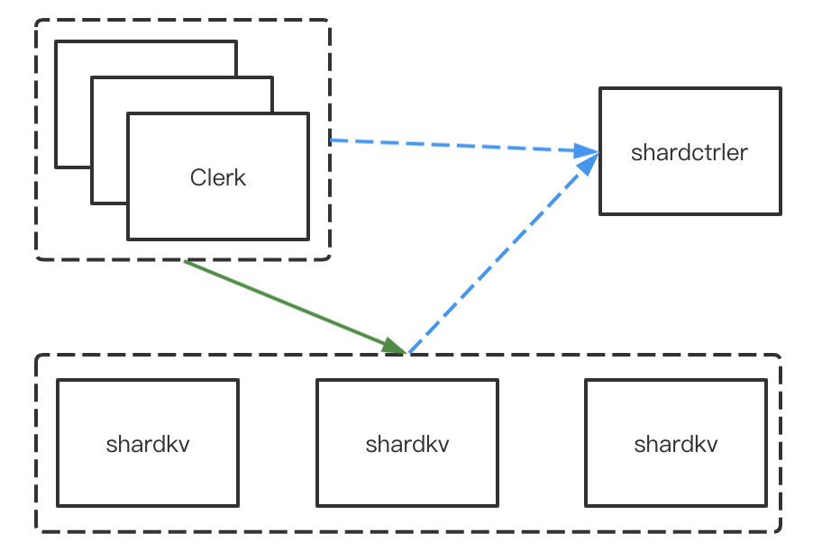
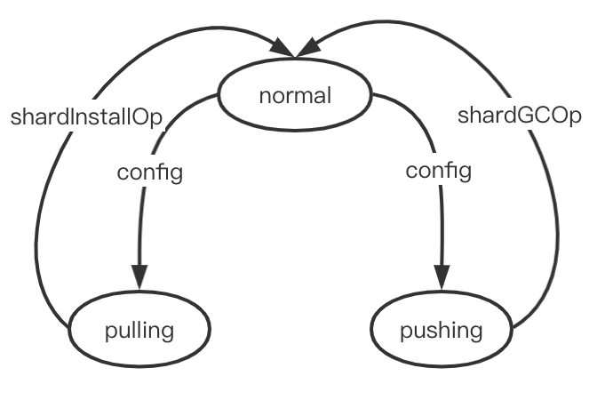

# MIT6.824_2021_lab4B_Sharded_Key/Value_Server

最后，构建一个分片的 kv 容错系统；感觉比 lab2 更难理解，因为 lab2 有一个模板论文可以参考，但是 lab4b 基本没有一个固定的范式

## Part B: Sharded Key/Value Server

每个 shardkv server 相当于副本组的一部分，每个副本组相当于 lab3，都支持`Get, Put, Append`操作，当然它们各自仅维护各自的分片；

客户端使用`key2shard()`去找到一个 key 对应哪个分片；

shardctrler 服务单例将分片分配给副本组；当这个分片分配发生变化时，raft 副本组之间必须互相交换分片，同时确保客户端不会看到不一致的响应。

multi-raft group 作为一个完整的存储系统，需要对外线性一致性，考虑当客户端发起请求和配置更改同时发生时，请求需要无感知响应

### 容错

从大到小的粒度有：整个 kv 系统 + 一个 raft 分片控制器组 > 多个 raft 分片副本组 > 一个 raft 副本组内的各个 server 节点

当一个 raft 组内的大多数能正常通信，该 raft 组可以正常工作；当至少一个 raft 组能和 分片控制器组单例通信时，该分片系统才能正常工作

实现必须能正常运行(为请求提供服务，并能够根据需要重新配置)，即使某些副本组中的少数服务器死机、暂时不可用或运行缓慢（高分区容错性）

### 关于raft 组内的成员变更

一个shardkv服务器仅仅是一个副本组的成员，给定副本组中的服务器集永远不会更改。

即不需要实现 raft 组成员变更

### 关于客户端

Clerk 将每个RPC发送到负责RPC键的副本组；但如果该 key 并不在副本组负责的分片中，副本组会提示 Clerk 重定向；在这种情况下，客户端需要向分片控制器询问最新的配置并重试。参考 kvraft，进行修改；

### 实验要求

首要任务是通过第一个 shardkv 测试；最大的改变是需要让服务器知道配置发生了更改并开始接受新配置分片所属的请求；

#### 配置变更

通过第一个测试之后，需要处理配置变更；

需要让服务器监听配置变更，一旦配置发生变更，需要开始分片迁移过程；

- 若一个副本组卸载了一个分片，其必须立即停止服务该分片的请求，并开始迁移分片数据到新接管的副本组

- 若一个副本组装载了一个分片，其需要等该分片的前任发送完分片数据后开始接收该分片的请求

确保副本组内的所有服务器在同一线性顺序下完成分片迁移，以至于服务器可以同时接受或拒绝客户端请求；

在处理后面的测试之前，您应该集中精力通过第二个测试`join then leave`。当您通过到`TestDelete`(不包括TestDelete)的所有测试时，就完成了此任务。

### 实验提示

- 服务器不需要调用分片控制器的`Join()`，tester 才会去调用；
- 服务器将需要定期轮询 shardctrler 以监听新的配置。预期大约每100毫秒轮询一次；可以更频繁，但过少可能会导致 bug。

- 服务器需要互相发送rpc，以便在配置更改期间传输分片。shardctrler的Config结构包含服务器名，一个 Server 需要一个`labrpc.ClientEnd，`以便发送RPC。使用`make_end()`函数传给`StartServer()`函数将服务器名转换为ClientEnd。`shardkv /client.go`需要实现这些逻辑。
- 在`server.go`中添加代码去周期性从 shardctrler 拉取最新的配置，并且当请求分片不属于自身时，拒绝请求
- 当被请求到错误分片时，需要返回`ErrWrongGroup`给客户端，并确保`Get, Put, Append`在面临并发重配置时能正确作出决定
- 重配置需要按流程执行唯一一次
- labgob 的提示错误不能忽视，它可能导致实验不过
- 分片重分配的请求也需要做重复请求检测
- 若客户端收到`ErrWrongGroup`，是否更改请求序列号？若服务器执行请求时返回`ErrWrongGroup`，是否更新客户端信息？
- 当服务器转移到新配置后，它可以继续存储它不再负责的分片（生产环境中这是不允许的），但这个可以简化实现
- 当 G1 在配置变更时需要来自 G2 的分片数据，G2 处理日志条目的哪个时间点将分片发送给 G1 是最好的？
- 你可以在整个 rpc 请求或回复中发送整个 map，这可以简化分片传输
- map 是引用类型，所以在发送 map 的时候，建议先拷贝一次，避免 data race（在 labrpc 框架下，接收 map 时也需要拷贝）
- 在配置更改期间，一对组可能需要互相传送分片，这可能会发生死锁

## challenge

如果想达到生产环境系统级别，如下两个挑战是需要实现的

### challenge1：Garbage collection of state

当一个副本组失去一个分片的所有权时，副本组需要删除该分片数据。但这给迁移带来一些问题，考虑两个组G1 和 G2，并且新配置C 将分片从 G1 移动到 G2，若 G1 在转换配置到C时删除了数据库中的分片，当G2 转换到C时，如何获取 G1 的数据

### 实验要求

使每个副本组保留旧分片的时长不再是无限时长，即使副本组(如上面的G1)中的所有服务器崩溃并恢复正常，解决方案也必须工作。如果您通过`TestChallenge1Delete`，您就完成了这个挑战。

### 解决方案

在分片迁移成功之后，可以立马进行分片 GC 了，GC 完毕后再进入到配置更新阶段

### chanllenge2：Client requests during configuration changes

配置更改期间最简单的方式是禁止所有客户端操作直到转换完成，虽然简单但是不满足于生产环境要求，这将导致客户端长时间停滞，最好可以继续为不受当前配置更改的分片提供服务

上述优化还能更好，若 G3 在过渡到配置C时，需要来自G1 的分片S1 和 G2 的分片S2。希望 G3 能在收到其中一个分片后可以立即开始接收针对该分片的请求。如G1宕机了，G3在收到G2的分片数据后，可以立即为 S2 分片提供服务，而不需要等待 C 配置转换完全完成

### 实验要求

修改您的解决方案，以便在配置更改期间继续执行不受影响的分片中的 key 的客户端操作。当您通过 `TestChallenge2Unaffected` 测试时，您已经完成了这个挑战。

修改您的解决方案，在配置转换进行中，副本组也可以立即开始提供分片服务。当您通过`TestChallenge2Partial`测试时，您已经完成了这个挑战。

### 解决方案

分片迁移应该是以 gid 为单位，即 `gid -> []shard`，这样即使一个 gid 挂了，也不会影响到另一个 gid 中的分片

----

> 以上总结自实验官网：https://pdos.csail.mit.edu/6.824/labs/lab-shard.html
>
> 不知道什么情况，在 2021 的 schedule 里点进 lab4 ，还是 2020 的

## 实验思路

一开始真的无从下手，信息量太大，看别人的博客文章甚至都不知道问题本身在描述什么；

> 在参考了 https://github.com/LebronAl/MIT6.824-2021/blob/master/docs/lab4.md 的讨论后，有了些许眉目

概括来说，lab4B 需要你实现一个 基于 multi-raft 的分片分布式 key-value 系统，主要包含两个部分`shardctrler`配置管理器，以及`shardkv`分片key-value 系统，架构图如下



并且在行为上：

- 客户端可以和`shardctrler`交互，拿到最新的配置，然后用该配置找到对应 key 的 shard，最终请求服务该 shard 的 group
- 服务端也需要定期和`shardctrler`交互，保证更新到最新配置(monitor)
- 棘手的部分是：测试代码会偶尔执行`Join`，`Leave`等，让某些 group 在系统中脱离，然后各个 group 之间能依照最新配置(lab4A)，做分片的迁移和分片的GC

如果没有第三部分，其实前两部分很好实现

### Clerk

想一切从简，先尝试从 Clerk 改造入手，和 lab4A 引入的概念一样，在 multi-raft 的框架下，变成了一个 group 下包含多个 servers：group_id(gid) -> server_id，并且一个 group 可能负责多个 shard；则 Clerk 的请求逻辑为：

1. 根据`shard`从当前配置中拿到有效的 gid：`gid := config.Shards[shard]`
2. 继续从配置中拿到有效的 group 信息：`group := config.Groups[gid]`
3. 循环：在一个 group 中重复寻找 leader，直到请求成功
4. 若`ErrWrongGroup`或整个 group 都遍历请求过了，则跳出 3. 的循环
5. `Query` 最新的配置，回到 1. 重复

```go
for {
  shard := key2shard(key)
  if gid := ck.config.Shards[shard]; gid != 0 {
		leaderId := ck.gid2LeaderIdMap[gid]
		oldLeaderId := leaderId
    if group, ok := ck.config.Groups[gid]; ok {
      for {
        var reply Reply
        serverName := group[leaderId]
        ok := ck.sendGet(serverName, &args, &reply) // makeEnd & Call
        if ok && (reply.Err == OK || reply.Err == ErrNoKey) {
          ck.gid2LeaderIdMap[gid] = leaderId
          return
        }
        if ok && reply.Err == ErrWrongGroup {
          break
        }
        leaderId = (leaderId + 1) % len(group)
        if leaderId == oldLeaderId {
          break
        }
      }
    }
  }
  time.Sleep(clientRetryPeriod)
  ck.config = ck.sm.Query(-1)
}
```

### server

lab4B 可以理解为将 lab3B 的 kvraft 和 lab4A 的 shardctrler 结合起来，并且需要将 lab3B 的 kvraft 改造为分片的，即原来的 kvMap 不再是整个数据塞进来了，而是变成了类似于`[Nshards]map[string]string`的结构；

除此之外，分片并不是在一个 group 中恒定的，它们会根据配置做动态迁移，则需要制定一个 group 之间的分片迁移方案，这个也是较为棘手的一部分；

另外，在 challenge 中，分片还需要会被定期 GC

先说结论，我将整个 lab4B 的 server 抽象出了几个部分（文件）：`shard`，`op`，`applier`，`monitor`，`snapshot`

#### shard

则可以首先定义底层的分片数据结构`shardData`，并封装出对应的每个分片的方法，如 getter setter 等

```go
// ShardData 每个分片相关的数据，用于 数据读取，请求去重，状态检测
type ShardData struct {
	Status                shardStatus       // 分片状态
	Data                  map[string]string // k-v 存储
	ClientId2RequestIdMap map[int64]int64   // 重复请求检测
}


type shardStatus int

// 分片状态
const (
	shardNormal  shardStatus = iota + 1 // 状态正常，包括不负责的分片
	shardPushing                        // 正在向其他 group 推送 shard
	shardPulling                        // 正在等待其他 group 推送 shard 给我
)
```

分片状态为 分片迁移 和 分片GC 做准备

#### op

在 lab3 中，Clerk 的请求会被包装成一个 Op 传给 raft 层，则在 lab4 中，不难想到，servers 之间的交互，也可以看做是包装成 Op 传给 raft 层；

即 raft 层依旧是保证整个 group 的状态转移是基于副本容错的，可追溯并且线性一致性；即抽象来看，一切让 group 本身信息产生变化的操作都可以包装成 Op 交给 raft 层同步

那么 group 可能会执行的操作包括：

- 客户端请求
- 和`shardCtrler`交互做配置更新
- `groups`之间的分片迁移
- 分片GC

则可以封装出对应的 Op：

- ClientOp（其实就是 lab3 加个 shardId）
- ConfigOp（这里我直接用 shardctrler.Config 做 Op）
- ShardOp（对应分片迁移和分配GC）

```go
// ClientOp 客户端请求操作
type ClientOp struct {
	// Your definitions here.
	// Field names must start with capital letters,
	// otherwise RPC will break.
	ShardId   int    // 访问的分片 id
	Name      string // Get Put Append
	Key       string
	Value     string
	ClientId  int64
	RequestId int64
}


// Config A configuration -- an assignment of shards to groups.
// Please don't change this.
type Config struct {
	Num    int              // config number
	Shards [NShards]int     // shard -> gid
	Groups map[int][]string // gid -> servers[]
}


// ShardOp 分片迁移操作
type ShardOp struct {
	Type          shardOpType               // install 或 gc
	ConfigNum     int                       // 当前配置版本
	ShardIds      []int                     // 访问的分片 id
	Datas         map[int]map[string]string // 分片数据
	RequestIdMaps map[int]map[int64]int64   // 分片去重
}


type shardOpType int

// 分片操作类型
const (
	shardInstallOp shardOpType = iota + 1 // 被动方安装分片
	shardGCOp                             // 主动方 GC 分片
)
```

其中 ShardOp 这样的设计的原因和分配迁移选择的模式有关，下文会有说明

#### applier

其实根据 lab3，我们就已经可以抽离出一个`applier`结构，其为 server 中一个 raft 的`applyCh`的总线，基本所有写操作都在`applier`中实现，并且`applier`有严格的逻辑顺序，根据 Op 的类型的不同，又可以分流出三种处理逻辑

```go
// applier
func (kv *ShardKV) applyEventLoop() {
	for msg := range kv.applyCh {
		switch true {
		case msg.CommandValid:
			kv.doCommand(msg)
		case msg.SnapshotValid:
			kv.doSnapshot(msg)
		default:
		}
	}
}


func (kv *ShardKV) doCommand(msg raft.ApplyMsg) {
	commandIndex := msg.CommandIndex
	if kv.enableSnapshot() {
		if commandIndex <= kv.snapshotIndex {
			return
		}
	}
	kv.mu.Lock()
	respErr := OK
	switch msg.Command.(type) {
  // 处理客户端请求
	case ClientOp:
		respErr = kv.applyClientOp(msg)
  // 处理配置操作
	case shardctrler.Config:
		kv.applyConfigOp(msg)
  // 处理分片操作
	case ShardOp:
		kv.applyShardOp(msg)
	}
	// 注意这里无论是请求有误，或者不服务该分片，都需要将资源释放掉
	if doneChan, ok := kv.opDoneChanMap[commandIndex]; ok {
		doneChan <- respErr
		// close 做通知
		close(doneChan)
		delete(kv.opDoneChanMap, commandIndex)
	}
	kv.mu.Unlock()
	if kv.enableSnapshot() {
		if kv.persister.RaftStateSize() >= kv.maxraftstate {
			kv.rf.Snapshot(commandIndex, kv.kvState())
			kv.snapshotIndex = commandIndex
		}
	}
}
```

除此之外，applier 还需要对各种Op做去重和合法操作，在 lab3 中的表现形式就是`clientId, requestId`，在 lab4 中更抽象来看，不止客户端请求，配置版本号也需要考虑进去

#### monitor

参考别人的博客中的设计，以及原lab 中的提示：

> Your server will need to periodically poll the shardctrler to learn about new configurations. The tests expect that your code polls roughly every 100 milliseconds; more often is OK, but much less often may cause problems.

可以抽离出一个 monitor，用于定期轮询`shardctrler`更新配置 和 定期检测分片状态并作出对于操作（迁移或GC）

这里我用到了两个 monitor 协程，一个更新配置，一个监听分片状态并作出迁移操作；注意，更新配置只有在所有分片状态都正常的情况下才会主动请求`shardctrler`，否则就先执行分片的迁移或者 GC，原因是，当有分片状态不为 normal，则证明在当前 config 下仍有分片未迁移完毕或未GC 完毕，此时不能进入下一个 config

```go
// 监视器，每隔一定时间由 leader 进行定时任务的执行
func (kv *ShardKV) monitor(do func(), timeout time.Duration) {
	for !kv.killed() {
		_, isLeader := kv.rf.GetState()
		if isLeader {
			do()
		}
		time.Sleep(timeout)
	}
}

// leader 周期性监听 shardctrler 的最新配置
func (kv *ShardKV) watchConfig() {
	// 为 leader 并且 现阶段没有待办分片任务
	currentConfigNum, notNormal := kv.hasShardNotNormal()
	if !notNormal {
		// bug情况：Query 一直阻塞，ErrWrongLeader 全 false
		// bugfix: lab4A 不要使用 ErrWrongLeader bool，因为零值是 false，可能会引起不必要的 bug
		nextConfig := kv.sc.Query(currentConfigNum + 1)
		if currentConfigNum+1 == nextConfig.Num {
			// 将分片状态更改，从而 让另一个监听线程，触发分片更新
			// 拉取新的分片，将旧分片删除掉，都要走 raft
			err := kv.startAndApply(nextConfig)
		}
	}
}

// 分片迁移采用 push 模式
func (kv *ShardKV) watchShardAndMigrate() {
	shardsNeedPush := kv.shardsWithStatus(shardPushing)
	// 有分片需要推送给其他 server
	DPrintf("[watchShardAndMigrate] %v %v", kv.num(), shardsNeedPush)
	var wg sync.WaitGroup
	for gid, shardIds := range shardsNeedPush {
		wg.Add(1)
		go func(innerGid int, innerShardIds []int) {
			defer wg.Done()
      // 执行分片迁移
			kv.callMigrateShard(innerGid, innerShardIds)
		}(gid, shardIds)
	}
	wg.Wait()
}
```

### 分片迁移

关于分片迁移，可以想到有 push 或 pull 模式，在和大佬的讨论后，决定采用 push 模式

> https://github.com/LebronAl/MIT6.824-2021/issues/11

原因如下：

> 考虑 push 模式和 pull 模式的不同：
> 如果是 push 模式，存在 G1 和 G2，G1 需要 push 分片数据给 G2，push 成功后需要 GC，即：
>
> G1 ===== push args ======> G2
>
> G2 Start -> apply
>
> G1 <==== push reply ======= G2
>
> 一次 rpc 即可知道 push 成功了，随即 G1 即可进行 GC
>
> G1 Start GC -> apply
>
>
> 如果是 pull 模式，G1 需要从G2 pull 分片数据，pull 成功后，G2 需要 GC，即：
>
> G1 ===== pull args ======> G2
>
> G1 <===== pull reply ====== G2
>
> G1 Start -> apply
>
> G2 并不能明确 pull reply 是否真正到达，只有 G1 才可以明确，所以需要 G1 再发送 GC 的通知，G2 接收到后方可GC
>
> G1 ===== GC args =====> G2
>
> G2 Start GC -> apply
>
> G1 <===== GC reply ===== G2
>
> 初步猜想，各有利弊，push 模式比 pull 模式少一次 rpc 调用

push 模式比 pull 模式少一次 rpc 调用，并且 pull 模式需要保留上一次的 Config 信息，push 模式不需要

则基于 push 模式的关于分片的状态转移图，如下所示：



分片迁移，清理中，原实现是逐个 shard 做操作，其实应该是逐个 gid 做操作，将同一个 gid 的不同 shard 聚合成 `map[int][]int`，然后统一一组 shards 做操作，统一迁移，统一清理，增加吞吐量

一次正常的更新配置，然后分片迁移和GC的完整流程应该是：

1. group 发现所有分片状态正常，拉取新配置
2. 使用 raft 执行配置更新，发现有分片需要 push 或者有分片需要等待别人push 给我
3. 将需要 push 的分片 push 给其他 group
4. 其他 group 安装分片，并成功返回
5. push 成功，可以立即使用 raft 开始 GC 分片
6. GC 完毕，至此所有分片重回 normal

使用 push 模式的话，则 server 之间的 rpc 交互逻辑可以写出：

```go
type ShardReceiveArgs struct {
	ConfigNum              int
	ShardIds               []int                     // 一次性向 gid 推送需要拉取的所有shards
	Datas                  map[int]map[string]string // 待推送的所有 shard 数据
	ClientId2RequestIdMaps map[int]map[int64]int64   // 待推送的所有重复检测数据
}

type ShardReceiveReply struct {
	Err Err
}

// MigrateShard Push 模式
// MigrateShard server 之间的通讯，push 模型，故需要防止重复的 push
func (kv *ShardKV) MigrateShard(args *ShardReceiveArgs, reply *ShardReceiveReply) {

	// 1. 合法判断，判断是否为 leader，判断 configNum
  doSomething()

  // 2. 安装分片，执行 shardOp
	// 我这边为 pulling，调用方为 pushing
	shardOp := ShardOp{
		Type:          shardInstallOp,
		ConfigNum:     argsConfigNum,
		ShardIds:      shardIds,
		Datas:         args.Datas,
		RequestIdMaps: args.ClientId2RequestIdMaps,
	}
	reply.Err = kv.startAndApply(shardOp)
}
```

## 引入的 bug

1. 数据竞态：labrpc 框架下，rpc 的 args 和 reply 数据都需要深拷贝；原来的实现里接收 reply 的数据是直接赋值到 shard，导致数据竞态，在 labrpc 框架中，这样做会导致数据竞态
2. 活锁：lab4A 引入的 bug，在检测到重复请求后，没有 close doneChan，导致一次 ErrTimeout 之后每次都 ErrTimeout了，所以，doneChan 无论如何都要释放掉
3. expected 5 completions with one shard dead; got (3/4)：这个问题我是将 serverTimeout 从 2s 减少到了 500ms，因为看到测试代码中的超时计时就是 2s

## 疑问

#### multi-group 之间的木桶效应

在 monitor 中，检测到有不为 normal 状态的 shard 则不会拉取最新配置做配置更新，则必定会有 group 的分片迁移或GC 任务并未完成，其他 group 即使升级到更高的 config，也可能需要等待 configNum 低的 group 完成分片任务，整个系统才会滚动向前并整体可用；

但无论分片迁移使用的是 push 还是 pull，在这里我有一点自己的疑问，不知道这样考虑是否正确

>configNum: []int (index: shardId, value: gid)
>
>1: [100, 100, 100]
>
>2: [100, 101, 102]
>
>3: [100, 100, 100]
>
>4: [100, 101, 102]
>
>当 gid 为 101 的 group 直接 shutdown 了，然后从 configNum 0 开始重放（如果没有 persister 做快照）
>
>如果是 pull 模式，101 在 conigNum 2 会 pull 100 的1号分片，在 configNum 3 时，101的 1 号分片又一直为 BePulling，等待 100 的 pull ，但是 100 在 configNum 4， 然后 101 就一直卡在 configNum 3 了
>
>如果是 push 模式，在 configNum 2 时，101 的 1 号分片为 BePushing，一直等待 100 的 push，但是 100 和 102 都在 configNum 4 了
>这个重放的问题是否会发生？

我使用 push 模式，测试都可以通过，如上顾虑的疑问并没有发生

## 实验结果


有点小慢，看lab都是 100s 刚出头，后续想起来了再重构一下

## 感想

完结撒花🎉

lab4B 的难度应该是整个 lab 系列最大的，但是我在设计方案上参考了别人的实现，比起 lab2，可以有一份论文做为参考，lab4B 基本没有可以参考的细节；MIT6.824 真的是神课，一套 lab paper schedule 跟下来，甚至可以写到简历上，什么时候国内的高校教育可以有这样的课程安排呢？感觉遥遥无期

后续还要继续读 paper，上面有一些对 paper 的问题还是值得回答的

