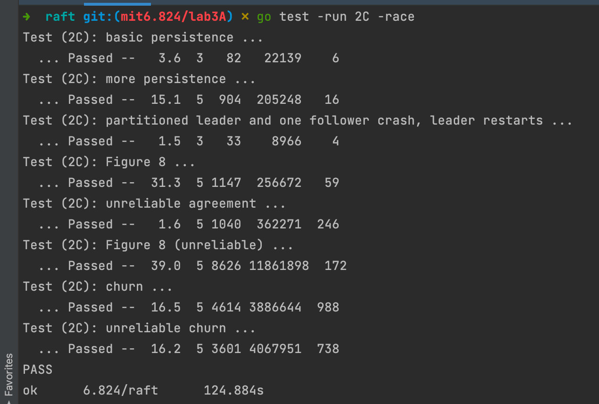

# mit_6.824_2021_lab2C_persistence

persistence 引入持久化，持久化的相关代码已经在 `persister.go` 中实现，我们要做的只是调用 api 就好，相对容易的一节；

但同时也是不容易的一节，因为这一节中有两个关于 图8 的网络崩溃节点崩溃实验，基本都会出 bug，出 bug 基本都是因为 lab2A 和 lab2B 引入的 bug；

本人也因为 lab2B 引入的 bug 导致在 lab2C 卡了很久；这里阐述一下自己的心路历程

## lab2C_persistence

### 实验内容

1. 在 raft.go 中实现 `persist()` 和`readPersist()`，需要将状态编码为字节数组，并调用`Persister` 的api；参阅`persist()`和`readPersist() 中`的注释即可，且在 go 中不要使用小写字段名称对结构进行编码，否则会错误
2. 在对论文图2中需要持久化的状态更改时调用`persist() `

### 实验提示

- 建议使用 go-test-many.sh 脚本多测几次，有时候 pass 只是偶然
- 实现  nextIndex 优化，可以参考助教的 guide
- 虽然 2C 只要求实现持久性和快速日志回溯，但 2C 测试失败可能与之前的实现部分有关。即使你通过了 2A 和 2B，但是 2C 也可能会失败

### 实验思路

#### 持久化

论文图2已经很清楚地说明了什么数据需要持久化，我这里的实现是设置一个 setter 做行为拦截，最后都需要调用`persist()`，在需要修改这些属性的地方统一调用的是 setter 而不是直接更改，这样持久化就不会入侵主流程逻辑了；

并且对 `log[]`封装 setter 很有必要，lab2D 快照的引入会导致日志条目的下标逻辑需要改造

#### nextIndex 优化

需要改造`AppendEntries`以及其请求体和返回体，添加`ConflictIndex`和`ConflictTerm`字段

需要阅读助教的 guide，其中有一段原文为：

> - If a follower does not have `prevLogIndex` in its log, it should return with `conflictIndex = len(log)` and `conflictTerm = None`.
> - If a follower does have `prevLogIndex` in its log, but the term does not match, it should return `conflictTerm = log[prevLogIndex].Term`, and then search its log for the first index whose entry has term equal to `conflictTerm`.
> - Upon receiving a conflict response, the leader should first search its log for `conflictTerm`. If it finds an entry in its log with that term, it should set `nextIndex` to be the one beyond the index of the *last* entry in that term in its log.
> - If it does not find an entry with that term, it should set `nextIndex = conflictIndex`.

建议直接读英文版，先按逻辑自己实现一次

已经说明地很清楚了，只要照做就能实现，只是这里不理解为什么，梳理之后，逻辑如下：

- 若  follower 没有 `prevLogIndex` 处的日志，则直接置 `conflictIndex = len(log)`，`conflictTerm = None`；
  - leader 收到返回体后，肯定找不到对应的 term，则设置`nextIndex = conflictIndex`；
  - 其实就是 leader 对应的 `nextIndex` 直接回退到该 follower 的日志条目末尾处，因为 prevLogIndex 超前了
- 若 follower 有 `prevLogIndex` 处的日志，但是 term 不匹配；则设置 `conlictTerm`为 prevLogIndex 处的 term，且**肯定**可以找到日志中该 `term`出现的第一个日志条目的下标，并置`conflictIndex = firstIndexWithTerm`；
  - leader 收到返回体后，**有可能**找不到对应的 term，即 leader 和 follower 在`conflictIndex`处以及之后的日志都有冲突，都不能要了，直接置`nextIndex = conflictIndex`
  - 若找到了对应的term，则找到对应term出现的最后一个日志条目的下一个日志条目，即置`nextIndex = lastIndexWithTerm+1`；这里其实是默认了若 leader 和 follower 同时拥有该 term 的日志，则不会有冲突，直接取下一个 term 作为日志发起就好，是源自于 5.4 safety 的安全性保证

如果还有冲突，leader 和 follower 会一直根据以上规则回溯 nextIndex

#### 引入的 bugs

1. 晦涩难懂的代码：在写日志强制覆盖写的时候，写了一段以下标变换的自以为很秀的代码，结果就是晦涩难懂，最后重构成简单易懂的分类讨论
2. nextIndex 优化：在找 nextIndex 优化的指定下标时，默认了 term 连续，这里 term 很可能不是连续的，有可能会找不到
3. 正确处理 rpc 请求：在 发送 rpc 请求 和 处理 rpc 返回体时都需要判断一次自身状态，即`currentTerm`和`state`；举个例子，本人遇到的 bug 是，一个陈旧的 leader 在广播后，接收到第一个 follower 的 reply，其 term 是比自身的 term 要大的，陈旧 leader 变回 follower，并且 term 更新，但是因为仍在广播，在发送第二个 rpc 请求时，若没有检查自身状态，则会以 follower 的身份将错误的 log 发送给其他 follower，导致 apply error

### 实验结果

### 感想

讲道理，lab2C 的内容其实算是很少的了，但是本人因为 lab2B 引入的bug，导致 lab2C 卡住的时间是最久的；真的，要设计封装好代码，不要写晦涩难懂的，然后遇到 bug 只能多打日志，在上千行日志里找逻辑错误

