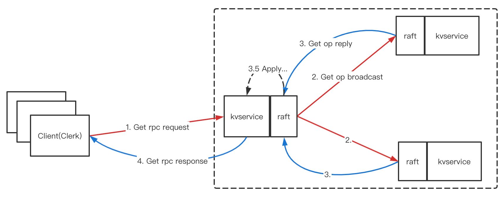
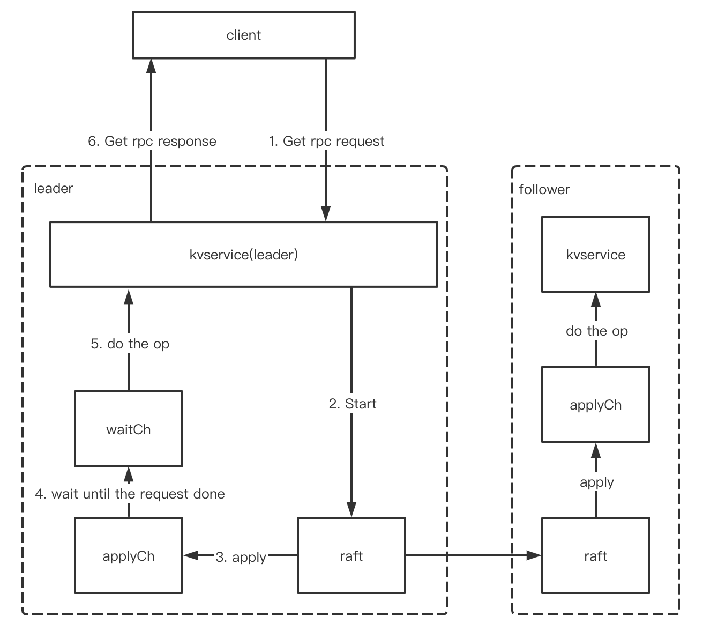
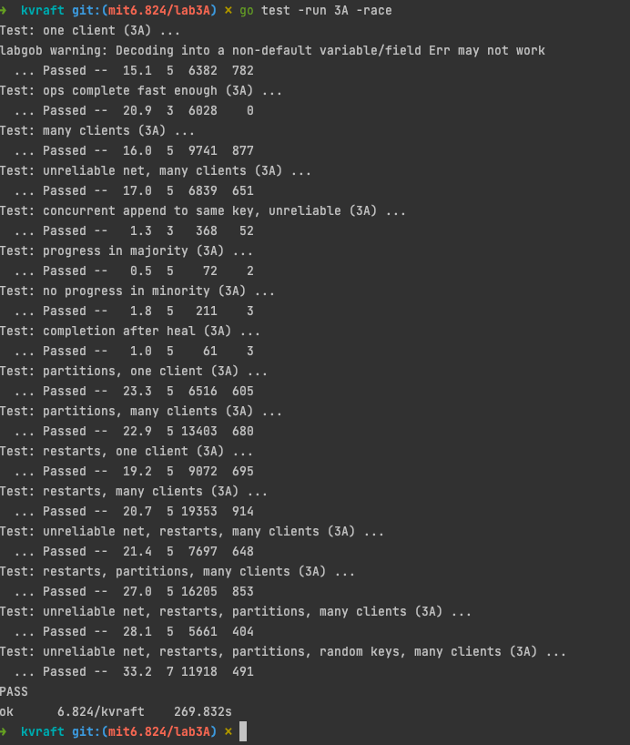

# mit_6.824_2021_lab3A

## mit_6.824_2021_lab3A_kvraft

lab3 系列是将此前写好的 lab2 的 raft 库加以调用，在此基础之上实现上层的状态机，即 service 层；所以，lab2 写得不好，lab3 怎么也过不去，故需要确保 lab2 基本万无一失；

但是在此基础上，还需要依靠 service 层实现线性一致性，lab3 工作量不大，但是还是需要有良好的设计

>参考了网上的部分博客和思路
>
>https://blog.csdn.net/qq_40443651/article/details/117172246
>
>https://www.codercto.com/a/84326.html

### lab3A_Key/value_service_without_snapshots

### 实验内容

1. 使用 lab2的 raft 库构建一个 kv 服务端，是一个复制状态机，以及一个客户端 Clerk

2. kv服务支持三种操作：Put, Append, Get。通过在内存维护一个简单的键/值对数据库，键和值都是字符串；

   对于不存在的键的Get应该返回一个空字符串。对不存在的键的 Append 应该类似于Put

3. 符合强一致性，即线性一致性

### 实验提示

客户端有时会不知道谁是 leader。lab3 的要求仅需要换个 server，重试即可；如果操作未能提交(例如，如果leader被替换了)，服务器就会报告一个错误，然后Clerk会使用另一个服务器重试。

你的kvservers不应该直接通信，它们只能通过Raft进行互动。这句要求，在构建上层 service 就有体会，共识协议让分布式系统对外表现得像一个副本一样。

#### 定义 Op

Op 是上层 service 和 raft 之间交互的语义日志， 通过 `Start()` API 向Raft日志中输入一个Op，需要使用 Op 描述Put/Append/Get操作；

每个服务器都应该在Raft提交Op命令时执行它们，即当它们出现在`applyCh`时。

当Raft提交它的Op时，leader 与 follower 不同之处在于，需要通知 RPC处理程序并作出响应。

- 小心 kvserver和它的Raft库之间的死锁

- 可以添加 Raft ApplyMsg 或rpc(如AppendEntries)的字段，但这应该不是必需的

- 如果kvserver 发生网络分区并为少数派，那么 leader 就不应该响应 RPC请求 (以便它不服务过时的数据)。

  一个简单的解决方案是在Raft日志中输入每个 Rpc 操作，如 Get，Put，Append。

  您不必实现第8节中描述的只读操作的优化(提交non-op，实现 readIndex 算法)。

- 最好从一开始就添加锁

在完成最基本的没有各种故障的测试之后，又有新的测试和提示

#### duplicate requests

duplicate requests：要求所有的 Rpc 请求都是幂等的；考虑这样一种情况，leader 在接收到请求并且提交后，在响应给客户端之前宕机了，客户端需要进行重试，但是其分布式系统里所有 server 都应用了该请求，重试之后的结果应该是幂等

添加代码以处理故障，并处理重复的Clerk请求，包括Clerk在一个term中向kvserver leader发送请求，超时等待应答，并在另一个term中将请求重新发送给新的leader的情况。请求应该只执行一次。

- 上层状态机需要知道自己已经不是leader。考虑这样一种情况：leader 调用了 `Start()`，然后在提交之前，就不是 leader了(真够混沌的)，在这种情况下，需要客户端换机重试。

  一种方案是让 service 检测到其已经不是 leader 了，通过`Start()`返回的同一个索引中出现了不同的`Op`，即此时旧 leader 被新 leader 用新日志替代了（参考 lab2B/C log replication），则此时需要给客户端返回`ErrWrongLeader`信息并提示重试；另一种方案是`Start()`前后的`Term`发生了变化（这里我使用了前前一种）

- 需要唯一地标识客户端操作，以确保键/值服务的每个操作只执行一次

- 重复检测方案应该快速释放服务器内存

### 实验思路

#### 整体架构

还是这张图：[diagram of Raft interactions](https://pdos.csail.mit.edu/6.824/notes/raft_diagram.pdf)

但是这里面隐藏了一些上层 service 和下层 raft 通讯交互的细节，宏观上看，可以理解为下图的流程，以一次Get 请求为例，其中，红线表示请求，蓝线表示响应



并且回忆 lab2  raft 的主从交互方式，follower 的 apply 时机会比 leader 的慢一拍的

从一个服务器角度来看，上层 service 和 下层 raft 的交互细节如下图



图中 leader 比 follower 多出一个 `waitCh` 环节，是因为 leader 需要处理 rpc 请求响应，而 follower 不用，一个很简单的流程其实就是 `client -> kvservice -> Start() -> applyCh -> kvservice -> client`，但是`applyCh`是逐个 commit 一一返回，所以需要明确返回的 commit 对应的是哪一个请求，即通过 `commitIndex`唯一确定一个请求，然后通知该请求执行流程可以返回了。

后台需要用一个`applyEventLoop`去开协程监听`applyCh`是否有msg被提交上来，一旦提交上来，立即顺序执行一个，并且执行完之后按需分发到二级`chan`中

这里的实现是使用`map[int]chan Op`做二级分发，当从 `applyCh`拿到 commit 的 msg 之后，已经 apply 的msg 就可以直接执行了，然后如果是 leader，则还存在一个二级分发的`map[int]chan Op`，对应将`commitIndex`的 Op 分发到一个等待通知的`chan`里，即这里使用 golang 的`chan`做信号量通知的特性

#### duplicate request

重复请求处理，每个 server 内存中除了维护一份 kv 的map，还需要维护一份`map[clientId]requestId`的map，用于重复请求的判定，lab3 里假定了 client 的每一个操作都是同步操作，不会并发执行；

- 这里需要注意的一点是，不能在处理 rpc 请求的一开始就判定是否是重复请求，需要在 Op commit 之后，提交到 data 之前，才去判定请求重复；原因是考虑如下情况：请求leader后，在`Start()`之前设定请求已提交，但是此时发生网络分区，client 会重试，此后重试的 request 被广播到该节点，或者网络恢复重新请求该 leader，都会被视为无效请求，导致该 Op 没有作用到系统上
- Get Op 虽然是读操作，但是和 Put Append 一样，也是需要先`Start()`广播，因为有可能请求的是少数派 leader，此时 Get 读取到的旧数据，所以需要广播得到多数派的认可后，Get 读到的才能保证不过时

从 `applyCh`中拿到 commit 的 msg，必定是系统一致协商好的结果，必定可信，然后此时就可以在每个 server 内部对自己的数据做操作，以及重复请求的判定了。

#### sever timeout

本次实验中，常规的点我都能做出来，反而是一些其他的细节问题让我卡了一会，其中需要考虑客户端调用服务端超时的问题。

一开始我认为超时处理应该放在客户端，调用侧，调用方设定一个定时器，如果超时则再次调用，这很合理吧，可是我使用一个 goroutine 去`Call()`，然后在主协程用`select case <-done`等待调用结束，偶尔会报`data race`的错误，无奈之下我把超时处理转移到 server 端做了

在 `Start` 之后到`applyCh`这段时间内，利用`select case`设定一个超时时间，超时则直接返回`ErrTimeout`让客户端重试，但这也让我引入了一些死锁的 bug QAQ

#### 引入的 bug

1. 对 golang 的 map 的不熟悉导致

在释放`waitCh`的代码里，我加入了一段置为`nil`的逻辑，`waitCh`这里采用了`make(chanOp, 1)`保留一个空间的读阻塞，但写不阻塞的 chan，为了保证`applyCh`的事件循环里能尽量不阻塞地运行，同时处理请求的下游又能阻塞住等待通知。这里置为`nil`以后，再次取`kv.opDoneChanMap[index]`竟然返回了`opChan`的`cap `为0的一个 `chan`，且`ok`为 true，导致了死锁的发生。。。即map里值若是引用类型，置为`nil`会判定为这个map有值，下次取的时候会拿零值，故真正的清除应该是调用`delete`内置方法

```golang
func (kv *KVServer) deleteMsgChan(index int) {
   opChan, ok := kv.opDoneChanMap[index]
   if ok {
      close(opChan)
      delete(kv.opDoneChanMap, index)
      // bug fix: 这里不能置 nil，否则再次取kv.opDoneChanMap[index]时，将会取到一个 len(0) cap(0) 的 chan
      //kv.opDoneChanMap[index] = nil
   }
}
```

2. server timeout 之后，我尝试了也删除 chan，考虑如下情况：`select case`同时满足的情况下，还是会随机选择，而不是有优先级的（TODO：之后可以考虑实现一个有优先级的 select case 库），并且`applyCh`的事件循环和处理请求侧是并发进行的，此时如果 timeout 之后删除`waitCh`的同时，也有`Op->waitCh`了，会发生`panic`，向已经 close 的chan 写。 实现里超时就直接返回错误，不做处理，等下一次 client 重试不超时了，就会又回到对应的`waitCh`，此时再关闭清除即可

3. 如果`Start()`之前的Op和`applyCh`返回的Op 不一致，即对应的 index 里先后的Op不同，则表示leader 已经发生了替换，需要提示 client 重试。我之前的实现里，发现如果不一致，则直接返回重试，不去执行提交的Op了，注意这里即使不一样，也是需要无脑执行已从raft提交的Op，因为这是系统一致协商的结果，可信。这里没有执行新的Op，导致有些请求结果漏掉了，发生了线性不一致性
3. 线性一致性：之前的实现里，leader 和 follower 的处理 applyCh 返回的Op 有一些不一致，leader是`client -> kvservice -> Start() -> applyCh -> waitCh -> kvservice -> process Op -> client`;follower 是 `client -> kvservice -> Start() -> applyCh -> processOp -> waitCh -> kvservice -> client`；这样必定会导致线性不一致性，原因是`waitCh`是非写阻塞的，相当于在往其发送消息时是异步，有可能下一个向`waitCh`发送的消息要比上一个发送的`waitCh`的消息要快（虽然这个在认知里是几乎不可能的）；但是在将`waitCh`放置在`process Op`逻辑之后，leader 和 follower 都变成了`applyCh -> process Op -> waitCh(if have) -> kvservice`；即让异步操作在回复请求之前做，执行Op之后做，线性一致性就pass了，这个基本验证了我的想法；即在回复请求之前，调换顺序是可以接受的，但是Op 调换顺序，则会引发线性不一致性

### 实验结果



### 感想

分布式里还是有很多知识待学习的，比如分布式的基石理论，线性一致性等等

#### 一个小隐患

其他博客里也有提及，我在写的时候也感觉到了，`Start()`之后，才会去构建二级`waitCh`，如果在`Start()`之后，构建二级`waitCh`之前，`applyCh`拿到消息了，则该`waitCh`将永远不会被访问到，但网络IO 一般比代码执行要慢得多，这个几乎不可能发生

