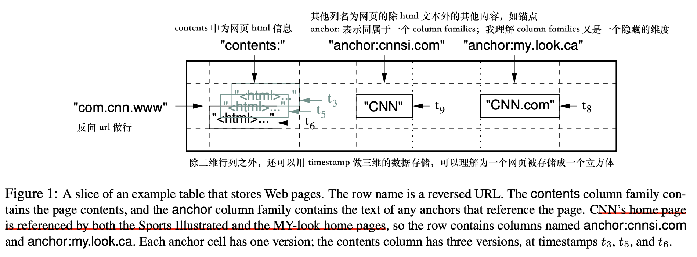
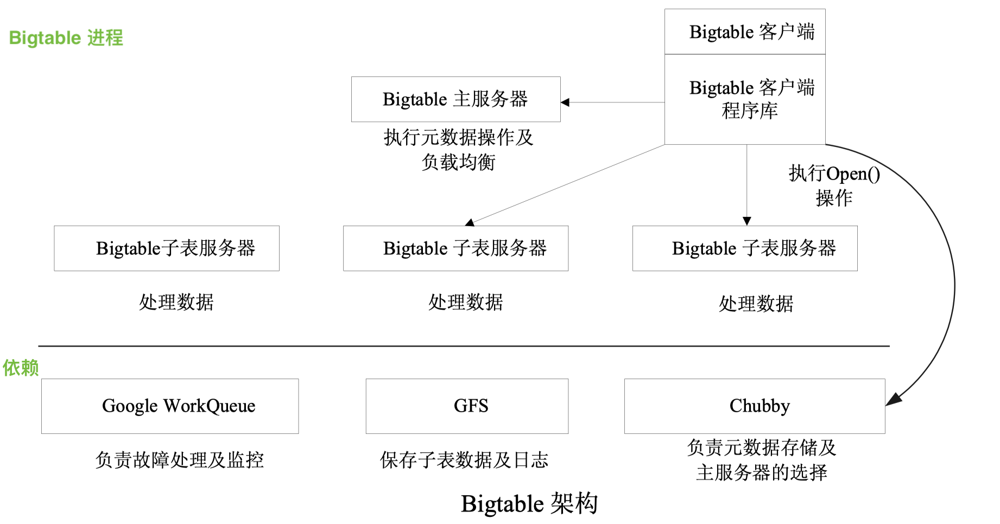

# Bigtable

由于 Spanner 反复提及 Bigtable，并且作为 Google 三大马车之一，有必要拜读一下

GFS-分布式文件系统，MapReduce-分布式数据流式处理框架，Bigtable-分布式结构化数据存储

这篇文章很好地阐明了 Bigtable，LSM，以及设计上的得失：[Bigtable 论文阅读](https://spongecaptain.cool/post/paper/bigtable/)

由于已经总结得很好了，这里挑一些自己在意的知识点做讨论

# 讨论

## 数据的组织形式



初见和一般的二维行列表单不同，更像是 三维的 kv 立方体

```
(row:string, column:string, time:int64) -> string
```

通过 row, column, time 唯一确定一个 value 值

这样的数据模型其实也能理解，Google 最初是做搜索起家，对于一个网页而言，时间方面的版本信息也是需要的，其次是网页基本是字符串组织而成的半结构化数据，一些元数据可以用 anchor families 存，但是网页内部本身是长字符，直接用 contents 存

然后是 url 先 split 然后反转，是因为 url 解析也是从后往前，这样解析 url 有一定区分度

### tablet

tablet 是一段行范围的所有数据，是 分配数据 和 负载均衡 的基本单位；可以理解为水平分表

Master 在 tablet server 之间移动 tablet 实现负载均衡，tablet 也可以根据数据量做自动合并，自动拆分

### column family

列族，我理解为一系列有相同语义信息的列的集合，是 访问控制，磁盘和内存计算 的基本单元

### timestamp

数据的第三维度，通过时间倒排序，可以利用该维度实现历史记录查询，旧版本的自动回收等等

## Bigtable 架构

Bigtable 分布式锁方面依赖 Chubby，我理解是一个类似于 Zookeeper 一样提供以文件 znode 子节点为基础的分布式原子锁服务

底层也依赖 GFS 存储 元数据文件

顶层 Master 服务器同时做 tablet server 负载均衡的控制器

图来自上文博客中



## LSM tree

文中也多次提及 SSTable，并对 SSTable 做了细节方面的优化

关于 lsm tree，这篇博客给了说明：[lsm-tree](https://zhuanlan.zhihu.com/p/38810568)

## 细节优化

论文 **6 Refinements** 中有很多细节上的处理和优化

**Locality groups**

将有可能一起访问到的数据放在同一个 组 里，如页面元数据放同一个组，而页面内容放不同组

**Compression**

对SSTable 数据可以采用两步压缩的方案减小体积

**Caching for read performance**

提供 scan cache 和 block cache

can cache 是高层缓存，它将SSTable接口返回的键值对缓存到 tablet server 中

Block Cache是底层的缓存，用于缓存从GFS读取的sstable块

**Bloom filters**

这篇介绍了布隆过滤器：[布隆过滤器，这一篇给你讲的明明白白](https://developer.aliyun.com/article/773205)

在 SSTable 上加一层布隆过滤器，LSM 常规操作了，通过多 hash 映射到同一位图实现元素判定

若 hash 后有一处为 0，则元素必定不存在；

若 hash 后全为1，只能说明可能存在；

这可以在查找不存在元素的时候不需要读磁盘

**Commit-log implementation**

如果每个 tablet 都用一个 log 文件，会造成大量的文件读写，故这里采用多个 tablet 一个 log 文件，但是同时也会导致对同一个 log 的 IO；

但是为了解决读取 log 恢复过程中的反复读取问题，通过将 log 做排序和连续化处理，提升恢复的性能

对 log 又进行分区并行排序的操作，将 log 划分为 64MB 的段，因此可以通过一个磁盘查找和一个顺序读取来有效地读取

同时，也为了为了防止GFS延迟峰值的变化，每个 tablet server 实际上有两个日志写入线程，每个线程都写入自己的日志文件；在同一时间，这两个线程中只有一个处于活跃状态。如果对活动日志文件的写操作性能不佳，则日志文件的写操作将切换到其他线程，提交日志队列中的变更将由新活动的日志写线程进行写操作。

**Speeding up tablet recovery**

在移动 tablet 之前，做一次小压缩，减少 tablet server 的提交日志中未压缩状态的数量来减少恢复时间

**Exploiting immutability**

SSTable 不可变，所以可以进行并行读，而 memtable 可变，可以使用 COW；

SSTable 不可变性也可以让子 tablet 共享父 tablet 的 SSTable

# 参考

- [Bigtable 论文阅读](https://spongecaptain.cool/post/paper/bigtable/)
- [lsm-tree](https://zhuanlan.zhihu.com/p/38810568)
- [布隆过滤器，这一篇给你讲的明明白白](https://developer.aliyun.com/article/773205)

