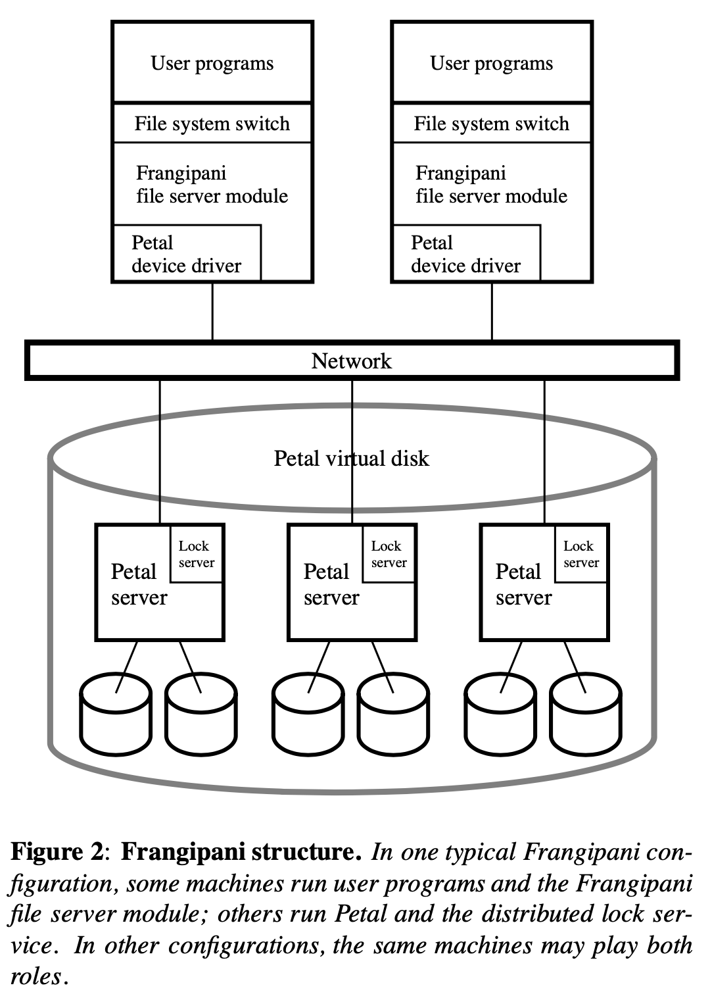
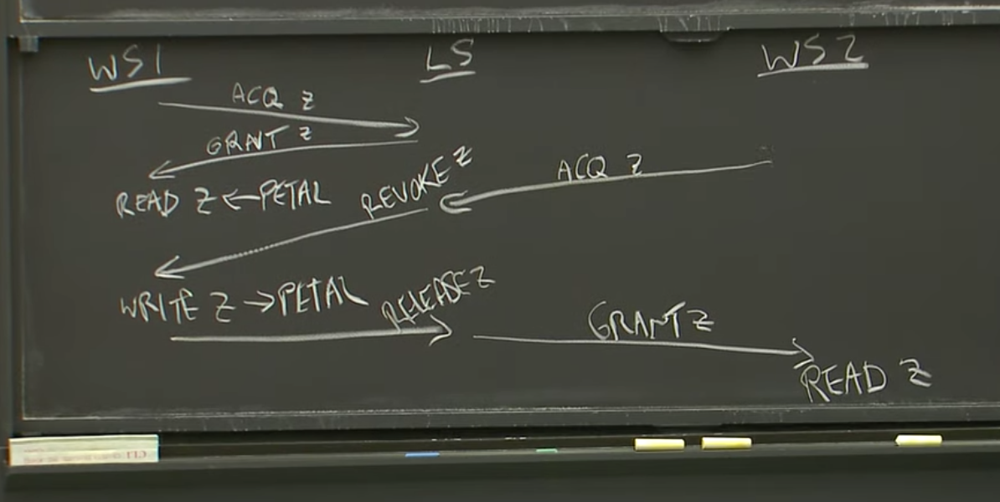

# Frangipani

# Lecture 12

Frangipani: A Scalable Distributed File System: Suppose a server modifies an i-node, appends the modification to its log, then another server modifies the same i-node, and then the first server crashes. The recovery system will see the i-node modification in the crashed server's log, but should not apply that log entry to the i-node, because that would un-do the second server's change. How does Frangipani avoid or cope with this situation?

假设一个服务器修改了 i-node，并将修改 append 到日志中，紧接着另一个服务器修改了同一个 i-node 数据，且第一个服务器宕机。恢复系统将会看到宕机服务器的日志中的 i-node 修改日志，但不会 apply 该日志到 i-node 中，因为这会撤销掉另一个服务器的更改。Frangipani 是如何避免或应对这种情况的？

答：文章中有提及，通过引入版本号，低版本号的 log 在重放的时候会被忽略，就不会导致后续更改被撤销了

# 讨论

Frangipani 是 1997 年的论文，有点年头了；这上面的客户端不是现代的电脑终端移动设备等，而是一种叫工作台(workstation, WS)的只可以对文件进行操作的终端

虽然已经过时，但是其中的一些技术挑战还是可以稍微琢磨一下，文章主要列举了三个挑战：

- 缓存一致性
- 分布式事务
- 分布式故障恢复

## 架构

它的架构也挺有意思的

上层是 Frangipani 提供类Unix文件系统接口

下层是 Petal 和 Lock server 提供分布式磁盘容错服务，总体来看对外表现像一个整体的虚拟磁盘

## 缓存一致性

每个 WS 都会在本地缓存数据，无论读写，故性能会很快，但其为了满足缓存一致性，使用了锁，并且其锁机制如下：

1. 向要读取或修改的目录或文件申请锁
2. 读取或修改数据，并在本地维护一份缓存（和脏数据一致）
3. log 写入 Petal，数据 写入 Petal
4. 之后的读取或者修改都可以先访问缓存，再是做请求，提升效率
5. 一系列操作完，**并不会释放锁**，而是等待其他 WS 请求锁服务器对其释放

其释放锁的方案是，当 WS2 访问了相同的数据，则会先向 Lock server 请求锁， Locker server 查 lock 表，再请求 WS1 回收锁，一切顺利的话，最后才是给 WS2 锁，如下图：

通过引入 锁服务，达到缓存的一致性；但感觉这种不释放锁，通过主动回收锁的方案在并发量高的情况下，Lock server 会频繁地和 WS 之间做交互，这无疑是提升了系统复杂性，并且还要考虑分布式环境的混沌，如果 Lock server 发生宕机或者数据不同步，又会有一堆问题

## 分布式事务

主要提及的是 原子性和隔离性：当 WS1 进行操作时，要么全部执行完毕，要么全部不执行，以及其他 WS 并不会观察到中间状态

同样也是通过使用 锁 进行实现，还引入了 WAL，版本号 等方案

### 原子性

借助 锁 和 WAL实现原子性

在写入真正数据之前，会先向 Petal 写入 write-ahead-log，并且 log 带版本号，等到所有 log 写入完毕，才会进行数据的修改

这里看 schedule 有一个处理方案是，挺有意思：

如果 WS1 此时发生宕机：

- log 和 数据都没写入（这个不讨论，相当于啥都没写入）

- 要么 log 写入完毕，但是数据未写入
- 要么 log 和数据都写入完毕

若 log 和数据都写入完毕，WS2 会因为 WS1 的崩溃而WS1 租约到期，迟早也会获得锁，此时能看到修改后的数据

若只有 log 写入，这里 lock server 会让 WS2 重放 WS1 崩溃前未执行的 log，然后才可以申请获得锁，即 WS2 帮助 WS1 执行了崩溃前的数据写入

即事务内的数据操作要么全部执行，要么全部不执行

### 隔离性

借助 锁 实现了隔离性

WS1 在执行事务时，WS2 是不能获得相应临界区的锁的

这个我感觉非常阻塞操作，Frangipani 原文也有说，后续优化可以是 不去锁整个文件或目录，而是锁一段数据区域，减少锁争用；但这个其实还是存在锁争用，在想是不是可以引入 mysql 的 MVCC，WS2 读旧版本的数据实现隔离性

## 分布式故障恢复

这里的分布式故障恢复，主要借助 WAL 和 版本号 实现

在分布式事务中，已经提及了一部分故障恢复的处理

这里主要考虑一种比较特殊的情况：

- 崩溃了的工作站只写入了与操作相关的部分数据，而不是全部的数据

解决方案是版本号，若不存在版本号；Frangipani 会存在类似 mysql 的幻读情况：

ws1 删除文件，并在释放锁之前崩溃了；ws2 创建了同名文件；ws3 接管 ws1 的 log，将可能会把 ws2 的同名文件删除

引入版本号后：ws3 接管的 ws1 的 log，log 的版本号会比 ws2 的低，自动忽略删除操作

这里可以有一个小优化：可以仅先写入修改的 Log，剩下的 Log 之后再写入，节省时间

## 参考

- [Frangipani: A Scalable Distributed File System 论文阅读](https://www.cnblogs.com/jamgun/p/14668522.html)
- [Frangipani 论文阅读](https://tanxinyu.work/frangipani-thesis/)

