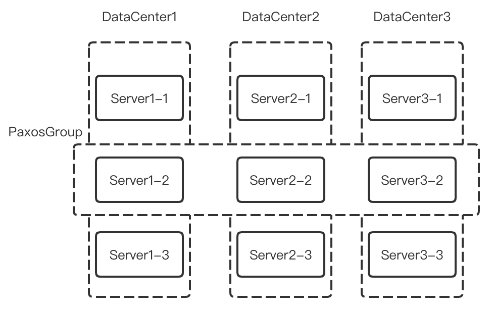

# 《Spanner》论文笔记

本文第一部分解答 Schedule 中的 Question，第二部分是自己对论文的一些讨论

# Lecture 14

Spanner Suppose a Spanner server's TT.now() returns correct information, but the uncertainty is large. For example, suppose the absolute time is 10:15:30, and TT.now() returns the interval [10:15:20,10:15:40]. That interval is correct in that it contains the absolute time, but the error bound is 10 seconds. See Section 3 for an explanation TT.now(). What bad effect will a large error bound have on Spanner's operation? Give a specific example.

Spanner 假设一个 Spanner 服务器的 TT.now() 返回正确的信息，但是其具有较大的误差。例如，假设绝对时间是 10:15:30，且 TT.now() 返回了区间 [10:15:20,10:15:40]。这个区间包含了当前时间，所以是正确的，但是误差范围是10 秒。请查阅第三节 TT.now() 的解释。一个大的误差范围将对 Spanner 的操作有什么不好的影响？请给出特定的例子。

这里问的是 commit-wait；这里的一篇博客：[简单解释Spanner的TrueTime在分布式事务中的作用](https://zhuanlan.zhihu.com/p/44254954)，说明了误差范围越大，commit-wait 时间越长，写延迟变高，吞吐量变低

# 讨论

这篇博客很好地翻译了 Spanner 的前四个章节：[Google Spanner论文解读](http://loopjump.com/google_spanner/)

该系列博客从自己的角度，很好地总结了 Spanner：[理解Google Spanner(3)：分布式事务原理与实现](https://www.jianshu.com/p/45d10cee1773)

Spanner 我初读下来，到第四章节并发控制和 Truetime 那里，就开始读不懂了，还是需要借助老师的视频讲义

Spanner 简短的篇幅但是其中涵盖了大量的知识点，Paxos，分布式事务，外部一致性，借助时钟的事务隔离 等等，等到后面学到了更多，再来二刷

## 架构

跨数据中心 的 multi-paxos，我理解类似一个矩阵

一个 DataCenter(DC) 中的集群基本是跨 Directory 的数据备份，而跨 DC 的负责同一 Directory 的 server group 用 Paxos 共识容错

TiKV 一定程度上借鉴了这种设计，通过 TiKV node 多 Region 的方式做 raft 共识：[TiDB 数据库的存储](https://docs.pingcap.com/zh/tidb/stable/tidb-storage)

这样的架构其实也引入了新的问题，即当涉及跨 paxos group 的分布式事务，需要有分布式事务的设计方案

## 并发控制

这里看论文看得有点懵，主要是结合视频里老师的讲解和网上的博客做理解

### TrueTime, commit-wait

这里有一篇博客只解释 Spanner 中 TrueTime 和 分布式事务的关系：[简单解释Spanner的TrueTime在分布式事务中的作用](https://zhuanlan.zhihu.com/p/44254954)

网上很多博客说这个方案很惊艳，初看论文也不是很能看懂在时间推导上的意思

实现的一个前提是需要有足够强大的硬件，通过 GPS 和 time Master 同步给 Spanner 中的各个 zone，达到时间一致

Spanner 会给数据打上时间戳，类似 MVCC，且也为不同的事务分配时间戳

读写型事务：Prepare 后，事务提交 Commit 前，分配一个时间戳

只读型事务：事务开始后分配一个时间戳

### wound-wait

Spanner 中对死锁的预防

我理解这个不是一个名词，更像是在面对可能发生死锁情况下的两种做法，叫 wound or wait 会更好一点

当两个并发事务AB，A：lock(a) lock(b)；B：lock(b) lock(a)，这有可能死锁

而 wound-wait 的做法是

新事务会等待老事务的 lock (wait)；而老事务发现自己需要的锁被占用了，会直接 abort 掉新事物已经占用的锁(wound)；（但在 spanner 的场景里是怎么决定新老的？）

这里避免死锁也可以简单地通过对 key 排序加锁(TiDB 是这么做的：[Spanner - CAP, TrueTime and Transaction](https://pingcap.com/zh/blog/Spanner-cap-truetime-transaction))

### 事务

#### read-only

通过 时间戳 和 snapshot isolation 做只读事务的外部一致性实现，也存在 Truetime 的调用和 wait

#### read-write

具体流程，[Spanner - CAP, TrueTime and Transaction](https://pingcap.com/zh/blog/Spanner-cap-truetime-transaction)和[Spanner十问](https://zhuanlan.zhihu.com/p/47870235)等诸多博客都有介绍，这里仅梳理下最朴素的情况，方便自己理解

##### 1PC

当只涉及一个分片上的数据时，可以将 2pc 合并为 1pc，但还是涉及 wound-wait 和 commit-wait，只是将 prepared 和 commit 合并了

##### 2PC

当涉及到修改多个分片上的数据，且属不同 paxos group，则需要分布式事务 2PC 处理

1. 首先是若 client 执行读操作，请求所需数据的 group，对应 group 的 leader 会将对应数据的 read lock 拿到，这里也是用的 wound-wait（这里也可以用 follower read 的优化）
2. Prepare：然后执行写操作，client 会选定一个 participant 同时作为 coordinate，并且 Prepared 消息是由 client 发出给所需的 group leader，而不需要 coordinate 再做转发，可以理解是一个细节优化了；（这里过后 coordinate 和 participant 之间会做心跳保持 liveness）
   - Prepare-同一 paxos group内：每个 participant group 的 leader 会将 prepared 消息用 paxos 广播给 follower 并等待大多数 follower的确认信息，apply 后入 prepare log，要记下获取的写锁
   - Prepare-跨 paxos group：在 prepare 过程中，各 participants 会获取到 write lock 和入 prepare log，并最终 coordinate 的 leader 会收到所有 Prepare 信息的 Ack，包括自己的和其他 group 的；
3. Prepared：此时，会调用 Truetime API，用当前的时间戳作为 commit 时间戳；且 coordinate 入自己的 prepare-commit log；prepare 阶段结束，进入 commit 阶段
4. Commit：commit 安全落地到日志后，Coordinate 才将 commit 消息发送给其他数据分片的 Paxos组（这里是从老师的视频讲义中提取到的信息，即 group 内的 follower 多数派返回 commit ack，这是为了保证 coordinate 不忘记事务的阶段）；等到所有 commit 消息接收到 ACK，说明事务提交成功；同时 coordinate 还会并发进行`commit-wait`，直到该事务的时间戳`t > TT.now().lastest_time`，这是为了确保后续的读请求能读到当前更改；之后才会对 client 进行响应

关于 Spanner 中的 Truetime 和 分布式事务的问题，还是有很多地方没理解清楚

# 参考

- [Google Spanner论文解读](http://loopjump.com/google_spanner/)
- [理解Google Spanner(3)：分布式事务原理与实现](https://www.jianshu.com/p/45d10cee1773)
- [Spanner十问](https://zhuanlan.zhihu.com/p/47870235)
- [Spanner - CAP, TrueTime and Transaction](https://pingcap.com/zh/blog/Spanner-cap-truetime-transaction)
- [TiDB 数据库的存储](https://docs.pingcap.com/zh/tidb/stable/tidb-storage)
- [简单解释Spanner的TrueTime在分布式事务中的作用](https://zhuanlan.zhihu.com/p/44254954)

