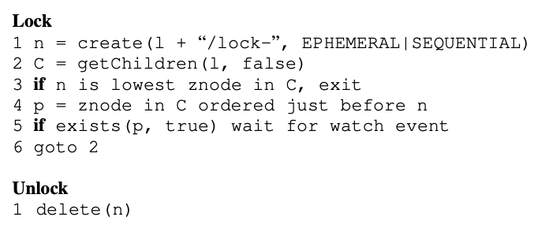
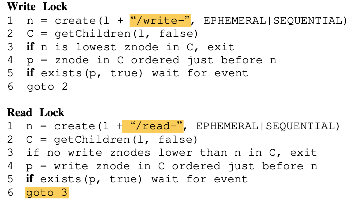
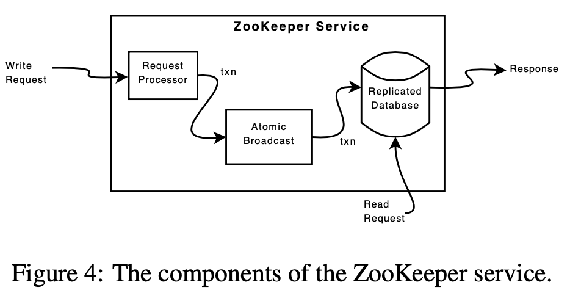

# Zookeeper

本文第一部分先解答 Lecture 9 的提问，第二部分是自己对 Zookeeper 的一些梳理

# **Lecture 9**

One use of Zookeeper is as a fault-tolerant lock service (see the section "Simple locks" on page 6). Why isn't possible for two clients to acquire the same lock? In particular, how does Zookeeper decide if a client has failed and it can give the client's locks to other clients?

Zookeeper的一个用途是作为容错锁服务(参见第6页的“Simple locks”一节)。为什么两个客户端不能获得相同的锁？特别是，Zookeeper如何判断一个客户端的锁是否已经失效，并且它可以将该客户端的锁给其他客户端？

Zookeeper 的思想是通过提供 API 来让开发人员根据业务实现新的原语，而不是直接提供原语，所以其是逻辑上通过维护一个 znode tree，让使用者在这上面玩出花来

Zookeeper 通过逻辑上的树形结构 znode tree 实现锁功能，其给出了三种实现：

- Simple lock(最简单的实现，带有一定局限性，由此引出下一种实现)
- Simple lock without Herd Effect
- Read/Write Locks

##### simple lock

首先最容易实现的方式是一个 znode 表示一个锁，通过在想要锁住的资源下添加子节点 "/lock-"，表示将该资源锁住

为了获取锁，客户端做的操作如下：

1. 尝试创建带有 EPHEMERAL 标志的指定 znode；
2. 如果创建成功，客户端将持有锁；
3. 否则，客户端可以读取带有watch标志的 znode，该标志设置为如果当前leader死亡将被通知；
4. 客户端在锁失效或显式删除znode时释放锁；（什么时候锁失效？）
5. 其他正在等待锁的客户端一旦发现znode正在被删除，就会再次尝试获取锁。

这样的实现简单，但同时也有局限性：

1. 羊群效应：锁可能被许多客户端争抢，均请求抢锁，消耗 网络和 CPU 资源
2. 只能实现排它锁，不能实现读写锁

##### simple lock without herd effect

Zookeeper 推荐的做法是每个客户端按照请求到达的顺序获得锁，即逻辑上维护一个 FIFO 的拿锁队列，文章中给出的伪码像是忙等

1. 使用 EPHEMERAL | SEQUENTIAL 标志创建子节点
1. 获取资源的所有子节点
1. 若 1. 创建的锁节点是最小编号的 znode，抢锁成功
1. 若存在 p 比 1. 的节点编号小
1. 再请求一次是否仍存在 p，存在则 watch p 直到其退出
1. goto 2.

SEQUENTIAL 标志，使得客户端获取锁的操作相对于所有其他操作排序，得到一个唯一编号

通过只观察比客户端的znode的编号更小的znode，我们可以在释放锁或放弃锁请求时只唤醒一个进程，从而避免集群效应。

##### 什么时候锁失效？

如果在获得锁之后发生意外，文章里仅一笔带过：

释放锁与删除表示锁的znode n一样简单。通过在创建时使用EPHEMERAL标志，崩溃的进程将自动清理锁请求或释放拥有的锁。

我这里稍微猜一下 - _ -，如果实现故障检测自动清理锁，可以通过心跳机制，客户端和 Zookeeper 之间维持一定联系，当心跳超时的时候，可以去释放锁清理资源并尝试通知客户端

##### Read/Write Locks

了解了 simple lock withou herd effect 之后，读写锁则相对简单理解，文章里的篇幅也不多，读锁是创建一个 "/read-" 子znode，写锁是创建一个 "/write-" 子znode，并且其逻辑上和排它锁稍微有点不同；

写锁释放后，正在抢读锁的客户端可能会引起羊群效应，但是这是符合要求的，因为读锁本来就支持共同访问

绕回来....所以 Lecture 9 的答案是：

#### 为什么两个客户端不能获得相同的锁？

如果都是读锁，两个客户端可以一起获得，如果是排它锁，znode 通过带EPHEMERAL | SEQUENTIAL 标志创建一个 "/lock-" 子znode 来进行客户端的排他，如果发现有一样的 "/lock-" 子znode 的编号比自己小，则不能获得锁

#### Zookeeper如何判断一个客户端的锁是否已经失效，并且它可以将该客户端的锁给其他客户端？

通过 EPHEMERAL 标志，判断失效就是判断 lock 子 znode 是否被清除，在分配锁的时候，采用的是 FIFO 的原则，先来的客户端会被分配到较小的 znode 编号，按照从小到大的原则优先分配锁

# 讨论

## 1. 介绍

关于 Zookeeper 的一致性的讨论，还有其与 etcd 的对比：[Zookeeper 论文阅读](https://tanxinyu.work/zookeeper-thesis/)

关于 Zookeeper 的详解：[详解分布式协调服务 ZooKeeper，再也不怕面试问这个了](https://mp.weixin.qq.com/s/DwyPt5YZgqE0O0HYEC1ZMQ)，以及[论文阅读-ZooKeeper](https://keys961.github.io/2019/04/01/%E8%AE%BA%E6%96%87%E9%98%85%E8%AF%BB-ZooKeeper/)

我理解 Zookeeper 是偏向元数据或配置管理的分布式协调服务

## 2. znode tree

上层状态机是采用 znode 的树形结构，类似于文件系统那样以路径分层，但实际上是常驻内存的，每个 znode 默认 1mb（可调）；通过提供对 znode tree 的读写 API，从而能让调用者实现各种功能

- 配置管理
- 进程管理
- 成员关系变更
- 锁和读写锁
- 双屏障：类似 waitGroup？

## 3. ZAB

ZAB：[A simple totally ordered broadcast protocol](https://www.datadoghq.com/pdf/zab.totally-ordered-broadcast-protocol.2008.pdf)

raft 和 ZAB 还是有很多类似的地方和区别：[Raft Vs Zab](https://www.jianshu.com/p/24307e7ca9da)

ZAB 通过 zxid 唯一确定一个提议，zxid 为 64 位标识符，高 32 位表示 epoch 任期，低 32 位表示在该任期期间的提议 id （单调递增），这个方式让 term+index 紧密耦合，节省存储

下层是采用自研的 ZAB 协议做分布式共识，而讨论争议比较大的也是其在上层服务上，写请求走 ZAB，而读请求直接读请求节点

通过这一逻辑，读请求的性能可以随着副本的增大而线性增大，但是毫无疑问会导致非线性一致性；实际上，Zookeeper 承诺的是写线性一致性，但读是顺序一致性

这点 Zookeeper 也给出了自己的保证，其写请求是走 ZAB 的，所以写请求在全局时间排序上是满足线性一致性，在对单个客户端的请求处理上是允许客户端并发操作，并且自动 FIFO 的

即如果整个 Zookeeper 只有一个客户端，该客户端的视角里是线性一致性，如果是多个客户端，读请求可能会读到陈旧数据

当然，Zookeeper 允许 sync + read 组成慢读的操作，它会让在其读请求之前的所有写请求执行完再执行该读请求

## 参考

- [Zookeeper 论文阅读](https://tanxinyu.work/zookeeper-thesis/)
- [详解分布式协调服务 ZooKeeper，再也不怕面试问这个了](https://mp.weixin.qq.com/s/DwyPt5YZgqE0O0HYEC1ZMQ)
- [论文阅读-ZooKeeper](https://keys961.github.io/2019/04/01/%E8%AE%BA%E6%96%87%E9%98%85%E8%AF%BB-ZooKeeper/)
- [A simple totally ordered broadcast protocol](https://www.datadoghq.com/pdf/zab.totally-ordered-broadcast-protocol.2008.pdf)
- [Raft Vs Zab](https://www.jianshu.com/p/24307e7ca9da)

