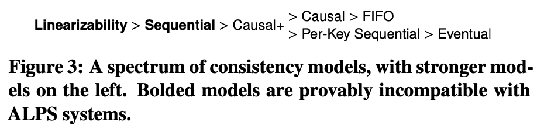
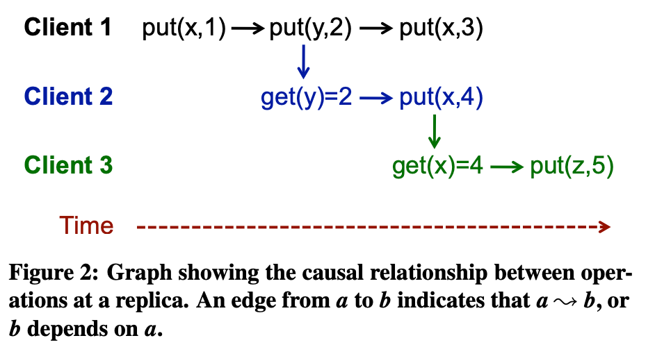
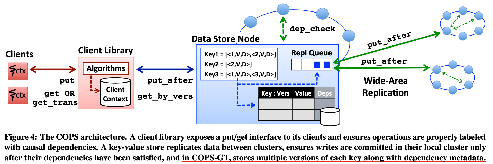

# COPS_论文笔记

本文第一部分是 schedule 中 Question 的解答，第二部分是对论文的讨论

# Lecture 17

COPS. The last sentence in Section 4.3 says a client clears its context after a put, replacing the context with just the put. The text observes "This put depends on all previous key-version pairs and thus is nearer than them." Why does clearing the context and replacing it with just the put make sense? You might think that the client's subsequent puts would need to carry along the dependency information about previous gets. What entity ultimately uses the context information, and why does it not need the information about gets before the last put?

4.3节的最后一句描述客户端在 put 操作后清除自身的 context 信息，将 context 里的版本依赖信息替换成 put 的信息即可。文章说明”这个 put 依赖于所有之前的 key-version 对，因此比它们更接近后面操作的因果关系“。为什么清除 context 将其替换为 put 会有效呢？你可能会认为客户端的后续 put 操作需要携带很久之前的 get 的依赖信息。什么 entity 最终使用 context 信息，以及为什么 entity 不需要最后一个 put 之前的所有 get 的信息？

答：老师的讲义中也要提及，这里主要考察 COPS 的因果一致性的实现

对于一个 client 而言，其依赖自身的 context 信息请求 COPS，并且 context 信息是隐藏在 COPS 的 client library 中的，client 执行：
$$
get(x) -> put(y) -> put(z)
$$
在 COPS 中，每个 get/put 操作，都需要带上 key-version，即，假设：

get(x) 带上 x-v2，

put(y) 带上 y-v3, x-v2，

则 put(z) 带上 z-v1, y-v3 即可，

在第二步 put(y) 中，context 做了一次依赖关系的清除，只保留了 y-v3；

#### 为什么清除 context 将其替换为 put 会有效呢？

已知在因果一致性中存在传递关系

> Transitivity. For operations *a*, *b*, and *c*, if *a* -> *b* and *b* -> *c*, then *a* -> *c*.

并且在实现的时候，如果 get(x) 不返回成功，则 put(y) 无法拿到依赖关系从而无法执行；

则可以反过来思考，如果 b 已经成立，则 b 依赖的各种前置依赖 a 也必定成立；

即 put(y) 执行成功，得到 y-v3 ，则 x-v2 其实也必定执行成功；

基于此，put(z) 就可以仅依赖 y-v3 即可，达到信息的简化；

#### 什么 entity 最终使用 context 信息？

处于同一 context 下的 entity

#### 为什么 entity 不需要最后一个 put 之前的所有 get 的信息？

同上，其实可以携带所有 get 信息，但没有必要

# 讨论

## 一、ALPS

CAP 在分布式系统中，一直是要么 CP 要么 AP 的

Spanner 通过 Truetime 实现了全球跨 DataCenter 的 CP，其目的是支持全球范围的数据存储

- 是线性一致性的

- 通过 Paxos ，2PC 和 2PL 支持分布式事务
- 读操作直接读本地 DataCenter 磁盘，性能较高
- 写操作需要来自 quorum Datacenter 的 ack，性能较低

Facebook 的 Memcache 则是通过牺牲一致性换性能实现的 AP，其目的是支持社交业务下的读多写少环境

- 是最终一致性的
- 通过 分区 和 复制 ，主从 DataCenter，look-aside cache 等技术 实现
- 读操作直接读本地 DataCenter 的 memcache 缓存，性能极高
- 写操作需要直接请求主 DataCenter 落盘，无论你靠近主还是靠近从；但不需要等从 DataCenter 响应(标记 Rk)，性能较低

在此基础上，文章提出 ALPS 系统指标

- **A**vailability-可用性

- low **L**atency-低延迟

- **P**artition-tolerance-分区容错

- high **S**calability-高伸缩性

而 COPS 则是为了ALPS 目标设计的，并实现了因果一致性以满足目标；其场景和 Facebook 的社交业务有点类似

- 是因果一致性的
- 通过 context，key-version，dependencies，chain replication 等技术实现
- 读操作带上 context 读本地 DataCenter，性能较高
- 写操作带上 context 写本地 DataCenter，并且不需要等其他 DataCenter 响应，性能一般
- 但是需要维护 context，key-version，dependencies 等数据结构

## 二、因果一致性

COPS 引出重要的 因果一致性和因果+一致性(causal plus) 概念，但其实这个概念之前就有较多论文提出并实现，其一致性程度如下：

因果一致性比顺序一致性低，比其他一致性高；

- 线性一致性

- 顺序一致性：全局排序

- 因果一致性：部分排序依赖操作

- FIFO一致性：保留执行线程的部分顺序

- per-key一致性：确保每个键的所有操作都有一个全局顺序

- 最终一致性

> ### 疑问
>
> 顺序一致性和因果一致性的强弱是如何区分出来的？顺序一致性会存在值回滚的情况，因果一致性可以解决写后读问题，为什么 顺序 比 因果 强？

私认为其解决了一个 client 的写后读问题，或许更适合 Facebook，不过其空间复杂度提高，需要存储 context 等信息，会消耗缓存，且对缓存一致性也是一个挑战吧

在定义上，三个规则定义了因果一致性：

1. Execution Thread：如果 a 和 b 是一个线程中的两个操作，如果 a 操作发生在 b 操作之前，则可以视为 b 依赖 a
2. Gets From：如果 a 是 put 操作且 b 是 get 操作并返回 a 所写的结果，则 b 依赖 a
3. Transitivity：传递性，a -> b，b->c 则 a-> c，即 b 依赖 a 且 c 依赖 b，则 c 依赖 a

具体而言，依赖关系如下图：

上图中，put(y,2) 依赖 put(x,1)，则其 context 中带上依赖信息 key-version，x-v

get(y) 依赖 put(y,2)，则其也需要带上依赖信息 y-v，然后带着 context 请求 COPS，并且 COPS 会去查询系统中相应 y 的 version，若查出 version 不满足 get(y) 的 context 中 version，其会阻塞直到 put(y,2) 执行成功；**即其 COPS 是否阻塞取决于操作携带的 context version 和自身存储的 key version 之间的关系；**

### COPS 实现的因果一致性的局限性

COPS在实现因果一致性时，是依赖 client 的 context 的；老师的讲义中也有提及：

假设两个分隔两地的客户端 AB，A 在相册中上传了一张照片，随后远程通知 B，B 带着自己的 context 访问 A 的相册，由于 A 和 B 分隔两地，所以极大可能请求两个不同的 DataCenter，导致 B 请求的 DataCenter 还未同步数据（异步复制），故查看到的相册有可能还是旧的，即没有新的照片；

本质上是现实世界的 context (A打电话通知了B)，无法和分布式世界的 context 同步；并且 COPS 实现的因果一致性是依赖 client 传入的 context 的；

其次，在管理冲突时， COPS 实现的是 latter-write-win，需要引入唯一递增 id；

## 三、COPS的实现

主要是了解一下因果一致性，其系统的实现不细节展开

### COPS 数据的组织方式

每个 kv 对有其关联的元数据。在 COPS 中为 version num；

每个 version num 高位放 lamport 时间戳，低位放唯一节点标识符；当并发写冲突时，COPS 采用 latter-write-win 的原则

关于 lamport time clock ，需要看这篇 paper 和 博客：

- 《Time, Clocks, and the Ordering of Events in a Distributed System》

- [分布式领域最重要的一篇论文，到底讲了什么？](https://mp.weixin.qq.com/s/FZnJLPeTh-bV0amLO5CnoQ)

在 COPS-GT 中，是 version num 和 一系列的其他 key 依赖；

COPS-GT 可以提供 get 事务，支持 GC；get 事务只需要两个 get round

### COPS 的写操作

写的时候，COPS 写本地主节点，然后异步写远程备份节点，需要检查依赖项是否已写入，否则就 block；重试后若超时则直接返回错误

COPS 系统还实现了支持 get 事务的 COPS-GT，除了 key-version 之外，还引入了 dependencies，并且由于需要占用更多的 context 空间，其还需要针对垃圾回收支持一系列优化

1. 垃圾回收

- version 垃圾回收
- depency 垃圾回收
- 客户端 metadata 垃圾回收(COPS 也需要)

2. 容错

3. 冲突检测

# 参考

- [COPS 论文阅读](https://tanxinyu.work/cops-thesis/)
- [分布式系统因果一致性与COPS算法](https://www.jdon.com/artichect/cops.html)
- [分布式领域最重要的一篇论文，到底讲了什么？](https://mp.weixin.qq.com/s/FZnJLPeTh-bV0amLO5CnoQ)

