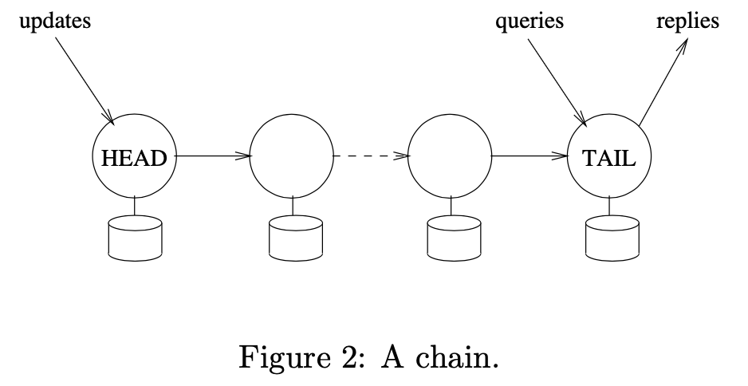
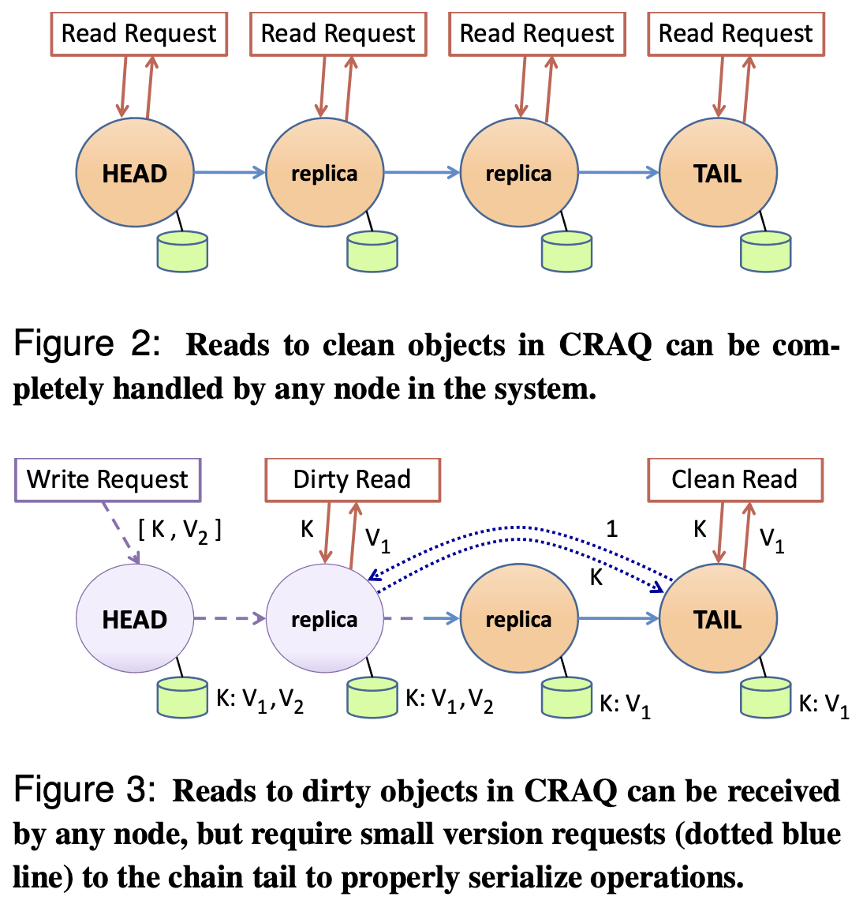

# Chain Replication

# Lecture 11

Give an example scenario where a client could observe incorrect results (i.e., non-linearizable) if the head of the chain would return a response to the client as soon as it received an acknowledgment from the next server in the chain (instead of the tail responding).

请给出一个示例，如果头结点在收到链中的下一个服务器的应答(而不是尾响应)后会立即返回一个响应给客户端，那么客户端可能会观察到错误数据(例如，非线性一致性)

这个问题的意思有点模糊，我感觉是问的 chain replication（下文简称 CR）的 update 行为更改成头结点请求后继节点，然后后继节点立即返回 ack 的话，会导致非线性一致性，并举例说明

CR 在 update 请求到来时，会以递归的形式，从头结点开始请求更新下一个节点，直到尾结点，然后尾结点再递归回复前驱，直到回复到头结点，最后由头结点返回更新请求的 ack

如果改为非递归形式，头结点请求后继，后继收到并更新本地数据后，立即 ack 头结点的话，客户端会认为 update done，然后进行 read，此时链很长的话，可能更新未能完全到达尾部，read 只请求尾部，最终导致读到陈旧数据

# 讨论

CR 的思想，感觉有点意思

在架构上，类似链表的形式，将服务器副本都串联起来

在行为上，读请求总是走尾部节点，更新请求先请求头节点，然后头节点递归地请求后继节点，最终的 ack 表明后继所有节点更新完毕，直接返回即可

但是简单的设计，往往带来问题

读请求只走 tail，在读多写少的情况下，tail 很容易被打满；而 Raft 起码还可以做一些 follower read 的优化

写请求走 head- > ... -> tail，需要走全部的服务器副本，写请求延迟随着服务器节点的增多而增大，为：
$$
latency = n * RTT
$$
n 为节点数量，即相邻两个节点之间的往返延迟总和；而 Raft 的写请求延迟为多数节点中的最大延迟的那个节点决定

## fault tolerance

CR 通过再起一个基于 paxos 的 master 服务去监视 CR 本身；类似于 sentinel；通过每个节点维护一个 sent(i)，表明已经发送给后继节点的请求id 集合，收到 ack 则置1

出现节点故障的话，就类似于链表的删除和插入一样，先将节点从 CR 删除，再插入新节点；

但是CR 的插入永远是从尾部插入，因为涉及到新 tail 的全部数据的导入(sent(tail))，这会有点耗时，导致牺牲 liveness

其次就是需要对故障做一些特定处理，如 头节点故障，尾节点故障，中间节点故障等，就是让 master 重新指定 head 或 tail 即可

## CRAQ

[CRAQ](https://www.usenix.org/legacy/event/usenix09/tech/full_papers/terrace/terrace.pdf)，CR 的优化版本

在全部数据版本一致的情况下，读请求确实可以从任意节点读

而写请求和 CR 类似，还是需要过一次 CR，此时会存在部分节点更新的情况，若读请求请求到已经更新的节点，但还未从后继中拿到 ack，则引入类似 MVCC 的概念，dirty read 会请求 tail 拿到旧版本的数据并返回

CRAQ 在读请求上确实做到了优化，不再是只走 tail，分摊了 tail 的压力；其次在写的时候引入 dirty read 的概念，避免读到陈旧数据

CRAQ 尤其适合读多写少的场景

## 参考

- [CRAQ 论文总结](https://www.cnblogs.com/brianleelxt/p/13275647.html)
- [CRAQ](https://www.usenix.org/legacy/event/usenix09/tech/full_papers/terrace/terrace.pdf)
- [浅谈Primary-Back Replication和Chain Replication](https://zhuanlan.zhihu.com/p/344808961)