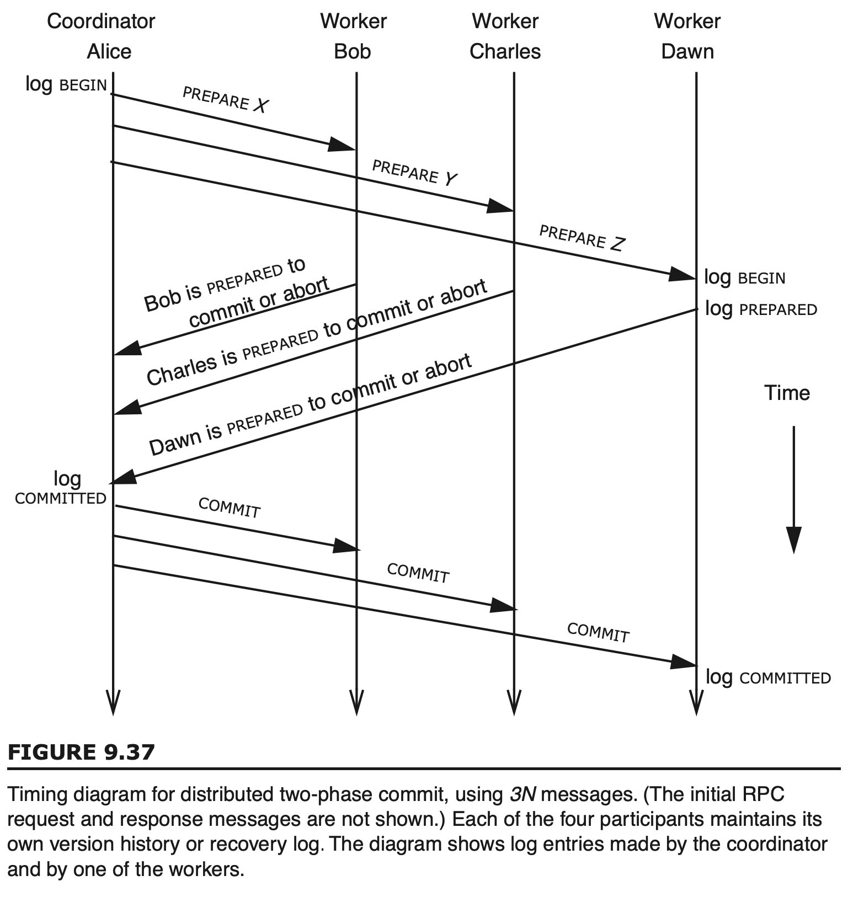
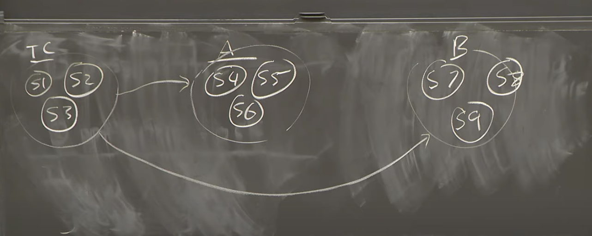

# 分布式事务初探_mit_6.824_2021

本文第一部分是对 schedule 中 Question 的解答，第二部分是根据 6.033 和网上博客内容，自己消化整理的一些分布式事务的知识梳理

# Lecture 13

6.033 Book. Read just these parts of Chapter 9: 9.1.5, 9.1.6, 9.5.2, 9.5.3, 9.6.3. The last two sections (on two-phase locking and distributed two-phase commit) are the most important. The Question: describe a situation where Two-Phase Locking yields higher performance than Simple Locking.

请阅读6.033书籍的第9章：9.1.5，9.1.6，9.5.2，9.5.3，9.6.3。最后两个部分(关于两阶段锁和分布式两阶段提交)是最重要的。问题是，请描述两阶段锁比简单锁产生更高性能的情况。

答：两阶段锁包含expanding phase 和 shrinking phase 两个阶段，而简单锁只会一次性获取或释放所有需要的锁；考虑如下情况，存在数据 x 和 y，两个并发事务 A 和 B：

A: w(y) w(x)

B: r(x)

若简单锁，则必定会导致 A 和 B 串行，最终结果是 AB 或 BA，即 w(y)w(x)r(x) 或 r(x)w(y)w(x)；结果必定正确，但是牺牲了并发

若两阶段锁，则除了上述串行情况外，还存在 [w(y), r(x)] w(x)，即 w(y) 和 r(x) 同时进行，但是 A 必须要等 B 执行完释放锁，才可以执行 w(x)，则宏观上看还是 BA，但是由于 [w(y), r(x)] 可以并发执行，A 的一部分操作可以一起和 B 执行，提高了性能，且满足正确性

# 讨论

Wiki：[Wiki-Two-phase locking](https://en.wikipedia.org/wiki/Two-phase_locking)

这篇博客从离散数学的角度介绍了两阶段锁，甚至是可串行性：[Transaction management：两阶段锁（two-phase locking）](https://zhuanlan.zhihu.com/p/59535337)

### 9.1.5 Before-or-After Atomicity: Coordinating Concurrent Threads

介绍了在并发线程环境下实现原子性

### 9.1.6 Correctness and Serialization

用 bank transaction 的例子，介绍了多个事务并发执行情况下的正确性和串行性

关于串行性的介绍，从离散数学的角度证明：[Transaction management：可串行性（serializability）](https://zhuanlan.zhihu.com/p/57579023)

### 9.5.2 Simple Locking

简单锁：一次性申请所有的锁，进入 lock point，在事务尾端，又一次性释放所有锁

这种实现简单，不会产生死锁，但是牺牲了一定的并发性

### 9.5.3 Two-Phase Locking(2PL)

关于两阶段锁和MVCC：[数据库的隔离级别与2PL/MVCC算法原理](https://niceaz.com/2019/03/24/isolation-2pl-mvcc/)

博客中描述到 MVCC 还是需要上 X 锁，具体在此不讨论

2PL 让事务分为两个阶段：

1. expanding phase：扩展阶段，事务只加锁，也可以操作数据（我理解这里的数据是加了锁的数据），但不能解锁
2. shrinking phase：收缩阶段，事务只解锁，也可以操作数据（这里的数据应该是未解锁的数据），但是不能加锁

即锁的数量在两个阶段里都只会单调递增或单调递减，这种实现保证正确性，且提升了性能；但是获取锁的顺序不对会导致**死锁**

死锁的解决办法，老生常谈了，超时释放重试，逐个锁释放等等

2PL 还会导致级联终止问题：在 shrinking phase 阶段，会存在部分资源释放但事务未 commit 的情况，此时其他事务可以访问部分资源了，若发生事务不能 commit 崩溃，则需要使得其他访问了资源的事务连锁回滚；这若发生了很浪费资源

2PL 也有一些变种：

- C2PL：保守两阶段锁，在事务开始之前获得了所需的所有锁(expanding phase)，确保只持有部分锁的事务不会阻塞等待其他锁，防止死锁
- S2PL：严格两阶段锁，在 shrinking phase 照常释放共享锁，但是排它锁在事务结束后才一次性释放；牺牲了一定的并发，但是为了防止级联终止问题
- SS2PL：强严格两阶段锁，S2PL 的特例，仅在事务结束后才释放所有锁

### 9.6.3 Multiple-Site Atomicity: Distributed Two-Phase Commit(2PC)

分布式两阶段提交，以下博客介绍了下分布式事务的内容：

- [我还不懂什么是分布式事务](https://mp.weixin.qq.com/s/MbPRpBudXtdfl8o4hlqNlQ)
- [二阶段提交（2PC）](https://learnku.com/articles/38511)
- [三阶段分布（3PC）](https://learnku.com/articles/38659)

N 个 worker 的 2PC 则需要消耗 3N 的消息；2PC 的常规流程很容易给出：

1. Prepare 阶段：协调者向参与者发出 prepare 消息，各参与者 undo 和 redo log 落盘，随即执行事务操作但不提交，此时参与者的该资源会进入 block 阶段，其他事务可能无法访问(排它锁或 MVCC 等)，返回 ACK 或者 NO
2. 若全部 ACK，则进入 Commit 阶段，若至少一个 NO，则发出 Abort 消息回滚
3. Commit 阶段：协调者向参与者发出 commit 消息，各参与者提交事务操作，资源得到释放，并回复 ACK 或 NO
4. 若全部 ACK，则事务提交完毕，协调者可以做后事务操作（清除log 等）；若至少一个 NO，则再次发出 Abort 消息回滚

#### 2PC 的故障恢复

棘手的永远都是故障恢复；

假定协调者和参与者都可以在任意阶段，请求发送和接收前后故障

- 单点故障和阻塞：若协调者在 Prepare 后，Commit 阶段前发生故障，可能会导致参与者处于资源阻塞；（这点我理解可以通过超时机制，超时未收到 Commit 消息，则释放资源定为 Abort 即可）
- 数据不一致：这个确实会有，协调者发出部分 Commit 消息后宕机，参与者部分 Commit，部分阻塞，此时整个系统数据不一致；部分阻塞虽然可以通过超时 abort，但是还是有部分 commit，会造成其他事务访问到该资源

2PC 也是有一些变种方式

- 3PC：canCommit, preCommit, Commit；引入多一个 prepare 阶段，为了同步各参与者状态，引入超时解除资源限制的做法，但还是有可能导致数据的不一致性
- SAGA：将业务长事务拆分为单链表的短事务，依次执行，FAIL 则依次向上回滚；（流程太长且耗时）

但是，分布式环境下，会存在一些基本无解的问题，如 9.6.4 的两将军问题，即若需要让两个分布节点**同时**执行某些操作，将会十分困难，2PC 只可以保证分布节点在一段时间内执行完操作，最终达到一致即可

#### 分布式事务与 lab4B

老师在课程的最后也说了，2PC 是分布式事务的一种解决方案，通常可以和 paxos 或者 raft 这类的副本共识协议联合使用，提高可用性，虽然这样会增加延迟....

感觉这块和 lab4B 就有点像了，shardkv 之间做分片的迁移，shardkv 与 shardctrler 之间做配置的更新；每个 shardkv 可以是 2PC 里的协调者和参与者

# 参考

- [Wiki-Two-phase locking](https://en.wikipedia.org/wiki/Two-phase_locking)
- [Transaction management：两阶段锁（two-phase locking）](https://zhuanlan.zhihu.com/p/59535337)
- [Transaction management：可串行性（serializability）](https://zhuanlan.zhihu.com/p/57579023)
- [数据库的隔离级别与2PL/MVCC算法原理](https://niceaz.com/2019/03/24/isolation-2pl-mvcc/)
- [分布式事务简介](https://tanxinyu.work/distributed-transactions/)
- [我还不懂什么是分布式事务](https://mp.weixin.qq.com/s/MbPRpBudXtdfl8o4hlqNlQ)
- [二阶段提交（2PC）](https://learnku.com/articles/38511)
- [三阶段分布（3PC）](https://learnku.com/articles/38659)