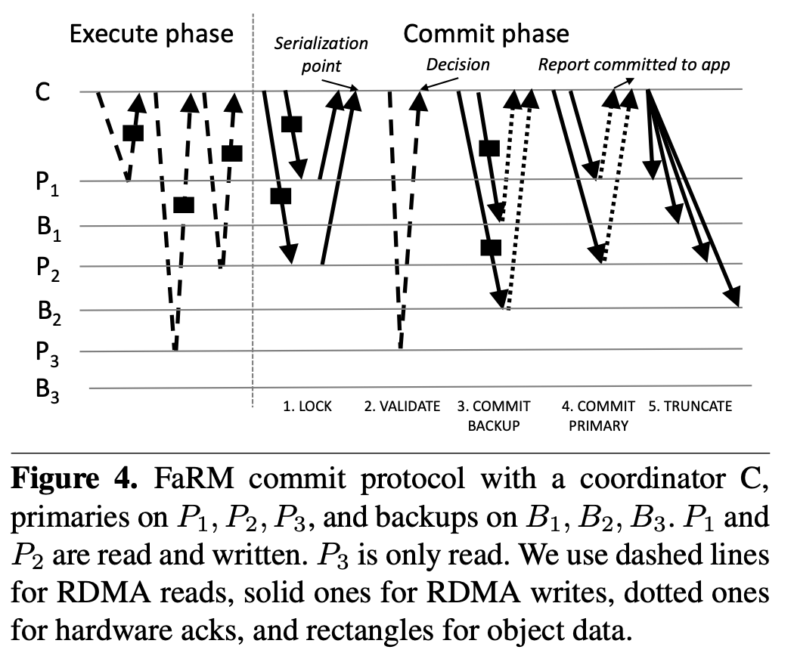

# FaRM_论文笔记

# Lecture 15

No compromises: distributed transactions with consistency, availability, and performance: Suppose there are two FaRM transactions that both increment the same object. They start at the same time and see the same initial value for the object. One transaction completely finishes committing (see Section 4 and Figure 4). Then the second transaction starts to commit. There are no failures. What is the evidence that FaRM will use to realize that it must abort the second transaction? At what point in the Section 4 / Figure 4 protocol will FaRM realize that it must abort?

假设有两个 FaRM 事务都对同一个数据对象执行累加操作(x++)。它们同时开始且读取到一样的初始值。一个事务完成提交，第二个事务此时开始提交，目前没有故障错误等情况。FaRM 会以什么依据去 abort 第二个事务？在哪个节点上 Section 4 图 4 协议中 FaRM 会意识到需要 abort 第二个事务？

答：FaRM 由于使用到了 RDMA 等不是很常见的技术，在 RDMA 的 one-side 编程模型的影响下，需要重新设计一些符合单边逻辑的协议；图4 就是 FaRM 对于并发控制事务的基于 RDMA 的协议设计，有点类似 2PC，但是更为复杂；

首先FaRM中，每个数据对象会有一个 meta-data 的头部，包含 lock 标志位和 版本号 等；其次，FaRM 使用乐观锁 OCC ；

Execute phase：用 rdma read 将所需数据对象读入 client 内存中进行事务操作

Commit phase：提交阶段，一旦冲突则直接 abort

1. LOCK：将更新后的数据对象发送给 primary，并且是以 log 形式；primary 轮询 log 并用 CAS 尝试对需要写入的数据对象加锁，如果发现 lock 标志位已置，返回 abort；如果没有，则置 lock 标志位
2. VALIDATE：这里是对只读对象的一个优化，只读对象就不需要写 log 和 lock 标志位了，只需要再次比对 lock 和版本号是否有差异，一旦冲突，直接 abort
3. COMMIT BACKUP：做备份容错
4. COMMIT PRIMARY：做 primary 的提交，且释放 lock 和更新版本
5. TRUNCATE：通知清除日志，释放资源

则该问题中，第一个事务提交完毕，数据对象的版本号已经更新，而第二个事务开始提交，此时版本号是旧的，会在 LOCK 阶段直接被 abort

# 讨论

FaRM 倾向于做高新技术的探索，因为这里面用到的技术都是数据中心里才能用到的昂贵硬件，缺乏一定的普适性；其目的也是通过高性能的硬件实现高性能的分布式系统

如 FaRM 用到的有：

- NVRAM 非易失性存储：数据先写入高速缓存，如果发生故障断电，会有一个附加电源做数据的落盘，并且 NVRAM 的写入速度比 SSD HHD 等要快；但其只能解决断电故障
- RDMA：remote direct memory access 远程直接内存访问：通过 RDMA 网卡设备让远程机器直接访问目标机器上注册好的内存区域块，并且可以做到 零拷贝，kernel bypass 等，解放 CPU 资源，提升性能；但其 one-side 操作（rdma read 和 rdma write）等，是和 socket 编程截然不同的编程模型的，故需要重新设计上层的软件栈（这也是 FaRM 的一些交互比用到 socket 的交互复杂的原因）

除此之外，还有常规的分布式的技术：

- 乐观锁 OCC：为了性能，FaRM 的并发控制事务也是还是用类似的两阶段提交
- PB 主从直接备份

### RDMA

对于 rdma，之前有做过一段时间的 RDMA 的学习，其依赖 RDMA 网卡和 RDMA 的驱动，即十分依赖硬件和配置；这里有个专栏介绍得很不错，可以从0到1搭一个模拟环境：[RDMA杂谈](https://www.zhihu.com/column/c_1231181516811390976)

有一本编程手册充分介绍了 RDMA 编程，但是里面还是有很多细节没有阐述完整：[RDMA Aware Networks Programming User Manual](https://www.mellanox.com/related-docs/prod_software/RDMA_Aware_Programming_user_manual.pdf)；手册对应的是其官方库 rdma-core：https://github.com/linux-rdma/rdma-core

除此之外，官方还封装了一个 python 版本的官方库 pyverbs：https://github.com/linux-rdma/rdma-core/tree/master/pyverbs

自己拿 pyverbs 写过一个 python 的 demo：https://github.com/SwordHarry/pyrdma

也尝试过用 golang cgo 实现 rdma，目前搁置了：https://github.com/SwordHarry/gordma

rdma 给我最直观的感受是其编程模型和以往的 socket 编程不同，尤其是其单边操作 rdma read & rdma write，是对于目标服务器无感知的，并且操作均是异步，ack 需要从 complete queue 轮询拿到；

可以理解为 rdma 技术是系统通讯层的 socket 替换方案，但是其编程模型需要对上层的编程有一定侵入；rdma 结合其他分布式的技术可以组合出一些有趣的东西，比如 paxos+rdma，raft+rdma，rdma 的 rpc 等等

# 参考

- [RDMA杂谈](https://www.zhihu.com/column/c_1231181516811390976)
- [RDMA Aware Networks Programming User Manual](https://www.mellanox.com/related-docs/prod_software/RDMA_Aware_Programming_user_manual.pdf)