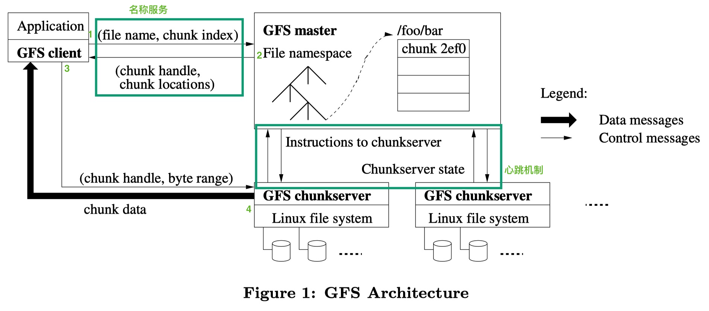

# GFS

## Lecture 3

Describe a sequence of events that would result in a client reading stale data from the Google File System.

在 GFS 中，描述导致客户端读到陈旧数据的一系列事件

### 讨论

这篇博客很好很全面地总结了GFS：https://spongecaptain.cool/post/paper/googlefilesystem/

读陈旧数据之前，先捋一下正常读情况下的GFS流程

首先是 GFS 采用 Master + Workers 架构方式，Master 存元数据，Workers 存实际文件数据+副本容错等，彼此之间靠心跳维持信息

Master 在内存中维护两份映射：

1. file_name -> []chunk_handler(或者 chunk_index 的数组)
2. chunk_handler(chunk_index) -> 一个描述chunk所需的信息
   1. list of chunk_server
   2. chunk version
   3. primary chunk_server index
   4. lease expiration time

即 file_name + chunk_index 唯一确定一个 chunk 数据

且第一个 kv 适合使用 hashMap，第二个 kv 适合使用 B+Tree

#### 一次常规读操作

1. Client -> Master：请求带 file_name + offset
2. Master -> Client：响应带 chunk_handler
3. Client 会对其响应做限时缓存
4. Client 根据 []chunk_server 中的 ip，推算出最近的一个，Client -> chunk_server
5. chunk_server 根据 Client 发送的 chunk_handler，做磁盘 IO 并返回数据给 Client

#### 陈旧数据

在  **4.5 Stale Replica Detection** 中有部分描述

Master 会采用 chunk version 确保在常规场景下避免 Client 读到陈旧数据，Client 总是会先询问 Master 拿到最新的 chunk version，然后缓存本地

Master 和 chunk server 之间通过心跳信息维持 chunk version 的更新

- 若 Master 中的 chunk version 比某些 chunk server 中的小，意味着 Master 在接收 chunk version 更新前宕机恢复，Master 会随机更新 chunk 信息
- 若 Master 中的 chunk version 比某些 chunk server 中的大，意味着 某些 chunk server 存放过时信息，Master 会认为其为过时数据，不对外提供访问，且定期GC

Client 随即带 chunk version 访问对应 chunk server，若 chunk version 比 chunk server 的新，将不对外提供信息

在 **5.1.3 Master Replication** 中有部分描述

为了实现 Master 的高可用，当 Master 宕机，会启用 shadow Master，该 shadow Master 的数据可能会稍微滞后于 Master，通常是几分之一秒

此时 Client 可能会从 shadow Master 中读到过期的元数据，但是，由于文件内容是从chunk_server读取的，chunk_server 可以保证 Client 不会观察到过期的文件内容。在短时间内可能过时的是文件元数据，如目录内容或访问控制信息。

----

## 论文总结

GFS 文件系统包含了太多细节了，这里给出自己对 GFS 的梗概要点

架构如下，图源自：https://spongecaptain.cool/post/paper/googlefilesystem

- Master - Workers 架构
- Master 管理元数据，包括每个 chunk_server 的状态，每个 chunk 的信息，文件命名空间结构，分配读写锁等
- Workers 表示为组组 chunk_servers，对于一个 chunk，通常有一个主 chunk server 和两个副本 chunk server 容错
- 文件分块，大文件以 chunk 区分，通常为 64MB
- 写操作：追加和覆盖写，采用 Lease 租约，分配给一个 chunk server 租约，使其成为 primary，primary 决定写操作顺序，随即返回给 Master，Master 继续分发写操作顺序给从 chunk server；租约可以延长
- Atomic Record Append，原子追加操作
- GC
- stale replica detection，过期数据检测
- 高可用：快恢复，chunk 复制，Master 容错（shadow Master）
- 数据完整性：checksum 校验和检测数据是否损坏

