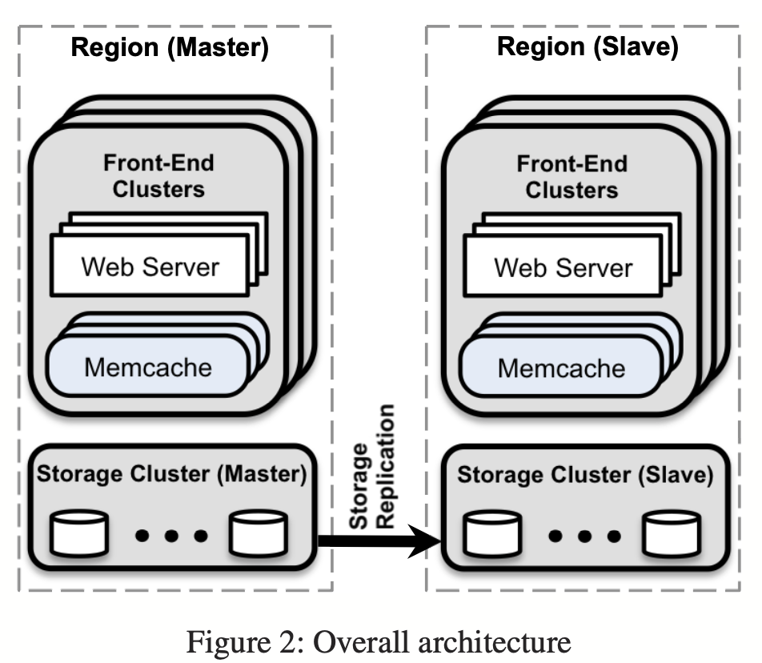
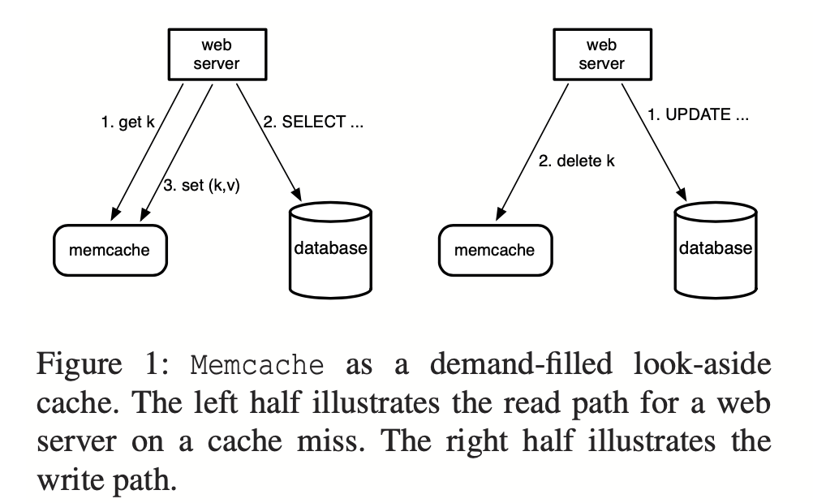
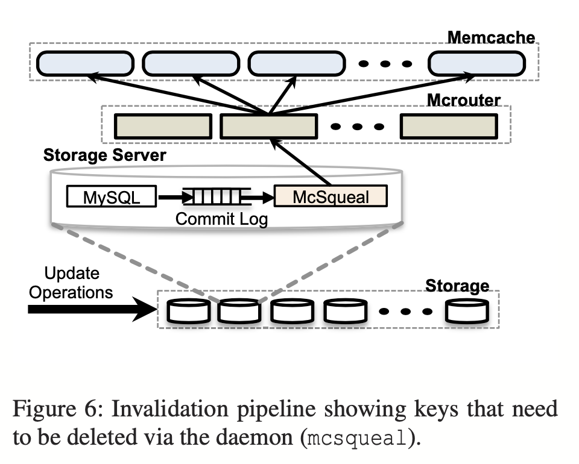

# Memcache_Facebook_扩展论文笔记

本文第一部分解答 Schedule 中的 Question，第二部分是自己对论文中自己在意的要点的讨论

# Lecture 17

Memcache at Facebook. Section 3.3 implies that a client that writes data does not delete the corresponding key from the Gutter servers, even though the client does try to delete the key from the ordinary Memcached servers (Figure 1). Explain why it would be a bad idea for writing clients to delete keys from Gutter servers.

3.3 节描述了客户端写数据但不会 delete gutter 中的 key，即使客户端会尝试 delete memcache 中的；解释下为什么不删除 gutter 中的 key

答：在老师的讲义中有提及，gutter 是 memcache 宕机时的兜底，主要是为了发出 delete 操作的负载减少；

# 讨论

这里有三篇 facebook 员工用大白话翻译自家的论文：

- [Scaling Memcache in Facebook 笔记（一）](https://zhuanlan.zhihu.com/p/20734038)
- [Scaling Memcache in Facebook 笔记（二）](https://zhuanlan.zhihu.com/p/20761071)

- [Scaling Memcache in Facebook 笔记（三）](https://zhuanlan.zhihu.com/p/20827183)

## 一、facebook 架构演化

首先，任何架构，都不能脱离业务场景而存在；根据老师的讲义，facebook 架构演化如下：

1. 单服务器；一般用 PHP 或者 python 等脚本快速构建验证想法；

2. 无状态的 web server 集群 + 单 mysql 服务器；

   业务逻辑在 web server 集群，瓶颈在单机数据库上

3. 无状态的 web server 集群 + storage 分片集群(mysql)；

   虽然用 sharding 解决了扩展和性能问题，但是还是不能很好地解决热 key 问题，热 key 有可能都打在同一个 shard 上，并且 sharding 后维护成本提高。web server 集群还需要根据 config 知道数据在哪个分片上，并且如果需要支持分布式事务，将继续加大延迟。但这是迈向大型网站的关键一步

4. 无状态的 web server 集群 + memcache(or redis) 缓存集群 + storage 分片和副本集群；

   这是 facebook 业务的读多写少场景下的演进，通过 memcache 做缓存兜底，但还是会有数据同步，一致性，shard 迁移，缓存穿透、击穿、雪崩 等问题（没有银弹啊

即当初，facebook 演化成了 4. ，在老师的讲义中，facebook 当初在西海岸和东海岸分别架设了 datacenter，西海岸为主 center，写操作统一落主 center，然后同步主从，读操作根据 ip 地址定位路由到东西海岸，即如下图：

在 facebook 的社交业务场景下，是允许容忍用户暂时看到一些过时（秒级别）的旧数据的（最终一致性？）；但对于某个用户来说，写后读的场景，必须及时反馈，即自身的读写请求满足线性一致性，否则会导致用户困惑

## 二、partition and replication（分区和复制）

facebook 的 cache 和 storage 都是用了分区和副本，但是使用的策略细节有所不同

图2中，先假定确实是有两个数据中心，然后每个数据中心中可以大致分为上下两个部分，底部为 storage cluster，上部为 front-end clusters；并且可以发现，storage cluster 在一个数据中心中只有一个，而 front-end clusters 有多个；

对于 storage 而言，两个数据中心就是一主一从，即有一个副本，且 cluster 内部再做分片；

对于 cache 而言，每个数据中心中有多个 cluster，cluster 之间不做交互，单个 cluster 内部，web server 和 Memcache server 做交互；

多个 cluster 可以理解是一种动态的副本，当 web server 前端服务器做 kv 读写时，热 key 会逐渐占用 memcache，这也是我们所希望的，并且多个 cluster 的趋势是一致的，即 热 key 的副本会在多个 cluster 中存在，达到读性能的并行优化，而冷 key 相对少甚至没有

> #### 为什么上层不使用单集群?
>
> 如果将上层 front-end cluster 使用一个大的单集群，将起不到 partition 的作用，在一个 memcache 中找到了热 key，将不会在其他 memcache 中 set 了；而分集群，会在多个集群中都存在一个热 key 的 memcache，热 key 的读分摊到多个 memcache，达到读性能并行优化；
>
> 另外，一个 cluster 中的 web server 和 memcache 之间，需要维护 O(n^2) 的网络连接管理，如果单个集群统一管理，数量将会很庞大，分 cluster 可以更好地管理网络连接；
>
> 因为 web server 可能需要和多个 memcache 做交互，这其中 facebook 又做了很多优化，其中一点就是尽量不要让集群变得很大；
>
> 而且维护多个小规模集群的网络硬件设施，会比维护单个大规模集群的网络硬件设施成本要小

## 三、look-aside cache & look-through cache

facebook 采用 look-aside cache 的方案，即让 web server 自己组织 memcache 和 mysql 之间的关系，cache 和 storage 之间不直接交互；

web server 先请求 memcache，若无数据则继续请求 mysql；写先落盘 mysql，然后入 memcache 或者 delete 逐出，如下图：

而 look-through cache 方案是，cache 和 storage 之间交互，并且 cache 逻辑落在 cache 本身；

web server 无脑请求 memcache，memcache 作为 web server 和 mysql 的中间层，当查无缓存时，memcache 主动请求 mysql 入缓存且返回数据；

## 五、一些细节优化

### 1. 在一个 cluster 内的优化

#### 1.1 请求批处理

一个 web server 需要和多个 memcache 交互，则没有依赖关系的请求可以做并发批处理

#### 1.2 自研滑窗-通信优化

UDP 读，TCP 写；并且需要控制一次性发出的请求包，避免网络阻塞；

解决方案是 facebook 采用自研的滑动窗口，控制未完成请求数；滑动窗口大小的选择事关网络延迟和阻塞

#### 1.3 lease 租约

主要解决两个问题

##### 1.3.1 stale set

陈旧数据的 set lease 会偏旧，被拒绝

##### 1.3.2 thundering herd

惊群问题：热 key 被写之后，按照原策略，memcache 中会 delete 热 key，将会导致瞬间所有读操作打到 storage

解决方案：第一个请求 memcache miss 的 web server 被分配 lease，并且这个 key 也被打上标记，后续请求该 key 的 web server 需要等待一个 lease，之后再请求 cache，如果还是 miss，则直接走数据库；此时持有 lease 的 web server 会读 storage 并将数据入缓存，达到避免读请求全部打到数据库的情况；

#### 1.4 memcache pool

在一个 cluster 内部，有很多 memcache，其中有的 memcache  可能一般不逐出更换缓存，一直存放的热 key，来来去去请求都是那些数据，有的 memcache 经常逐出更换缓存，若不加以隔离，可能会导致经常更换的缓存将常驻缓存的热 key 逐出，类似于不同的 memcache 可以有不同的”习性“一样；

不仅如此，既然一个 pool 内的 memcache 有特定的缓存数据，则可以在一个 pool 内对热 key 的 memcache 做副本处理

#### 1.5 故障恢复

gutter server：简单理解为 gutter server 为 memcache 故障时的一个挽救方案，一个缓存的备份

### 2. 在一个 region 内的优化

region 在图 2 里的意思是数据中心吧（西海岸和东海岸

#### 2.1 写请求的处理

对于写请求，当 数据落 mysql 后，会使用 mcqueal 做 cache 的 delete；即不会让 mysql 和每个 memcache 做通讯，因为这会让 storage 层需要维护大量的网络连接，并且网络连接交给 mcrouter 处理

当写操作写 storage 的时候，facebook 利用 mysql 自带的异步日志复制机制，从日志中读写操作，然后将 cache 中的 key 删除

> #### 为什么是 delete 而不是 set?
>
> 根本原因是 storage 和 cache 的数据同步在这里并不是原子的。
>
> 如果采用 set，客户端 c1 c2 并发请求的情况下：
>
> c1_set_storage(x=1) -> c2_set_storage(x=2) -> c2_set_cache(x=2) -> c1_set_cache(x=1)
>
> 则导致写后读，读到陈旧数据

> #### 为什么不能先 delete 再更新数据？
>
> 这样会导致 stale data read
>
> 考虑有并发的读写请求，写请求到来时，先 delete cache 再写数据库，读请求此时也在处理中，已知读请求会先读 cache，若 miss 则读 storage，并最终将读到的数据 set 回 cache，假设：
>
> write_delete_cache(x) -> read_storage(x) -> read_set_cache(x) -> write_storage(x)
>
> 那么陈旧数据 x 将会在 cache 中，导致写后读的不一致性，但其实并发场景下，还是会存在陈旧数据被 set 到 cache，facebook 使用了 lease 做优化

#### 2.2 region pool

memcache server 专门负责热 key，而通过专门维护一个 region pool，放冷 key 数据，或者这些 key 除了被访问得少，还很占内存；

#### 2.3 cluster 冷启动

刚启动的集群会被标记为 cold start，因为有一部分请求会打到 cold start cluster，而其必定走数据库；

解决办法是做 cold start 处理，此时带有 cold start 标记的 cluster 被允许跨集群访问 memcache，做到热 key 的复制搬运，等到 hit 上来了，移除标记即可

### 3. 多个 region 之间的优化

主要是一致性的优化；server 跨 region 访问数据比跨 cluster 访问数据更耗时，故当写请求发生在主 region 时，会有一段时间从 region 还没收到写的数据

这里用标记 Rk 标记 key k 目前正在更新数据，但是数据还没到这个 region 来，所以标记存在

### 4. 一个 server 内的优化

单服务器性能的优化

基本优化

1. 允许 memcache 的 hashtable 自动扩张

2. 多线程访问数据结构，加全局锁

3. 每个线程用单独端口对外通信

进阶优化：

1. 全局锁换成细粒度锁，可以在内存中继续分片

2. UDP 读替换 TCP

#### 4.1 内存管理

slab allocator 是 facebook 内存管理模块，即内存在 server 中是可以分块的，小块 slab 专门存小 key，大 slab 存大 key；当一个 memcache 小 key 更多时，可以弹性地将大 slab 转换成小 slab 供小 key 存储，或者大 key 变多了也可以将小 slab 转换成大 slab 供大 key 存储

#### 4.2 逐出策略

memcached 支持过期时间，可以延迟清除 key，但是有些 key 只会在短时间内被频繁访问，之后不再被访问，这样的 key 还是会占用内存，直到其到达 LRU 队列的末端；

解决方案：针对短时间的 key，放到内存的一块中统一管理，一定时间 check 做清除

# 参考

- [Facebook 的 Memcached 系统扩展论文阅读](https://tanxinyu.work/scaling-memcached-thesis/)
- [Scaling Memcache in Facebook 笔记（一）](https://zhuanlan.zhihu.com/p/20734038)
- [Scaling Memcache in Facebook 笔记（二）](https://zhuanlan.zhihu.com/p/20761071)

- [Scaling Memcache in Facebook 笔记（三）](https://zhuanlan.zhihu.com/p/20827183)