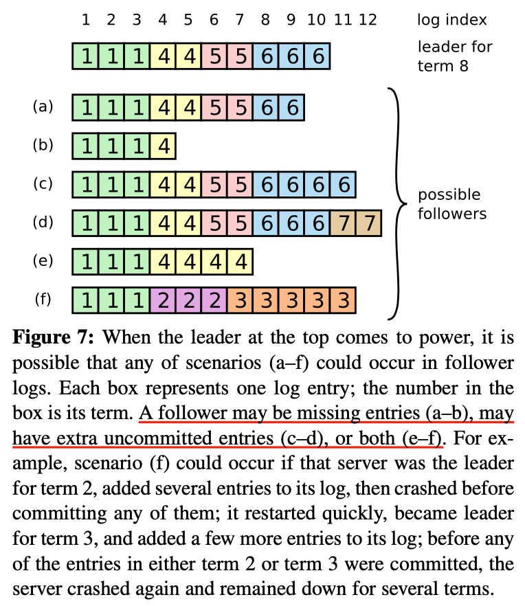
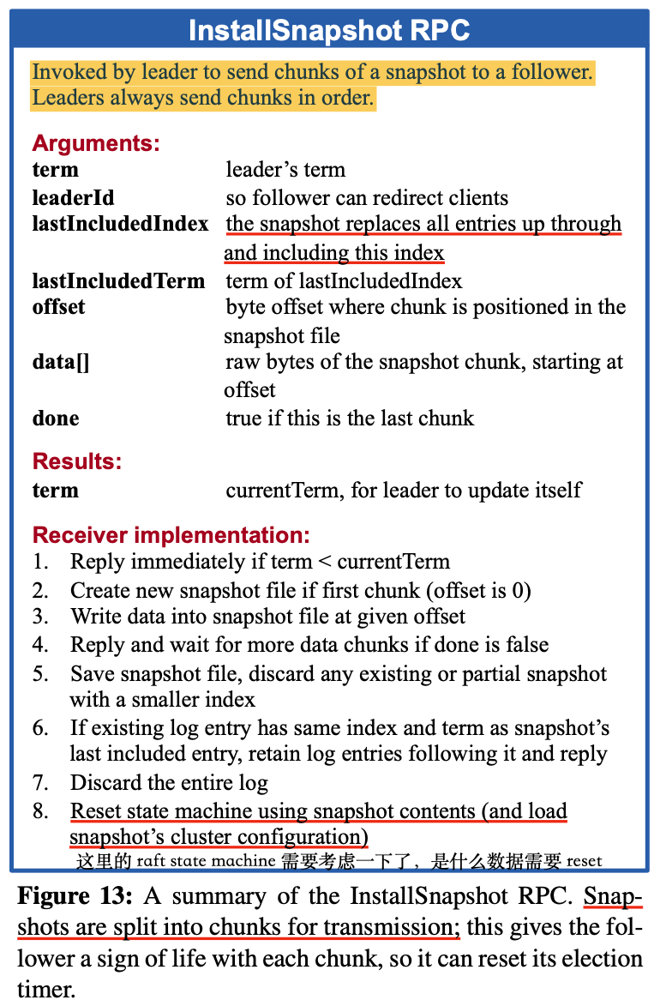
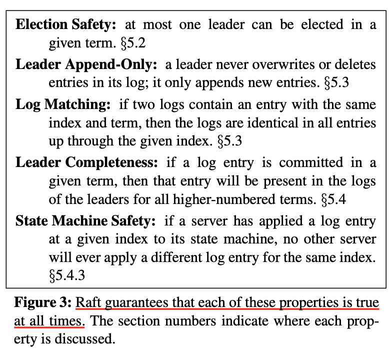
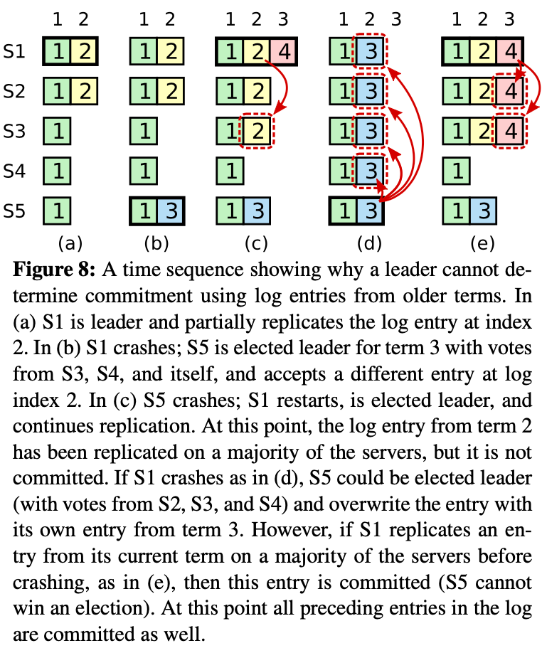
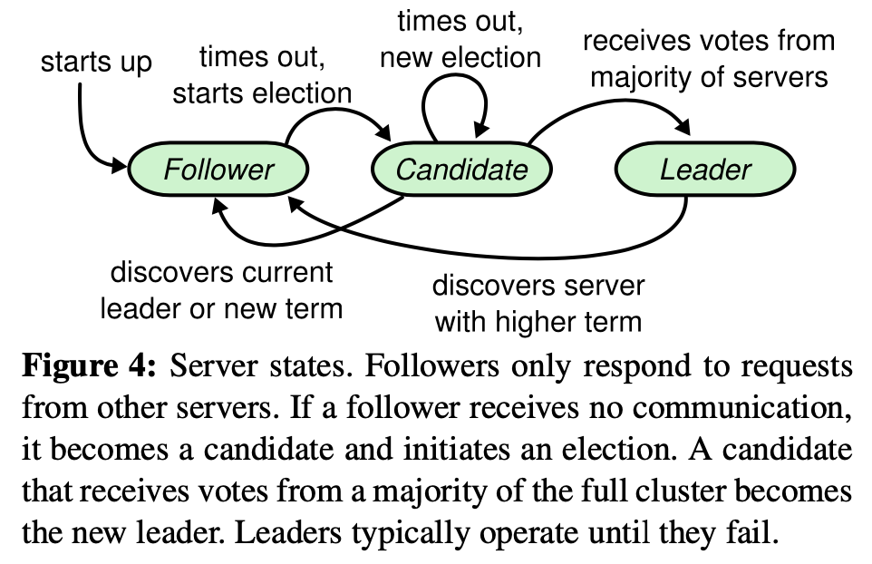
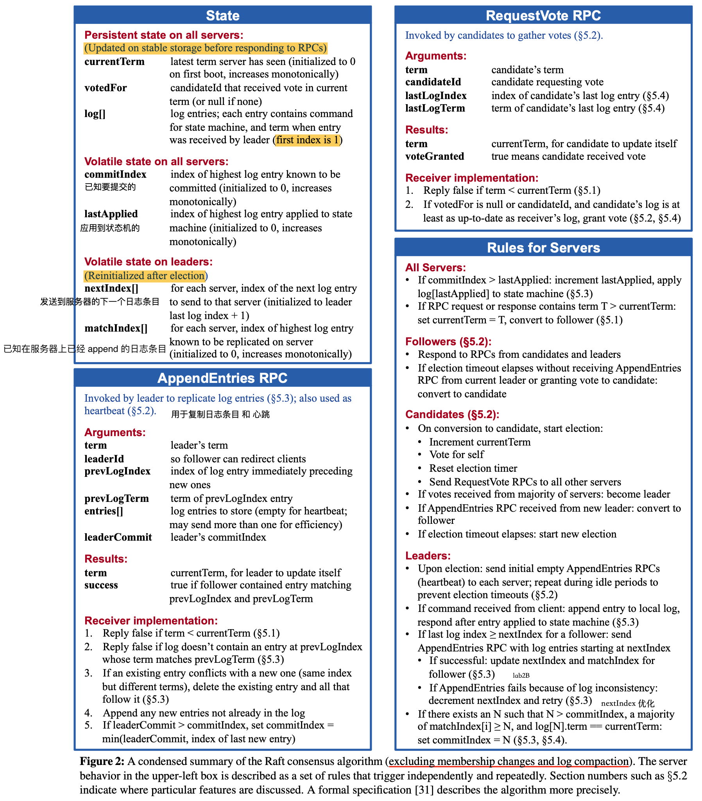

# Raft梳理

此文第一部分是对 schedule 中 Question 的自己的解答，第二部分是自己对 Raft 的梳理，如有不对，欢迎指正！ 

# Questions

## Lecture 5

Suppose we have the scenario shown in the Raft paper's Figure 7: a cluster of seven servers, with the log contents shown. The first server crashes (the one at the top of the figure), and cannot be contacted. A leader election ensues. For each of the servers marked (a), (d), and (f), could that server be elected? If yes, which servers would vote for it? If no, what specific Raft mechanism(s) would prevent it from being elected?

假设 Raft论文图7的场景:一个由7个服务器组成的集群，其中显示了日志内容。第一个服务器崩溃了(图中最上面的那个)，且网络无法链接，紧接着发生 leader 选举。对于编号为(a)、(d)和(f)的服务器，它们之一是否可以当选？如果是，哪些服务器会投票？如果没有，具体有哪些机制会阻止它当选？



这个问题问的是 选举限制。在 **5.4.1 Election restriction** 中有提及，即

Raft 通过比较日志中最后一个条目的索引和任期来确定两个日志中哪一个是最新的。如果日志的最后一个条目具有不同的任期，那么后面更大任期的日志是最新的。如果日志以相同的任期结束，那么较长的日志是最新的。

同时还要考虑 votedFor 的话，用程序员的代码语言翻译过来就是

```go
func (rf *raft) canVote(args *RequestVoteArgs) bool {
  // If votedFor is null or candidateId, and CANDIDATE’s log is
	// at least as up-to-date as receiver’s log, grant vote (§5.2, §5.4)
	votedFor := rf.votedFor
  if votedFor == votedForNil || votedFor == args.CandidateId {
    lastLog, lastIndex := rf.logs.LastLog()
    if lastLog.Term < args.LastLogTerm || 
    (lastLog.Term == args.LastLogTerm && lastIndex <= args.LastLogIndex){
      return true
    }
  }
  return false
}
```

用以上逻辑来看的话，结合图7，即使我们知道日志条目中的任期，我们也并不知道每个 server 当前所处任期；那就假设大家都处于 leader 的 term8，如果不是，那么低 term 的 follower 即使发起选举，也很快会被打回 follower

若 (a) 先发起选举，则 (a) 可以被(b) (e) (f) 投票，则 (a) 可以获得4个投票（包括自身），则 (a) 可以成为新的 leader

若 (d) 先发起选举，则其可以获得除宕机的 leader 外的所有投票，(d) 可以成为 leader

若 (f) 先发起选举，根据规则，其只能获得自身的投票，其余节点均不投票

## Lecture 7

Could a received InstallSnapshot RPC cause the state machine to go backwards in time? That is, could step 8 in Figure 13 cause the state machine to be reset so that it reflects fewer executed operations? If yes, explain how this could happen. If no, explain why it can't happen.

InstallSnapshot RPC 调用会导致 follower 的状态机倒退吗？即，图 13 的步骤 8 reset 了状态之后，状态会变为旧状态？会的话，解释这是如何发生的，若不会，解释为何不会



这个问题问的是 Raft 的安全性证明。结合 Raft 的图3 的原则性保证，我们可以得出 InstallSnapshot RPC 不会导致 follower 的状态机倒退



由图3可以得出，在一个 term 中只能有一个 leader 存在，并且 Ieader 必定包含了之前 committed 过的日志，状态机(或 snapshot)由 committed 的日志演算得出，uncommitted 的日志对上层状态机没有影响，甚至其有可能在后续被 AppendEntries 冲突日志覆盖写

而 snapshotIndex，是在 committed index 之前的，所以 snapshot 必定是多数派协商之后的结果

故当 leader 调用 follower 的 InstallSnapshot RPC 时，是不会导致 follower 的上层状态机倒退的

## 图8说明了什么问题？即 leader 为何只能提交自己任期的日志，为何不能提交之前任期的日志？

这里捋一下 raft 中可能会被常问的问题



这一篇文章很好地解释了如果 leader 可以直接提交之前 term 的日志，会导致同一 index 被重复提交不同日志

> [Raft 的 Figure 8 讲了什么问题？为什么需要 no-op 日志？](https://zhuanlan.zhihu.com/p/369989974)

在 **5.4.2 Committing entries from previous terms** 和 **5.4.3 Safety argument** 中也有指出，图8是为了说明，leader 只能通过提交自己任期的日志从而间接提交之前任期的日志

存在这样一个事实，leader不能立即断定来自上一个 term 的日志一旦被存储在大多数服务器上就被提交了。

即在 (c) 中，index 2 的日志虽然已经被复制到多数派，但是可能存在 S1 在 commit 日志之前宕机了，导致 index 2 处的日志并没有被提交，但其实此时也并不能提交 term 为 2 的日志

而 term 的提升反映了这样一个情况，raft 集群内部有非常规的事件发生导致 term 提升（无论是人为配置，还是服务器宕机），我这样理解，若 leader 含有更高的 term，其实低 term 的 uncommitted 日志存在一定的不可信，有可能在后面会被覆盖掉，所以不能直接提交，需要间接提交

结合图8，图 3 和选举规则，我们可以得出如果 leader 可以提交之前任期的日志，那么将违反图3 的 Raft 安全性原则：在图 8 (c) 中，如果 leader 可以提交 index 2 term 2 处的日志，提交后S1 宕机，则可以存在 (c) -> (d) 情况的转变，结合选举规则，S5 可以被除 S1 之外的投票，S5 当选 leader 后，继续提交 index 2 term 3 处日志，导致同一 index  提交了不同的日志条目；

这违反了 Leader Completeness  和 State Machine Safety；即 index 2 term 2 committed 的日志从前导日志中消失了！并且同一 index 应用了不同的日志！

----

对于课程中的 paper，解答一遍 question，将内容通读一遍即可；

但是对于 Raft，感觉有必要较为详尽地梳理一遍其中的知识点

# Raft 梳理

## 1. 介绍

Raft 算法为分布式共识算法中的一种，但其实如果把视角放得更高一点，在区块链的视角里，Raft 是非拜占庭问题的分布式共识算法中的一种实现

- 拜占庭
  - PBFT
  - PoW
- 非拜占庭
  - Paxos
  - Raft
  - ZAB

而 Raft ，某种程度上是为了解决 Paxos 难以理解和实现的困惑而提出的

TODO：以后如果有空闲时间，还是需要将 Raft 的博士论文被 paxos 完整过一遍的

- Raft 博士论文：https://stacks.stanford.edu/file/druid:qr033xr6097/cameraready-try2-augmented.pdf
- Raft-extended：https://pdos.csail.mit.edu/6.824/papers/raft-extended.pdf
- paxos-simple：https://lamport.azurewebsites.net/pubs/paxos-simple.pdf

Raft 将分布式共识问题拆分为几个易于理解和实现的子问题，并给出子问题的各个实现：

- Leader election
- Log replication
- Safety
- Follower and candidate crashes
- Timing and availability
- Cluster membership changes
- Log compaction
- ....

在博士论文和工业界实现中，还有很多可以实现和优化的细节：

- Batch & Pipeline

- Pre vote
- Read Index
- Leader lease
- no-op log entry
- ....

有关于 Raft 的介绍，已经有很多博客有梳理过了，这里还是想简单过一遍自己做过的 lab 和已经了解的部分，对于自己想要了解的部分，会有侧重地梳理；

## 2. 节点类型

首先，Raft 中对于一个节点的可能状态为：follower，candidate，leader

- leader：在一个 Term 内最多只能有一个 leader；负责心跳，响应客户端，日志复制等
- candidate：当 follower 心跳超时转变而来，负责选举，有机会变成新的 leader
- follower：在基本的实现中，从不主动发起请求，只被动地接收 leader 的日志和快照等；若心跳超时则会转变为 candidate



这是最基本的三者状态，在其他优化细节中，还有 pre-candidate，Learner 等状态

- pre-candidate：pre-vote 优化的过渡状态，为了 candidate 被网络分区，从而导致竞选超时而不停提升 term，pre-candidate 会先和集群中的多数派取得联系（和 RequestVote 一样也有自己的判断逻辑），然后才会提升自己的 term 变为 candidate；
- Learner：只参与同步 raft log 而不参与投票，通常用于配置变更的中间态中新节点的加入等

## 3. 节点状态

在做 lab 的过程中，可以说是反复盯着图2看，看是否有遗漏或者理解错误的部分，图 2 可以理解为 Raft 最基础的功能部分了



在 图2 左上角的 State 为一个基本的 Raft 节点所包含的数据结构：

### 3.1 持久化状态

首先是需要定期持久化的状态

- currentTerm：节点目前所处的 term，任期本质上是一种 逻辑时钟 的概念，让节点的状态随着事件而进行状态的推移
- votedFor：用来表明在当前 term 中投票给了谁，只能是 none 或者 candidateId
- log[]：日志列表，下标从 1 开始，为了方便运算

其中有一个小点之前困扰了我一下，currentTerm 和 log[] 需要持久化可以很容易理解，但是为什么 votedFor也需要持久化？

#### 3.1.1 为什么 votedFor 需要持久化？

currentTerm和votedFor都是用来确保每个任期只有最多一个Leader。

考虑这样一个情况，在一个故障的场景中，Raft 中 3个节点，如果一个节点收到了一个RequestVote请求，并且为节点1投票了，之后它故障。如果它没有存储它为哪个节点投过票，当它故障重启之后，收到了来自节点2的同一个任期的另一个RequestVote请求，那么它还是会投票给节点2，因为它发现自己的votedFor是空的，因此它认为自己还没投过票。现在这个节点，在同一个任期内同时为节点1和节点2投了票。因为节点1和节点2都会为自己投票，它们都会认为自己有过半选票（3票中的2票），那它们都会成为Leader。现在同一个任期里面有了两个Leader。这就是为什么votedFor必须被持久化存储。

### 3.2 非持久化状态

然后是常驻内存中但不需要持久化的数据状态，不管是什么节点状态，都会持有：

- commitIndex：节点中需要提交的日志最大下标
- lastApplied：当前已经提交了的日志最大下标，和 commitIndex 组成了日志提交的滑动窗口 [lastApplied, commitIndex]

#### 3.2.1 为什么 commitIndex 和 lastApplied 不需要持久化？

在 Raft 中，Leader 的 commitIndex 可以通过 AppendEntries RPC 和 matchIndex[]，nextIndex[] 来计算确定

而 lastApplied，如果节点宕机后，lastApplied 会需要从 0 开始，则一旦确定好 commitIndex，滑动窗口 [lastApplied, commitIndex] 将会很大，此时按顺序再一次 apply 日志即可，这符合 Raft 的安全性保证；但是效率得不到保证，我们不可能让 log 无限增长，在生产环境中，需要生成快照让 [lastApplied, commitIndex] 中有一个 checkpoint 来让 apply 不需要从 0 开始，转变为 [checkpointIndex, commitIndex]，即引入快照功能之后，快照的 index 和 term 还是需要持久化的

follower 则是在 Leader 更新了自身的 commitIndex 后，通过下一轮心跳通知更新 follower 的 commitIndex，所以在一个 Term 中，Leader 的日志提交是比 follower 要领先一个 RPC 的

最后是仅 Leader 所有的状态：

- nextIndex[]：发送给其他 follower 的下一段日志的起点下标
- matchIndex[]：已知其他 follower 的已经 append 的日志下标

其中在参考助教的博客中有提及， nextIndex 是乐观估计，初始化为 Leader 的 len(logs[])，而 matchIndex 是悲观估计，初始化为 0；而不是简单地认为 matchIndex = nextIndex - 1，否则二者的初始化是矛盾的

因为二者的使用目的不一样，nextIndex 是用来确认发送给 follower 的日志的下标，而 matchIndex 是用来给 Leader 计算出 commitIndex 的

## 4. 日志

日志是 Raft 内部节点之间用于信息交互和同步的，通过集群内部统一维护一个一致的日志队列，达到集群对外的表现一致，通过日志上报到上层状态机，上层状态机对日志进行解析演算（这里就和 Raft 无关了，我们可以赋给日志不同的语义），可以让状态机进行更新

日志最基本则包含三个部分：

- index 下标
- term 任期
- command 上层状态机的语义信息，Raft 层不关心

## 5. 功能点

### 5.1 Leader选举

最基础的功能点之一，Raft 中 Leader 和 follower 通过心跳维持联系，如果 Leader 发送宕机或网络出现问题，follower 将长时间收不到心跳，并发起选举；

心跳周期是固定的，但是 follower 的心跳超时和 candidate 的选举超时都是随机的，这样可以简单地保证很难会有多个 follower 同时发起选举导致平票，但还是有可能发生；并且一个 term 里，一个 follower 只能投票给一个 candidate，则一次选举会导致下列情况：

- 新 Leader 诞生，当且仅当一个 Candidate 收到了多数派的投票；
- 有多个 Candidate 瓜分选票，无人胜出，进入下一轮竞选；

这里有一个小坑是，当 follower 收到 candidate 的 RequestVote 时，不能立即重置心跳超时，而是需要其满足投票要求后，才可以重置心跳超时

### 5.2 日志复制

基本上就是通过 AppendEntries RPC，达到 Leader 的日志向 follower 的流动；

还是图 2，在图 2 中有列出 AppendEntries RPC的实现逻辑，图 2 虽然是需要怀着敬畏之心实现的蓝本，但是我感觉其中还是有一些细节没有披露或没有串联起来，比如其只说明了 term < currentTerm 的情况，当 term > currentTerm 时，是需要转变为 follower 的，在 1. 和 2. 之间，也是需要 follower 进行心跳重置的

日志复制也有很多可以优化的地方，通信的大头，常见的优化策略有：

- nextIndex 快恢复
- batch 批处理
- pipeline 并发日志复制
- 异步 apply
- ....

#### 5.2.1 强制覆盖写

当 Leader 和 follower 的日志发生冲突时，是需要找到彼此之间的第一个日志冲突点，并将冲突及其之后的日志截断，然后 append 上 leader 的日志；

Raft 里说，Leader 从不删除和覆盖日志，我理解这里是对于历届 Leader 的自身的日志（已经 applied 的日志不会被修改），但是对于 follower 的日志，还是会进行冲突的解决

### 5.3 安全性

图3 是 Raft 保证的原则，通过基础的功能，还不足以保证 Raft 可以实现分布式共识，其还通过增加各种限制保证：

- 选举限制
- Leader 只能通过提交自身 term 的日志从而间接提交之前term 的日志
- Follower 和 candidate 崩溃：RPC 接口幂等
- 时间与可用性：*broadcastTime* ≪ *electionTimeout* ≪ *MTBF*

### 5.4 成员变更

Lab 里没有要求，但是这也是工业界需要实现的运维能力

这里很好地说明了这个功能：[Raft成员变更的工程实践](https://zhuanlan.zhihu.com/p/359206808)

### 5.5 日志压缩（快照）

首先 节点 的日志不能无限增长，所以每到达一定阈值，需要对日志做截断和生成快照，其次是当 follower 的日志落后于 leader 许多时，leader 可以直接发送快照，减少网络传输

#### 5.5.1 snapshot 的安装策略

Raft 实现中是允许 Leader 和 follower 都可以自行主动安装快照，这是因为：

由 leader 发送快照给每个 followers 浪费网络带宽和减慢快照进度，且这会使得 leader 的实现变得复杂

其次，在写快照时，节点将不能响应写请求，解决方案是优化采用写时复制技术：COW（工业界参考实现博客有待粘贴 -_ -）

#### 5.5.2 引入快照带来的图2更新

日志压缩功能的引入，会导致图2的内容之外增加新东西

比如新的持久化状态：

- snapshotIndex：压缩过后的最后一个压缩的日志 index
- snapshotTerm：snapshotIndex 的日志的 term

并且原来的 logs[] 需要对 snapshotIndex 做相对位置转换

以及：

- 状态机当前状态（包括kv数据和去重表等）
- 集群配置信息

#### 5.5.3 安装 snapshot 的原子性

在 2021 lab2D 中，引入了一个`CondInstallSnapshot`的接口，这在论文和以往的实验里也是没有的，这里我找到一个解释是为了保证 Raft 层和上层 service 安装 snapshot 的原子性：[MIT6.824 spring21 Lab2D总结记录](https://www.cnblogs.com/sun-lingyu/p/14591757.html)

### 5.6 客户端交互

这里涉及上层 service 状态机，Raft 虽然能保证集群共识，但是要实现线性一致性，需要上层 service 利用 Raft 做好一致性的逻辑实现，比如：

- 客户端可以给指令加序列号防止二次执行，lab3 去重表
- 只读操作防止返回陈旧数据，常规操作是读操作也进行日志广播，但这样效率很低，还有其他优化

#### 5.6.1 no-op 日志，为什么不能直接广播？

这是一个工业界普遍遇到的 bug，当一个 leader 刚选举成功时，其 commitIndex 需要通过 matchIndex 计算得出，所以此时 commitIndex 并不是集群中的最新状态，故需要一个 no-op log 广播，让 leader 的 commitIndex 更新到当前集群的最新状态，从而迅速提交之前任期的日志，快速响应请求

##### 疑问

在这里我有个疑问，在 lab 实现`AppendEntries`时，无论是否是心跳包，即使不附带 log entry，也会去计算`preLogIndex`，`PrevLogTerm`和`nextIndex`，从而可以更新 `matchIndex[]`了，为什么这里一定要附带一个 no-op Log？直接广播不行吗？

## 6. 优化

优化文章参考于[TiKV 源码解析系列 - Raft 的优化](https://zhuanlan.zhihu.com/p/25735592) 和 [让Raft变快100倍 - Dragonboat的写优化](https://zhuanlan.zhihu.com/p/52620657)

常见优化有：

- Leader 选举
  - pre-vote

- 日志复制
  - nextIndex 快恢复
  - batch 批处理
  - pipeline 并发日志复制
  - 异步 apply

- 快照
  - 安装快照 COW

- 客户端请求
  - read index & lease read
  - follower read

- 日志落盘（其实本质是信息的磁盘IO）
  - 并行磁盘 IO

- ....

### 6.1 Read Index & Lease Read

[TiKV 源码解析系列 - Lease Read](https://mp.weixin.qq.com/s?__biz=MzI3NDIxNTQyOQ==&mid=2247484499&idx=1&sn=79acb9b4b2f8baa3296f2288c4a0a45b)

[TiDB 新特性漫谈：从 Follower Read 说起](https://zhuanlan.zhihu.com/p/78164196)

对于读操作，最普通的是走 Leader 然后添加一个 read log 并且广播，这在性能上是十分低效的；

本质上是为了确认当前 leader 仍被多数派接收，读操作不会读到陈旧数据

#### 6.1.1 Read Index

当 leader 处理一个读请求时：

1. 先记录当前日志的 commitIndex 为 readIndex
2. 广播心跳，不附带日志
3. 等待 apply index 到 readIndex 后，可以保证线性一致性了，执行读请求返回给客户端

虽然还是要网络IO，但是其有关与 log 日志的逻辑可以不走

但是这个优化还是要考虑 no-op log 的情况，当 leader 刚刚当选时，其 commitIndex 不是最新的，需要提交一个 no-op entry，从而更新其 commitIndex，此时的 readIndex 才是正确的

##### follower read

使用 ReadIndex，可以很容易提供 follower read 的功能，follower 收到 read 请求之后，直接给 leader 发送一个获取 ReadIndex 的命令，leader 走1，2 的流程，并将 ReadIndex 返回给 follower，follower 等到当前的状态机的 apply index 超过 ReadIndex 之后，就可以 read 然后将结果返回给 client 了。

#### 6.1.2 Lease Read

Read Index 还是有一次 heart beat 的网络IO 的开销，在 Raft 博士论文中，Lease Read 方案指出，Leader 在广播心跳前记录时间戳 start，每次 heartbeat 获得多数派认可后，其 Leader 身份的有效期 lease 可以一直保持到
$$
lease = start + election\_timeout / clock\_drift\_bound
$$
之所以可以这么假设，是因为 follower 至少是在 election_timeout 之后，才会发起选举，即下一个leader 最早也需要在 start + election_timeout 后出现；

则在 Lease 有效期之内，可以立即响应读请求，在 Lease 有效期之后，还是需要走 Read Index

但这个机制依赖各个机器的 CPU clock 时钟保持一致

## 参考

- [Raft 算法介绍](https://tanxinyu.work/raft/)
- [Raft 的 Figure 8 讲了什么问题？为什么需要 no-op 日志？](https://zhuanlan.zhihu.com/p/369989974)
- https://pdos.csail.mit.edu/6.824/papers/raft-extended.pdf
- [Raft的PreVote实现机制](https://www.jianshu.com/p/1496228df9a9)
- https://thesquareplanet.com/blog/students-guide-to-raft/
- [为什么 Raft 的 ApplyIndex 和 CommitIndex 不需要持久化？](https://www.zhihu.com/question/382888510)
- [Raft成员变更的工程实践](https://zhuanlan.zhihu.com/p/359206808)
- [MIT6.824 spring21 Lab2D总结记录](https://www.cnblogs.com/sun-lingyu/p/14591757.html)
- [TiKV 源码解析系列 - Lease Read](https://mp.weixin.qq.com/s?__biz=MzI3NDIxNTQyOQ==&mid=2247484499&idx=1&sn=79acb9b4b2f8baa3296f2288c4a0a45b)
- [TiKV 源码解析系列 - Raft 的优化](https://zhuanlan.zhihu.com/p/25735592)
- [让Raft变快100倍 - Dragonboat的写优化](https://zhuanlan.zhihu.com/p/52620657)
- [TiDB 新特性漫谈：从 Follower Read 说起](https://zhuanlan.zhihu.com/p/78164196)