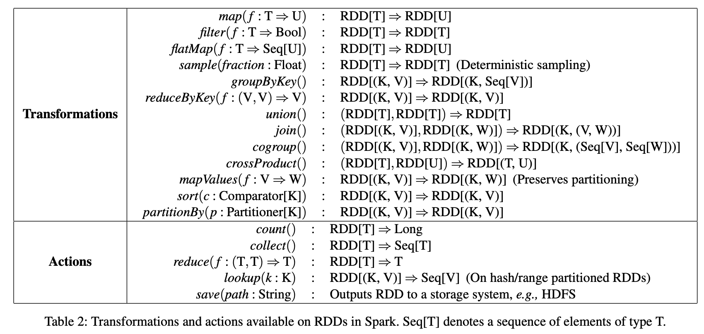
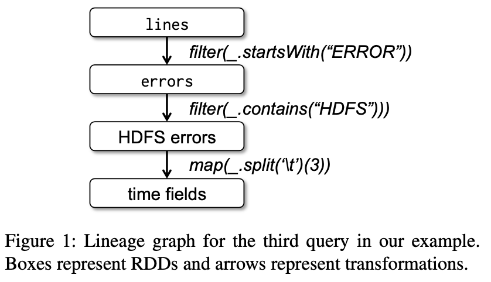
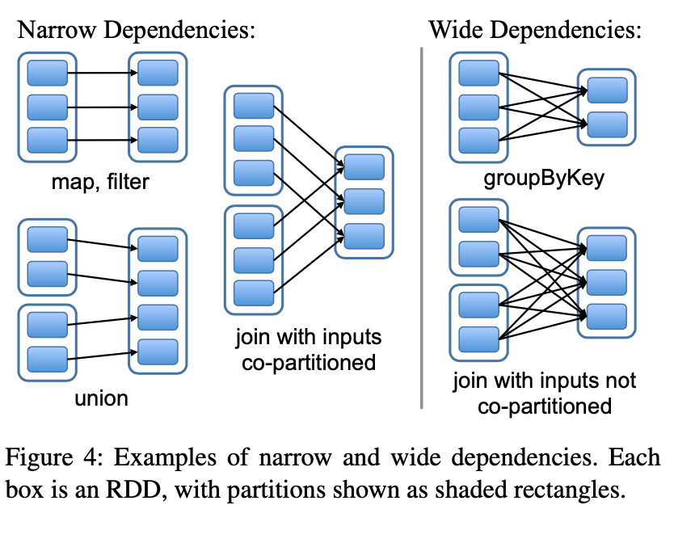
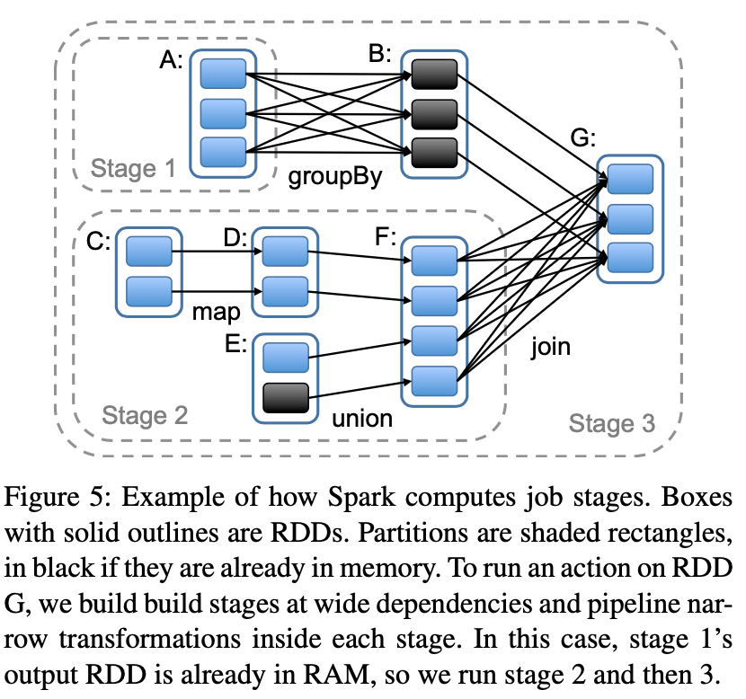
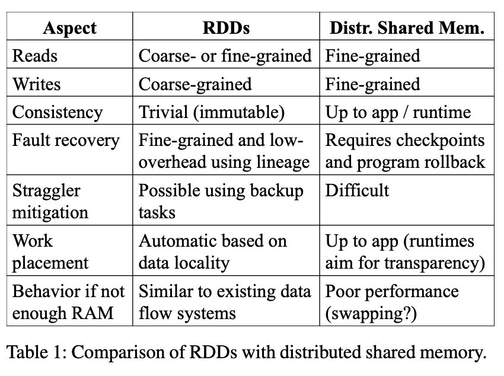

# Spark_论文笔记

# Lecture 16

Resilient Distributed Datasets: A Fault-Tolerant Abstraction for In-Memory Cluster Computing What applications can Spark support well that MapReduce/Hadoop cannot support?

什么应用用 Spark，比用 MapReduce 或者 Hadoop 会更好？

答：这个问的是开发 Spark 的 motivation；

MapReduce 虽然是很经典的分布式计算框架，但其仍存在一定的局限性

- MapReduce 将中间结果放到磁盘上，对于需要复用中间结果或做迭代分析的场景，需要涉及大量磁盘IO，影响性能；如 机器学习(logistic regression and k-means)，PageRank 等，而 Spark 是优先放在内存，性能客观；并且 Spark 还内嵌了交互式环境，支持交互式数据挖掘场景
- MapReduce 的编程模型固定，且表达能力有限，难以实现部分算法；而 Spark 通过提供粗粒度的 API 让自由组装实现其他算法

综上，如需要做迭代分析的应用，分布式机器学习等，以及交互式数据挖掘的场景，使用 Spark 会更好；但是Spark 是对 MapReduce 的一种补充而不是替代

# 讨论

## RDD

Resilient Distributed Datasets 弹性分布式数据集，理解为是一种分布式内存资源的抽象，将资源封装成对象，RDD 本身只读，只能通过暴露一些粗粒度的方法对其RDD 本身进行转换生成子RDD；

当然，当机器内存不足时，RDD 可以从内存降级为磁盘IO；

关于 RDD 的介绍：[Spark RDD 论文简析](https://zhuanlan.zhihu.com/p/36288538)

RDD 提供一系列的粗粒度接口，链式调用实现数据的内存处理，Transformations 通过注入回调做懒调用，并不会触发计算，当调用 Actions 时就会正式计算任务

其次，每调用 Transformations 就会生成新的 RDD，通过 RDD 的生成顺序，可以组成 Lineage

**RDD 容错：**通过 Lineage，可以在 RDD 结果失效的时候，迅速重新演算，还可以根据 RDD 的大小和生成时间，在中间插入 checkpoint，就不需要从头开始计算最终结果

## 作业调度

一个 RDD 对象在物理上是分片存储，分散在不同机器的内存上，根据 Transformations，父子 RDD 之间存在依赖关系，根据出度，又可以做细分和优化

- 窄依赖：出度为 1 的父 RDD 分片的边，即只被子 RDD 的一个分片依赖
- 宽依赖：出度大于 1 的父 RDD 分片的边，即被多个子 RDD 分片依赖

对于窄依赖可以做单独的优化，比如

- 在同一节点上进行子 RDD 的后续任务，流水线进行
- 恢复 RDD 时，只需要恢复父 RDD 的依赖的对应分片即可；恢复父分片时，还能将不在依赖中的其他父分片做并发执行，加快恢复效率

同时，在做分布式调度时，Spark 也会分析生成的 DAG，将窄依赖的 RDD Transformations 放到一个 Job Stage 里，而 Job Stage 之间需要做 shuffle。

Job Stage 划分完毕后，Spark 便会为每个 分片 生成计算任务（Task）并调度到集群节点上运行

在调度 Task 的时候，Spark 也会为每个 分片 遵循就近原则去调度：

- 如果 RDD 是从 HDFS 中读出数据，那么 Partition 的计算就会尽可能被分配到持有对应 HDFS Block 的节点上；（靠近数据源做处理）
- 如果 Spark 已经将父 RDD 持有在内存中，子 Partition 的计算也会被尽可能分配到持有对应父 Partition 的节点上；（靠近数据源做处理）

不同 Stage 之间的 shuffle，这里 Spark 则和 MapReduce 类似，做中间数据的落盘，简化 checkpoint

## 内存管理

在 RDD 分片的内存管理上，通过 LRU 的方式处理当 内存不足的情况，同时也支持 加权 RDD 分片的方式

对于 RDD 的存储格式， Spark 提供了三种形式：

- 内存中反序列化对象；
- 内存中序列化对象；
- 硬盘存储

性能从高到低

## RDD 与 DSM

分布式共享内存（Distributed Shared Memory，DSM）

两者的设计意图和使用场景不一样，但是可以横向对比一下；

RDD 提供粗粒度的数据转换，而 DSM 可以支持随机读写，各有优势：

1. RDD 的设计是为了支持批量写入和分区容错，其 Lineage 可以支持其重算；DSM 支持随机读写，分区容错通常借助 PB 或者分布式共识

2. RDD 还可以通过备份节点唤起和缓慢节点一起计算缓解长尾问题；DSM 在分布式环境中需要等待缓慢节点的响应做主从数据同步，存在一定的长尾问题
2. RDD 由于是数据分片的一坨数据包装，所以可以更好地支持空间就近原则做数据的计算处理

# 参考

- [Spark RDD 论文简析](https://zhuanlan.zhihu.com/p/36288538)
- [Spark 论文阅读](https://tanxinyu.work/spark-thesis/)