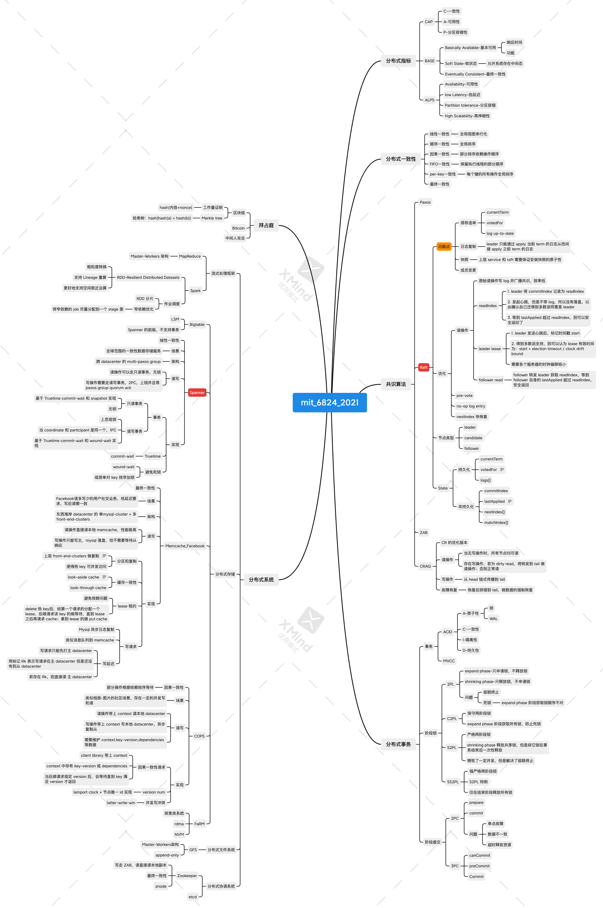

# mit_6824_2021_学习总结

mit 6.824 2021 课程算是基本完结了

4 labs(含 chanllenge) + 14 paper notes：https://github.com/SwordHarry/mit_6.824_2021_note

觉得有帮助，希望能给个 star ⭐️

4 labs 主要是将自己的思路和淌过的坑记录一下，不涉及过多源码，希望能给大家一些帮助；

14 papers 主要是做 schedule 中的 Question 的解答，以及自己对 paper 内容的讨论和思考；

根据自己的时间安排和偏好，有一些论文没有去读，主要是一些拜占庭问题的论文，目前的重心还是在非拜占庭下的分布式系统

# 知识点

学完 mit 6824 2021，感觉自己对分布式系统有了一个初步的认知，打开了新世界的大门，作为分布式系统的入门课，无疑是王牌课程；

但是确实是感觉学到了很多知识，但又没有一个总体的框架，感觉知识点都很零散；

在此，给出自己的知识总结的脉络；学完了 mit 6824，我学到了：

## 分布式系统指标

- CAP
- BASE
- ALPS

## 分布式一致性

- 线性一致性
- 顺序一致性
- 因果一致性
- FIFO 一致性
- per-key 一致性
- 最终一致性

## 分布式共识算法

- Raft：首先是接触了 Raft，并实现了基础的功能点，体会到了魔鬼都在细节中
- Paxos：分布式共识只有一个算法，那就是 Paxos
- ZAB
- CRAQ

## 事务

ACID

### 单机事务

- 2PL
- C2PL
- S2PL
- SS2PL

### 分布式事务

- 2PC
- 3PC

## 分布式系统

不能撇开业务场景和设计目标谈系统实现，每种系统的实现都是有其特定的取舍的

### 数据流式处理框架

- Mapreduce
- Spark

### 分布式文件系统

- GFS

### 分布式协调系统

- Zookeeper
- etcd

### 分布式存储

- Bigtable
- Spanner
- Memcache_Facebook
- COPS
- FaRM

## 拜占庭

- 区块链：Merkle tree
- 比特币：proof-of-work
- 中间人攻击

# 思维导图

按照自己的理解做的思维导图

# 参考

在完成课程的过程中，有参考很多网络的博客和文章，在此对博主们致以诚挚的感谢

其实我很希望我的疑问能得以解答，甚至是若我的笔记中出现错漏，能得以提示和更正

